# 1.Product Introduction

**Download address：https://fs.keyestudio.com/KS4036F**

1. Description

Have you ever wondered how automatic devices like sensor lights and automatic doors work?
Let’s explore together! The KEYESTUDIO Microbit Smart Robot  Car uses a micro:bit control board, which is a microcomputer development board specially designed by BBC for programming education for teenagers.
The car boasts a small car body, a simple structure and block holes. More importantly, it is capable of detecting distance and light intensity, 
discerning black and white lines and can be controlled via a Bluetooth and an IR remote control.
It enjoys two language tutorials such as makecode graphical programming and Python, making it easier for beginners to understand program logic and develop programming thinking. 
The version of Python running on the BBC micro: bit is called MicroPython,which is committed to reviving the Python programming language in microcontrollers and embedded systems.
For your convenience, detailed code explanations have been provided in the tutorial. If you have any difficulties or problems, please contact us at any time.

2.  **Features**

- It boasts Lego holes and is easy to carry

- Simple wirings

- Micro:Bit enjoys a passive buzzer to play Micro:Bit library music

- It boasts two RGB LEDs, which can be used as a left or right turn
  light for your car, or combined to create a dazzling light show

- The motor speed can be adjusted via the PWM

3.  **Parameters**

- Connector port input: DC 4.5V

- Operating voltage of sensors: 3V

- Motor speed: 200RPM

- Working temperature range: 0-50℃

- Dimension: 99\*78\*58mm

- Environmental protection attributes: ROHS

4. Kit

|     |                                                                  |                                 |     |
|-----|------------------------------------------------------------------|---------------------------------|-----|
| #  | Picture                                                          | Components                      | QTY |
| 1   | 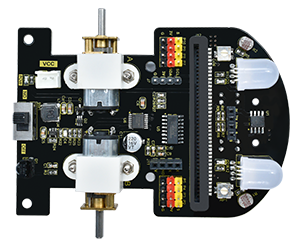 | Expansion Board                 | 1   |
| 2   | 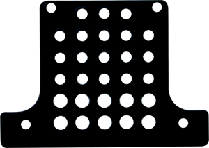 | Acrylic Board                   | 1   |
| 3   | 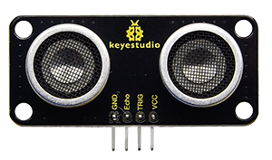 | Ultrasonic Sensor               | 1   |
| 4   | 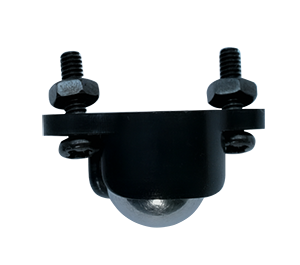 | Universal Wheel | 1   |
| 5   | 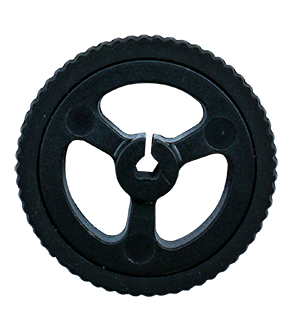 | Wheels                          | 2   |
| 6   | 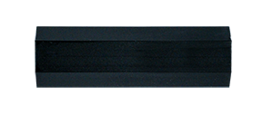 | M3\*20mm Nylon Column           | 4   |
| 7   | 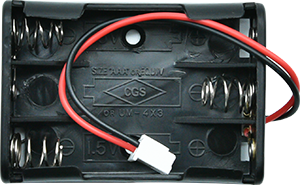 | 3AAA Battery Holder             | 1   |
| 8   | 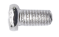 | M3\*6MM Flat Head Screws        | 4   |
| 9   | 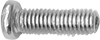 | M3\*10MM Flat Head Screws       | 6   |
| 10  | 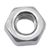 | M3 Nickle-plated Nuts           | 2   |
| 11  |  | Slotted Screwdriver             | 1   |
| 12  |  | Cross Screwdriver               | 1   |
| 13  | 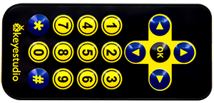 | IR Remote Control               | 1   |

