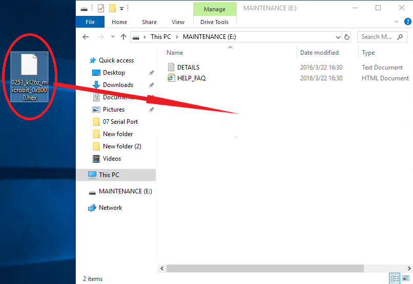

# Troubleshooting for MAINTENANCE Mode

**1.Problem**

Recently, many users encounter the issue that Micro:bit board doesn’t
respond when connected to computer.

If the way you operate is correct, maybe you accidentally press the
reset button and enter the Maintenance mode or lead to lose the firmware
due to misoperation.

Plug in Micro:bit board, the“MAINTENANCE”drive appears. That means the
program can’t be downloaded.

**2.Solution**

Download the hex file from this page to your computer.

Download the latest firmware---0257:

<https://www.microbit.org/get-started/user-guide/firmware/>

After the latest firmware is downloaded, then drag it into
the“MAINTENANCE”drive as follows, which makes Micro:bit come back to
normal mode.

**3.How to avoid to enter“MAINTENANCE”mode？**

1.  Make sure the Reset button is not pressed when plugging the board by
    USB cable.

2.  Don't unplug the cable suddenly during downloading micro:bit
    program, otherwise, the firmware will be lost and enter
    in“MAINTENANCE”mode

3.  n the experiment, wrong wiring also cause short circuit or losing
    the firmware.
