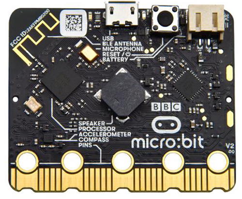
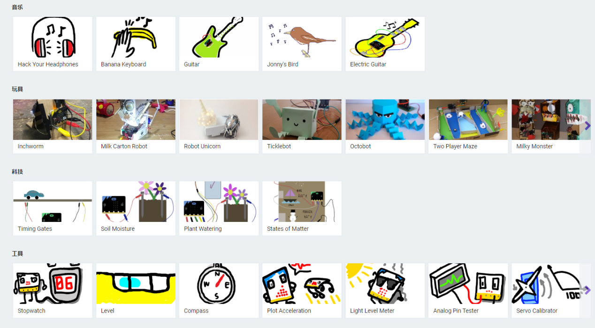
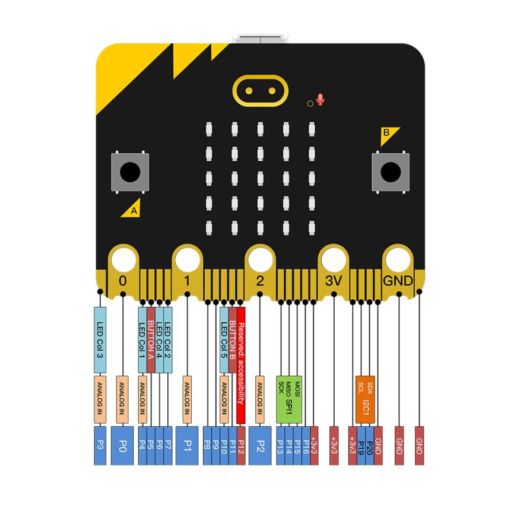
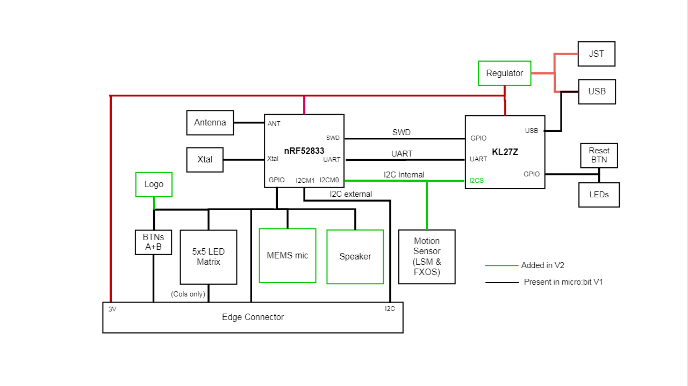
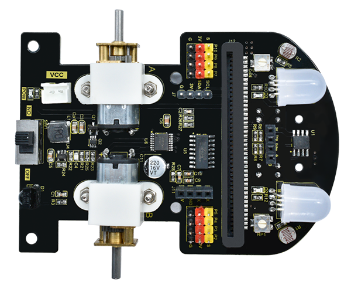
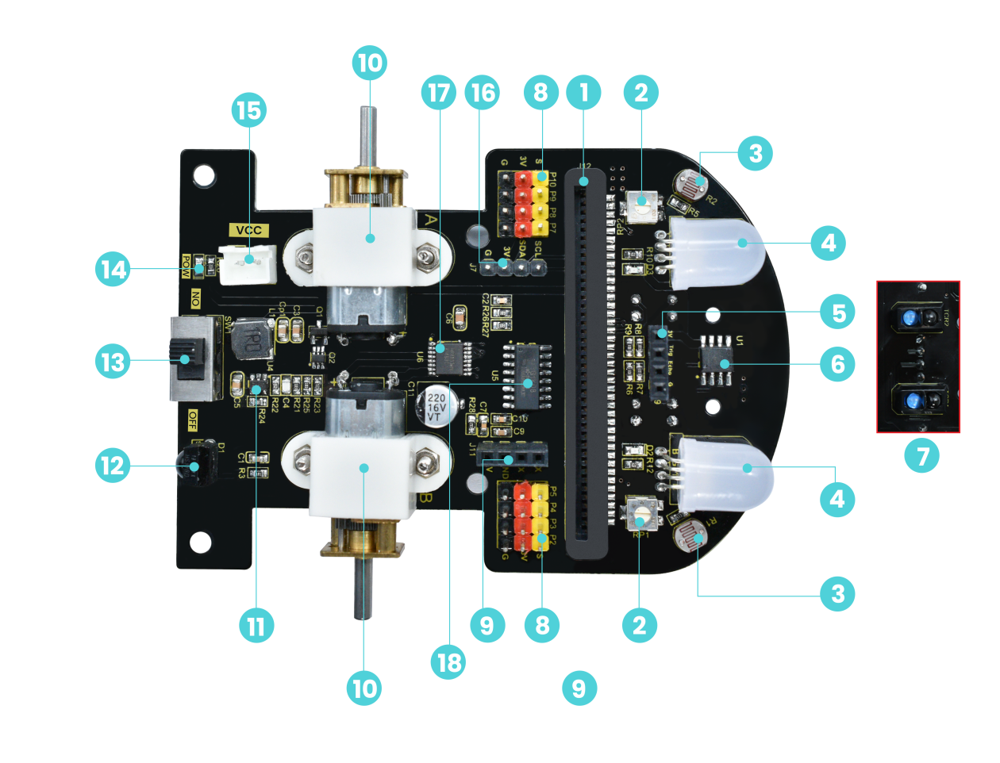

# 2. Mainboard and Expansion Board

Micro:bit Introduction

**1.Overview**

Micro:bit is a single chip microcomputer with ARM architecture designed
by BBC, which is half the size of a credit card. However, it integrates
a Bluetooth, an accelerometer, a compass, three buttons, a 5 x 5 LED dot
matrix as well as a microphone.

The micro:bit designed by BBC is committed to getting teenagers involved
in creative hardware and software programming via it.

Micro:bit boasts many open source libraries and interesting solutions
that you can check out on the website：

[Microsoft MakeCode for micro:bit
(microbit.org)](https://makecode.microbit.org/)

For your convenience, we designed a bottom board of the car and
integrated all kinds of sensors needed on it.

This product is designed for the micro:bit V2 board. Please use a V2
development board for control. (If the V1.5 development board is used,
some functions will be incompatible.)

**2.Parameters**

- [Processor](javascript:;)：Nordic Semiconductor nRF52833

- [Memory](javascript:;)：512kB Flash, 128kB RAM

- [Microphone](javascript:;)：MEMS [microphone](javascript:;) and LED
  indicator

- Speaker：Onboard speaker

- Logo touch：Touch-sensitive Logo

- Edge connector：Pins need a special base, interfaces on the board are:
  VCC , GND, P0, P1and P2

- Wireless：2.4Ghz Micro:bit Radio/BLE BT 5.0

- Power：5V is powered via the Micro USB port, 3V via an edge connector
  or a battery pack.

- Available current：200mA

- Motion sensor：ST LSM303

- Software：Make Code, Python, Scratch

- Dimension：52\*43.2mm

**3.Functions**

- Onboard speaker

- MEMS [microphone](javascript:;) boasts a LED indicator

- Touch-sensitive logo

- Built-in sleep or shutdown mode allows you to power off the circuit
  without removing the battery

- Discrete voltage regulator can provide up to 200mA current for
  peripheral accessories

- Edge connector makes it easier to connect the alligator clips and
  wires

**4.Pin Out**

**5.Framework Diagram**

**6.Related information**

[<u>Micro:bit Educational Foundation \| micro:bit
(microbit.org)</u>](https://www.microbit.org/)

Microbit Smart Robot Car

**1.Overview**

The expansion board integrates an IR receiver, a photoresistor, a line tracking sensor, RGB LEDs, an ultrasonic port, an IIC interface, a serial port communication port as well as motors. Moreover, it introduces eight IO ports for subsequent expansion.

Due to the small number of IO ports of micro:bit, the micro:bit board sends control instructions to STC8G1K08 via the IIC, and then ST8G1K08 sends PWM to control HR8833 motor to drive IC, thus controlling the motor to rotate. LED RGB is controlled in the same way as above.

**2.Parameters**

- Connector port input: DC 4.5V

- Motor speed: 200RPM

- Working temperature range: 0-50℃

- Dimension: 99\*78\*58mm

- Environmental protection attributes: ROHS

**3.Expansion Board Diagram**

1.  Slot of Micro:bit board

2.  Potentiometer: adjust the line tracking sensors

3.  Photoresistor

4.  RGB LED

5.  Ultrasonic port

6.  LM393 Voltage comparator

7.  Line tracking sensors

8.  IO ports（Note：Some IO ports are used by functions on the mainboard, which cannot be used simultaneously）

9.  Serial port communication port: download STC8 program

10. Motor:you need to turn on the power first

11. ETA3413 drop voltage IC :input voltage will drop to 3V

12. IR receiver

13. Power switch

14. Power indicator

15. External power port

16. IIC extended port

17. HR8833 motor：drive IC

18. STC8G1K08：control IC（micro:bit sends instructions via IIC to control the STC8）
