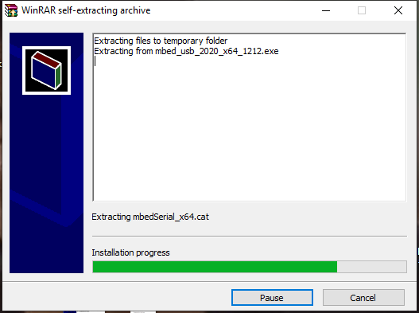
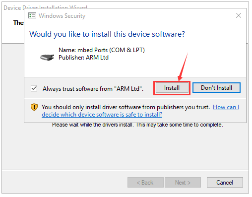

# 4. Install Microbit Driver

**Step 1**

First of all, connect the micro:bit to your computer using a USB cable，

then double-clickto install.

After downloading the driver, then click“Next”

Click“Install”and “Finish”

Then click“Computer”—\>“Properties”—\>“Device manager”, as shown below.

