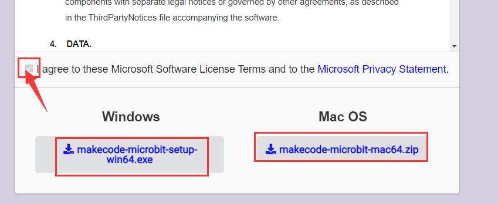
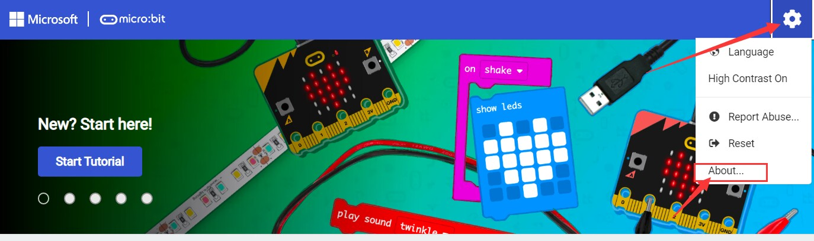
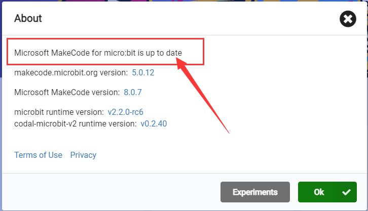
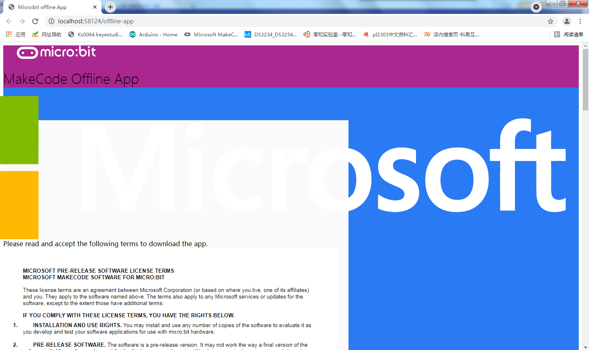
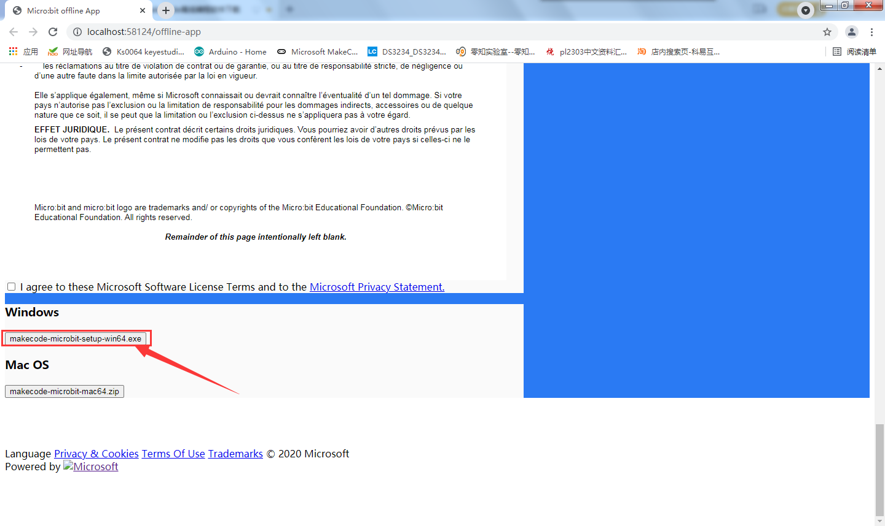

# Download Link:

<https://makecode.microbit.org/offline-app>

Update Tutorial:

First, open the software and click Settings in the upper right corner
and then click About.

Then go to the About interface and click the latest version

The official website of the software will be redirected

Slide all the way to the bottom, such as My System is windows, then
select Windows to download.

