# 5. Makecode Tutorial

## 5.1 Install IDE

Micro:bit is a product that requires no IDE installation and only needs
to download the programming from the web: [Microsoft MakeCode for micro:bit (microbit.org)](https://makecode.microbit.org/)

If you need an offline version, refer to the "Offline Makecode" file

## 5.2 Install the Driver

refer to the “4. Install Microbit Driver”file

## 5.3 IDE Setting and Introduction of the Toolbar

Enter website：[Microsoft MakeCode for micro:bit (microbit.org)](https://makecode.microbit.org/)

If your want to import the existing code, tap"Import" → "Import file"→"continue".

If you need to write your own code, click on the New Project and enter the project name.

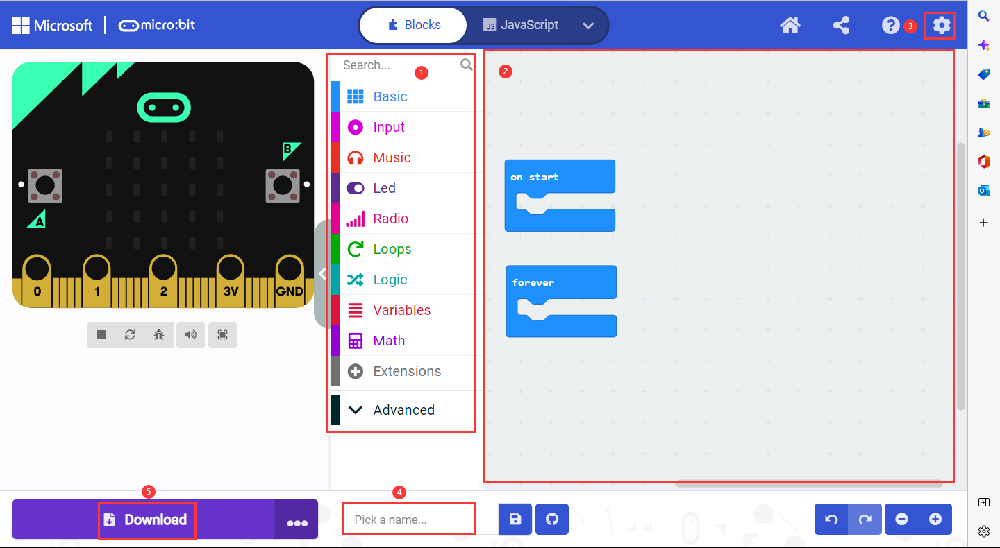

① Code block area: we can see it subdivided into multiple columns, each
column contains the corresponding code blocks, which are described at
the website：<u>https://makecode.microbit.org/reference.</u>

② Code writing area:Our code is completed in this area. There are two
code blocks in the newly created project.

③ Programming environment setting area: We can set up the language of
the development environment and import the library files we need.

④ Project name

⑤ Download button of projects

## 5.4 Download Code

Enter”Basic”→ ”show icon“ → ”forever“

TapWindows 10 computers can download it directly to the microbit development board.

Windows 7 computers need to find the downloaded code and select "Send to" microbit or copy and paste.

If the computer does not display  please check according to the five files.

## 5.5 Import Code

Connect the micro:bit development board to your computer via a USB cable, then open the online makecode programming page and tap Import.

Then click Add Folder, select the code file you want to add, and tap "Go ahead" to add the code to the online compiler.

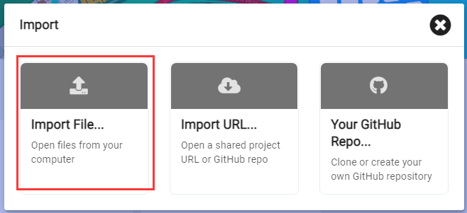

## 5.6 Install the Library File

Import makecode Or add the code manually:

Tap Extensions

Enter the link in the search box, and then click on the library file
named Mini Car.

Offline Makecode

Download Link:

<https://makecode.microbit.org/offline-app>

## 5.7 Update Tutorial:

First, open the software and click Settings in the upper right corner and then click About.

Then go to the About interface and click the latest version

The official website of the software will be redirected

Slide all the way to the bottom, such as My System is windows, then select Windows to download.

## 5.8  Microbit Basic Projects

### Project 1: Heartbeat

1. Description

The sensor modules and LED dot matrix of the Microbit basic projec omes with the micro: bit mainboard.

Prepare a Micro:bit board and a USB cable. Next we will conduct a basi xperiment that a heartbeat pattern flashes on the micro:bit board.

2. Components Needed

<table>
<colgroup>
<col style="width: 32%" />
<col style="width: 33%" />
<col style="width: 33%" />
</colgroup>
<tbody>
<tr class="odd">
<td>

</td>
<td>

</td>
<td></td>
</tr>
<tr class="even">
<td>Micro:bit * 1</td>
<td>USB Cable * 1</td>
<td></td>
</tr>
</tbody>
</table>

3. Test Code

You can upload the code directly from the tutorial (read th Development Environment Configuration" file if in doubt).

Or add the code blocks manually:

1)  Go to“Basic”→“show icon”.

2)  Copy it again and place into“forever”block.

3)  Click“”t    select“”.

Complete Program：

Click“JavaScript" to view the corresponding JavaScript code:

4. Test Result

Download code to the micro:bit and plug in it via a USB cable. The LE ot matrix will display
 and.

If download unsuccessfully, disconnect the micro:bit and reboot it

### Project 2 Light Up A Single LED

1. Description

Micro:bit motherboard consists of 25 light-emitting diodes, 5 pcs in  roup, which correspond to x and y axis, forging a 5\*5 matrix oreover, every diode locates at the point of x and y axis.

Virtually, we could control an LED by setting coordinate points. Fo nstance, set coordinate point（0，0）to turn on the LED at row 1 an olumn 1; light up LED at the row 1 and column 3, we could set （2，0 nd so on.

2. Components Needed

<table>
<colgroup>
<col style="width: 32%" />
<col style="width: 33%" />
<col style="width: 33%" />
</colgroup>
<tbody>
<tr class="odd">
<td>

</td>
<td>

</td>
<td></td>
</tr>
<tr class="even">
<td>Micro:bit * 1</td>
<td>USB Cable * 1</td>
<td></td>
</tr>
</tbody>
</table>

3. Test Code

You can upload the code directly from the tutorial (read th Development Environment Configuration" file if in doubt).

Or add the code blocks manually:

1)  A. Click“Led”→“more”→“led enable false”

B. Put it into the“on start”block, click the drop-down triangle butto  elect“true”.

\(2\) A. Enter“Led”→“toggle x 0 y 0”block;

B. Combine it with“forever”，alter“x 0”to“x 1”.

\(3\) A. Enter“Basic”→“pause (ms) 100”from“

B. Then move it below the“toggle x1 y0”block, and set the delay time t 00ms.

\(4\) Duplicate cod tringonc nd place it into“forever”block.

\(5\) A. Enter“Led”→“plot x 0 y 0”

B. Keep it beneath block“pause(ms)500”, then set to“plot x 3 y 4”.

\(6\) Replicate“pause (ms) 500”once and keep it below the block“plo 3y4”

Click“Led”→“unplot x 0 y 0”and set to“unplot x3 y 4”;

Lay down it beneath“pause (ms) 500”block

Copy“pause (ms) 500”block once, and keep it below the“unplot x3 y  lock.

Complete Program：

4. Test Result

Upload program and plug in micro:bit via USB port, the LED at coordinat oint (1,0) flashes for 0.5s, then the LED at (3,4）blinks for 0.5s lternately.

### Project 3: 5 x 5 LED Dot Matrix

1. Description

Dot matrix gains popularity in our life, such as LED screen, bus statio nd the mini TV in the lift.

The dot matrix of Micro:bit board consists of 25 light emitting diodes n previous lesson, we control LED of Micro:bit board to form patterns umbers and character strings by setting the coordinate points oreover, we could adopt another way to complete the display o atterns, numbers and character strings.

2. Components Needed

<table>
<colgroup>
<col style="width: 32%" />
<col style="width: 33%" />
<col style="width: 33%" />
</colgroup>
<tbody>
<tr class="odd">
<td>

</td>
<td>

</td>
<td></td>
</tr>
<tr class="even">
<td>Micro:bit * 1</td>
<td>USB Cable * 1</td>
<td></td>
</tr>
</tbody>
</table>

3. Test Code

You can upload the code directly from the tutorial (read th Development Environment Configuration" file if in doubt).

Or add the code blocks manually:

Code 1：

Enter“Led”→“more”→“led enable false”

Put it into the“on start”block

Click the drop-down triangle button to select“true”

Click“Led”to move“plot x 0 y 0”into“forever”, then replicate“plot x 0  ”for 8 times, respectively set to“x 2”y 0”,“ ”y 1”,“x 2”y 2”,“x 2”y 3”,“x 2”y 4”,“x 1”y 3”“x 0”y 2”,“x 3”y 3”,“x 4” ”.

Complete Program：

Code 2：

1)  A. Enter“Basic”→“show number 0”block,

2.  Duplicate it for 4 times, then separately set to“show numbe    1”,“show number 2”,“show number 3”,“show number 4”,“show number 5”.

2)  Click“Basic”→“show leds”, then put it into“on start”block，tick blu    boxes to light LED and generate“↓”pattern.

3)  Move out the block“show string” from“Basic”block, and leave i    beneath the“show leds” block

Choose“show icon” from“Basic”block, and leave it beneath the block“sho tring“Hello!”block

Enter“Basic”→“show arrow North”;

Leave it into“forever”block，replicate“show arrow North”for  imes，respectively set to“North East”, “South East”,
“South West”,“North West”.

Click“Basic”to get block“clear screen”the emain it below the block “show arrow North West”

Drag“pause (ms) 100”block from“Basic”block and set to 500ms, then leav t below“clear screen”block.

Complete Program:

4. Test Result

Upload code 1 and plug in micro:bit via USB cable , we will see the
icon.

Upload code 2 and plug in micro:bit via USB cable. Micro: bit start howing number 1, 2, 3, 4, and 5, then cyclicall isplay,“Hello!”,
,,, andpatterns.

### Project 4：Programmable Buttons

1. Description

The button can control the on and off of the circuit, which is attache o the circuit. The circuit is disconnected when the button is no ressed. The circuit is connected as soon as it is pressed, but it i isconnected after being released.

Both ends of button are like two mountains. There is a river in between.

The internal metal piece connect the two sides to let the current pass ust like building a bridge to connect the two mountains.

-   （Internal Structure）

Working Principle：Before pressing the button, 1, 2 , 3 and 4 ar witched on, but 1, 3 or 1, 4 or 2, 3 or 2, 4 is disconnected (blocked) hich will be on when the button is pressed.

Micro:bit board has three buttons, the reset button is on the back an wo programmable buttons are on the front. Press A, B and AB at the sam ime respectively, and the corresponding screen displays the espectively.

2. Components Needed

<table>
<colgroup>
<col style="width: 32%" />
<col style="width: 33%" />
<col style="width: 33%" />
</colgroup>
<tbody>
<tr class="odd">
<td>

</td>
<td>

</td>
<td></td>
</tr>
<tr class="even">
<td>Micro:bit * 1</td>
<td>USB Cable * 1</td>
<td></td>
</tr>
</tbody>
</table>

3. Test Code

You can upload the code directly from the tutorial (read th Development Environment Configuration" file if in doubt).

Or add the code blocks manually:

Code 1：

1)  A. Click“Basic”→“show string”;

B. Then place it into“on button A pressed”block, change“Hello!”into“A”.

2)  Copy cod    string    tap the drop-down button“A”to select“B”and modify character“A”to“B”.

3)  Copyonce，an    set to“on button A+B pressed”and“show string“AB”

Complete Code:

Code 2：

1)  A. Click“Led”→“more”→“led enable false”,

B. Put it into the block“on start”，click drop-down triangle button t elect“true”

.

2)  A. Click“Input”→“on button A pressed”.

B. Go to“Variables”→“ change item by 1 ”

C. Place it into“on button A pressed”and 1 is modified into

3)  Duplicatecod    string once，click the drop-down button to select“B”，the    set“change item by -5”    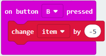

4)  A. Enter“Led”→“plot bar graph of 0 up to 0”

B. Keep it into“forever”block

C. Go to“Variables”to move“item”into 0 box，change 0 into 25.

5)  A. Go to“Logic”to move out “if...true...then...”and “=”blocks，

B. Keep“=”into“true”box and set to “\>”

C. Select“item”in the“Variables”and lay it down at left box of “\>”，change 0 into 25；

D. Enter“Variables”to drag“set item to 0”block into“if...true..then...” lter 0 into 25.

6)  A. Replicate cod    stringonce

B.“\>”is modified into“\<”and 25 is changed into 0.

C. Leave it beneath
cod tring.

Complete Program：

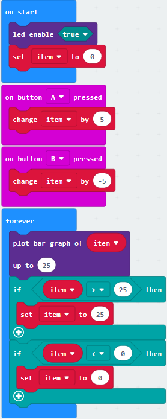

4. Test Result

Upload code 1 and plug in micro:bit via USB cable, press“A”on Micro:bi oard, character“A”will be displayed；in case that B i ressed，letter“B”will appear.“AB”will be displayed if you press A and  uttons simultaneously.

Upload code 2 and plug in board via USB cable. Press button A, th umber of rows lit by the LED dot matrix will increase, when B i ressed, the number of rows lit by the LED dot matrix will decrease.

### Project 5: Temperature Measurement

1. Description

Micro:bit main board doesn’t come with temperature sensor actually, bu etect temperature through built-in temperature of NFR51822 chip hereby, the detected temperature is more close to chip’s temperature.

In this project, we will use the sensor to test the temperature in th urrent environment, and display the test results in the display dat equipment), then set the temperature range detected by the sensor in  ay that controls the LED dot matrix to display different patterns.

（Temperature Sensor**）**

2. Components Needed

<table>
<colgroup>
<col style="width: 32%" />
<col style="width: 33%" />
<col style="width: 33%" />
</colgroup>
<tbody>
<tr class="odd">
<td>

</td>
<td>

</td>
<td></td>
</tr>
<tr class="even">
<td>Micro:bit * 1</td>
<td>USB Cable * 1</td>
<td></td>
</tr>
</tbody>
</table>

3. Test Code

You can upload the code directly from the tutorial (read th Development Environment Configuration" file if in doubt).

Or add the code blocks manually:

Code 1：

1)  Go to“Advanced” →“Serial” →“serial redirect to USB”.

Place it into “on start”

2)  Click“Serial”to drag out“serial write value x=0”.

Move it into“forever”block

3)  Go to“Input” →“temperature(℃)”

Place it into 0 box

Change x into Temperature

4)  Move “pause (ms) 100”from“Basic” block and place it unde    block“serial write.....temperature(℃)”

Complete Program：

<table>
<colgroup>
<col style="width: 100%" />
</colgroup>
<tbody>
<tr class="odd">
<td>

</td>
</tr>
</tbody>
</table>

Download code 1 to micro:bit board and keep USB cable connected, the ap button
:

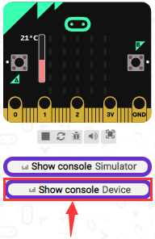

Temperature data is shown below:

Through the test, the room temperature is 35℃ when touching the NFR5182 hip of micro:bit; however, the temperature rises to 37℃ when it touche ater cup.

If you don't have a Windows 10 computer, then Google Chrome can't pai evices to read digital or analog signals. Here you can use CoolTer oftware to read the serial port.

Open CoolTerm, click Options to select SerialPort. Set COM port an 15200 baud rate(the baud rate of USB serial communication of Micro:bi s 115200 through the test). Click“OK”and“Connect”.

The serial monitor shows the current ambient temperature value, as show elow:

Code 2：

Click“Led”→“more”→“led enable false”into“on start”，click drop-dow riangle button to select“true”

Go to“Logic”→“if..true...then...else”and “=” block;

Move“if..true...then...else” into“forever”block，the lace“=”into“true”box.

Change “=” to“≥”

Go to“Input”→“temperature(℃)”and move it into the left 0 box;

Change 0 into 35.

Tap“Basic”→“show icon”，copy it once and lay down them under the“i ..then” and else blocks, then click the drop-down triangle button t elect“”.

Complete Program：

4. Test Result

Upload the code 2 plug in micro:bit via USB cable, when the ambien emperature is less than 35℃, the 5\*5 LED wil how hen the temperature is equivalent to or greater than 35℃, th attern
will appear.

### Project 6: Compass

1. Description

This project mainly introduces the use of the Micro:bit’s compass. I an be used to determine the direction. We need to calibrate th icro:bit board when magnetic sensor works. The correct calibratio ethod is to rotate the Micro:bit board.

In addition, the objects nearby may affect the accuracy of readings an alibration.

(Compass)

2. Components Needed

<table>
<colgroup>
<col style="width: 32%" />
<col style="width: 33%" />
<col style="width: 33%" />
</colgroup>
<tbody>
<tr class="odd">
<td>

</td>
<td>

</td>
<td></td>
</tr>
<tr class="even">
<td>Micro:bit * 1</td>
<td>USB Cable * 1</td>
<td></td>
</tr>
</tbody>
</table>

3. Test Code

You can upload the code directly from the tutorial (read th Development Environment Configuration" file if in doubt).

Or add the code blocks manually:

Code 1：

1)  A. Click“Input”→“more”→“calibrate compass”

B. Lay down it into the“on start”block.

2)  A. Go to“Input”→“on button A pressed”.

B. Enter“Basic”→“show number”, put it into“on button A pressed”block;

C. Tap“Input”→“compass heading(℃)”， and place it into“show number”

Complet rogram：

<table>
<colgroup>
<col style="width: 100%" />
</colgroup>
<tbody>
<tr class="odd">
<td>

</td>
</tr>
</tbody>
</table>

Program Description：

Upload the code 1, plug in micro:bit via USB cable and press button A ED dot matrix indicates that“TILT TO FILL SCREEN”. Then enter th alibration interface, the calibration method is: rotate the Micro:bi otherboard to make the screen (LED dot matrix) draw a square (25 LED re on), as shown in the following figure:

The calibration is finished until you view the smil attern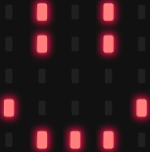.

The serial monitor show will 0°, 90°, 180°and 270° when pressing A.

Code 2：

Make micro: bit board point to the north, south, east and wes orizontally , LED dot matrix displays the corresponding directio atterns.

This code string complies that we read the value detected incessantl nd determine the direction by the value range. The direction is towar orth at this time.

As shown in the figure, if the reading is between 292.5 and 337.5, the ake the display show an arrow pointing to the top right. Since 0. annot be entered in the program, the values are 293 and 338. Then ad ther logical criteria, and you will get the complete program.

Find the instruction blocks:

Enter“Input”→ “more”→“calibrate compass”

Move“calibrate compass”into“on start”

Click “Variables”→“Make a Variable...”→“New variable name：”

Input“x”in the blank box and click“OK”, and the variable “x” i enerated.

Drag out“set x to”into“forever”block.

Go to“Input”→“compass heading(℃)”, and keep it into “0” box

Tap“Logic”→“if...then...else”, leave it below block“sex x to compas eading”，the lickico or 6 times.

Place“and”into “true” block

Then move“=”block to the left box of “and”

Click“Variables”to drag“x”to the left“0”box, change 0 into 293 and se o“≥”;

Then copy“x≥293”once and leave it to the right“0”box and set to“x\<338”

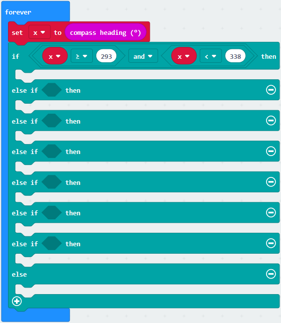

Go to“Basic”→“show leds”

Lay it down beneath
block hen

click“show leds”and the pattern
appears.

Duplicate
for  imes.

Separately leave them into the blank boxes behind“else if”.

Set to“x≥23 and x\<68 ”,“x≥68 and x\<113 ”,“x≥113 and x\<158 ”,“x≥15 nd x\<203 ”,“x≥203 and x\<248 ”,“x≥248 and x\<293 ”respectively.

Then copy“show leds”for 7 times and keep them below the “els f.......then” block respectively.

Click the blue boxes to form th attern“”,
“”,“”,“”,“”,“”and“”.

Complet rogram：

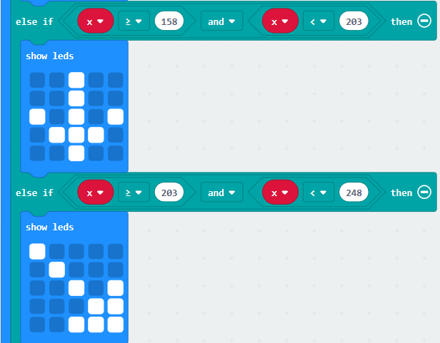

4. Test Result

Upload code 2 and keep USB cable connected. After calibration, til icro:bit board, the LED dot matrix displays the direction signs.

### Project 7: Accelerometer

1. Description

The Micro:bit board has a built-in LSM303AGR acceleration senso accelerometer). It has a resolution of 8,10 and 12 bits, and th rogram sets the measuring range to 1g, 2g, 4g, and 8g.

We often use the accelerometer to detect the attitude of machines.

In this project, we will introduce the detection of several specia ostures by the accelerometer, then view the triaxial raw data output b he it.

2. Components Needed

<table>
<colgroup>
<col style="width: 32%" />
<col style="width: 33%" />
<col style="width: 33%" />
</colgroup>
<tbody>
<tr class="odd">
<td>

</td>
<td>

</td>
<td></td>
</tr>
<tr class="even">
<td>Micro:bit * 1</td>
<td>USB Cable * 1</td>
<td></td>
</tr>
</tbody>
</table>

3. Test Code

You can upload the code directly from the tutorial (read th Development Environment Configuration" file if in doubt).

Or add the code blocks manually:

Code 1：

\(1\) A. Enter“Input”→“on shake”，

B. Click“Basic”→“show number”, place it into“on shake”block, then chang  into 1.

\(2\) A. Copy code string
for  imes;

2.  separately click the triangle button to select“logo up”,“log    down”,“screen up”,“screen down”,“tilt left”,“tilt right”and“fre    fall”, then respectively change 1 into 2, 3, 4, 5, 6, 7, 8.

Complete Program：

<table>
<colgroup>
<col style="width: 100%" />
</colgroup>
<tbody>
<tr class="odd">
<td>

</td>
</tr>
</tbody>
</table>

<table>
<colgroup>
<col style="width: 100%" />
</colgroup>
<tbody>
<tr class="odd">
<td>

</td>
</tr>
</tbody>
</table>

Code 2：

Check the acceleration value at X, Y and Z axis.

1)  A. Go to“Advanced”→“Serial”→“serial redirect to USB”

B. Drag it into“on start”

2)  A. Enter“Serial”→“serial write value x =0”

B. Leave it into“forever”block

3)  A. Click“Input”→“acceleration(mg) x”；

B. Keep it into“0”box and capitalize the“x”

4)  Go to“Basic”and move out“pause (ms) 100”below th    block    then set to 100ms.

5)  Replicate cod    string

for 3 times and keep them into“forever”block，separately set the whol ode string as follows:

Complete Program：

Download code 1 to micro:bit board, keep USB cable connected an lick

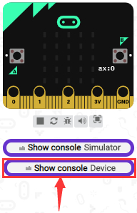

The coordinates of the Micro:bit accelerometer are shown in th ollowing figure:

It shows the decomposition of acceleration on the X-axis, Y-axis, an -axis, as well as the synthesis of acceleration (the synthesis o ravitational acceleration and other external forces). Then flip th icro:bit board, the data is shown below:

If you don't have a Windows 10 computer, then Google Chrome can't pai evices to read digital or analog signals. Here you can use CoolTer oftware to read the serial port.

4. Test Result

Download code 1 to micro:bit board and plug in power with USB cable hen shake the Micro:bit board, the number 1 appears.

When the logo is up, the number 2 is displayed:

When the logo is down, the number 3 is displayed:

When the screen is up, the number 4 is shown.

On the contrary, the number 5 is displayed when the screen is down.

When Micro:bit board is tilt to the left, number 6 is shown.

When Micro:bit board is inclined to the right, number 7 is displayed.

When it is free fall, number 8 will appear on dot matrix.（Note：w on’t recommend you to make it free fall, it will cause board damage)

### Project 8: Detect Light Intensity

1. Description

This project will introduce how Micro:bit detects the external ligh ntensity. Since Micro:bit doesn’t come with a photosensitive sensor he detection of light intensity is completed through the LED matrix.

The LED matrix is used to sense the surrounding light and repeatedl onverts the LED into input and samples the voltage decay time. Th ight intensity detected is a relative value.

（Light Intensity Area）

2. Components Needed

<table>
<colgroup>
<col style="width: 32%" />
<col style="width: 33%" />
<col style="width: 33%" />
</colgroup>
<tbody>
<tr class="odd">
<td>

</td>
<td>

</td>
<td></td>
</tr>
<tr class="even">
<td>Micro:bit * 1</td>
<td>USB Cable * 1</td>
<td></td>
</tr>
</tbody>
</table>

3. Test Code

You can upload the code directly from the tutorial (read th Development Environment Configuration" file if in doubt).

Or add the code blocks manually:

(1)A. Enter“Advanced”→“Serial”→“serial redirect to USB”;

B. Drag it into“o tart”block.

\(2\) A. Go to“Serial”→“serial write value x =0”;

B. Move i nto“forever”

3)  A. Click“Input”→“Light level”

B. Put“Light level”in the“0”box and change “x”to“Light intensity”.

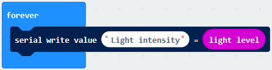

4)  A. Click“Basic”→“pause (ms) 100”;

B. Lay it down into“forever”and set to 100ms.

Complete Program：

4. Test Result

Download code to micro:bit board don’t plug off USB cable an lick

The intensity value is 0 when covering the LED dot matrix. And it varie ith the light intensity when placing micro:bit board under th unlight. The stronger the light intensity, the larger the light leve ill be.

### Project 9: Speaker

1. Description

The micro:bit motherboard has a built-in speaker, which makes it ver asy to add a sound to your project. The speaker can be programmed t mit a variety of tones, such as writing a song: Ode to Joy, and pla t.

（ Speaker）

2. Components Needed

<table>
<colgroup>
<col style="width: 32%" />
<col style="width: 33%" />
<col style="width: 33%" />
</colgroup>
<tbody>
<tr class="odd">
<td>

</td>
<td>

</td>
<td></td>
</tr>
<tr class="even">
<td>Micro:bit * 1</td>
<td>USB Cable * 1</td>
<td></td>
</tr>
</tbody>
</table>

3. Test Code

You can upload the code directly from the tutorial (read th Development Environment Configuration" file if in doubt).

Or add the code blocks manually:

Enter“Basic”→show icon, put it to the“on start “block

Click the drop-down triangle to select th  attern.

Tap
“Music”→ ut it to the“on start “block

Enter“Basic”→“pause (ms) 100”, then put it to the“forever“block an hange 100 to 1000.

Replicate the cod tringfo  times, then put it to the“forever“block. Click the drop-down triangl o select

”happy, ”hello”and ”yawn”.

Complet rogram：

4. Test Result

Upload the program and plug in micro:bit via a USB cable, then th peaker will emit a sound and the LED dot matrix will display a musi ogo pattern.

### Project 10:Touch-sensitive Logo

1. Description

If you have a micro:bit mainboard, it makes sense to use a gol ouch-sensitive logo as another input in your project, which is like a xtra button. It uses a capacitive touch sensor that detects smal hanges in electric fields when you press (or touch) it with you inger. When you touch it, you can control the micro:bit board t erform certain functions.

（Touch-sensitive Region）

2. Components Needed

<table>
<colgroup>
<col style="width: 32%" />
<col style="width: 33%" />
<col style="width: 33%" />
</colgroup>
<tbody>
<tr class="odd">
<td>

</td>
<td>

</td>
<td></td>
</tr>
<tr class="even">
<td>Micro:bit * 1</td>
<td>USB Cable * 1</td>
<td></td>
</tr>
</tbody>
</table>

3. Test Code

You can upload the code directly from the tutorial (read th Development Environment Configuration" file if in doubt).

Or add the code blocks manually:

1.  Delete the“on start”and “forever”blocks

2.  Enter“Input”→ “when logo is touched”, then click the drop dow    triangle button to select “is touched”

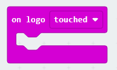

3.  Click “Variables”→“Make a Variable”, then enter start in the dialo    box and tap OK to create the variable "start".

Drag the“ set the variable to 0” block from the Variable bar, then pu t to the“when logo is touched” block.

（4）Enter“Input”→ “more”→ ”[running time](javascript:;)(ms)”, then pu t into the number 0 of the “ set the variable to 0” block.

（5）Tap “Basic”→ “show icon❤”, then put it into the “when logo i ouched”block.

\(7\) Enter“Input”→ “when logo is touched”→”is released“, then creat he variable“time”in the same way.

Click “Variables”→“ set time to 0”and put it into the “when logo i eleased”block.

Go to “Math”→“0-0”, then put it into the number 0 of the “ set the tim o 0” block.

7)  Enter“Input”→ “more”→”[running time](javascript:;)(ms)”, then put i    into the number 0 box on the left side of the “0-0” block.

Click “Variables”→“start”, then put it into the number 0 box on th ight side of the “0-0” block.

8)  Tap “Basic”→ “show number”, then put it into the“when logo i    released”block.

Go to “Math”→ “square root 0”, and put it into the 0 box, then click th rop-down triangle button to select the integer ÷.

9)  Click “Variables”→“time”, then put it into the 0 box on the righ    side, and change 0 to1000.

Complete Program：

4. Test Result

Upload the program and plug in micro:bit via a USB cable. Press and hol he "Logo" sign on the mainboard of the micro:bit, then the LED do atrix displays the ❤ pattern, however, numbers will appear at th Logo" sign when we release it.

### Project 11: Microphone

1. Description

The micro:bit motherboard boasts a built-in microphone, which can b sed to measure the ambient sound level. When you clap, the LE ndicator on the micro:bit motherboard will turn on. It can measure th ntensity of sound. In this connection, you can make a sound level char r disco lights that are in tune with the music.

（Sound input hole of microphone）（Microphone）

2. Components Needed

<table>
<colgroup>
<col style="width: 32%" />
<col style="width: 33%" />
<col style="width: 33%" />
</colgroup>
<tbody>
<tr class="odd">
<td>

</td>
<td>

</td>
<td></td>
</tr>
<tr class="even">
<td>Micro:bit * 1</td>
<td>USB Cable * 1</td>
<td></td>
</tr>
</tbody>
</table>

3. Test Code

You can upload the code directly from the tutorial (read th Development Environment Configuration" file if in doubt).

Or add the code blocks manually:

Code 1:

\(1\) Delete the“on start”and “forever”blocks, then enter“Input”to dra u he
block.

Tap “Basic”→ “show icon”, then put it into the “on start”block.

\(2\) Replicate the cod tring，the lick the drop-down triangle button behind "loud" to select "quiet" an hen tap the button behind ❤ to select
.

Complete Program：

Code 2:

1)  Go to“Advanced” →“Serial” →“serial redirect to USB”

Place it into “on start”

2)  Click “Variables”→“Make a Variable”, then input maxSound in th    dialog box and tap OK.

Tap “Variables”→“set maxSound to 0”, then put it into the “on start”

block.

3)  Tap“Logic”→ “if ..then ...else”, then put it into the “forever” block.

Go to“Input” →“when button A is pressed”, and put it into then.

4)  Click “Basic” →“show number”, and put it behind “if”.

Go to “Variables”→“maxSound”, then put it into number 0.

5)  Create the variable“soundLevel”, then drag out the “set soundLeve    to 0”and put it behind “else“.

Go to“Input” →“loudness of sound”, then put it into number 0.

6)  Tap“Led”→“plot a bar graph with a value of 0 max 0”, and put i    behind “else“.

Go to “Variables”→“soundLevel”, then put it into 0 behind “the value is“, and change the number 0 behind the max to 255.

7)  Tap“Logic”→ “if true...then”, and put it behind “else“.

Go to“Logic”→ “0 \> 0”, and put it into “then”.

Click “Variables”→“soundLevel”, then put it into number 0 on the lef ide.

Enter“Variables”→“maxSound”, then put it into number 0 on the righ ide.

8)  Click “Variables”→“ set maxSound to 0”, then put it behind th    second “if”.

Tap“Variables”→“soundLevel”, then put it into number 0 .

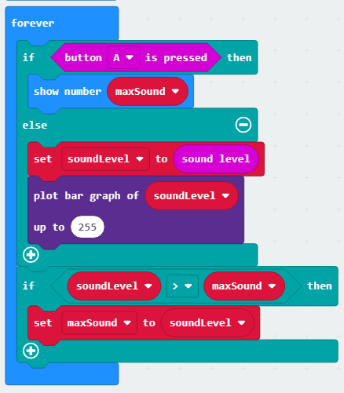

Complete Program：

Download code 2 to micro:bit board and keep the USB cable connected hen tap button
:

The output data of the serial port will be displayed. When the ambien ound increases, the output sound level of the serial port increases.

When you press the A button on the micro:bit motherboard, the LED do atrix displays the detected maximum sound level value in th nvironment at this time (Note: reset the maximum value by pressing th eset button on the back of the micro:bit). When applauding, it display he sound level pattern.

4. Test Result

Download code 1 to micro:bit board and keep the USB cable connected hen applauding, the LED dot matrix displays the
❤ pattern. When the outside world is quiet, i ill display theattern.

### Project 12: Bluetooth Wireles ommunication

1. Description

Micro:bit board boasts a built-in Bluetooth 5.1 low-power BLE and 2.4GH ntenna, which can be used for Bluetooth and 2.4G wireles ommunication.

In this project, we will connect a cellphone or iPad to Micro:bi otherboard to complete the wireless connection.

2. Components Needed

<table>
<colgroup>
<col style="width: 32%" />
<col style="width: 33%" />
<col style="width: 33%" />
</colgroup>
<tbody>
<tr class="odd">
<td>

</td>
<td>

</td>
<td></td>
</tr>
<tr class="even">
<td>Micro:bit * 1</td>
<td>USB Cable * 1</td>
<td></td>
</tr>
</tbody>
</table>

  . Test Code

Download link：<https://microbit.org/get-started/user-guide/mobile/>
（Android can refer to it）

Let's take ios device as an example:

Enter the page：

[https://www.microbit.org/get-started/user-guide/ble-ios/](https://www.microbit.org/get-started/user-guide/ble-ios/)
，tap“Download pairing HEX file”to download the micro:bit firmware t he folder you created or to your desktop, then burn the downloade irmware into the micro:bit motherboard.

Open 
on an iPhone device (phone /iPad), then search“micro:bit”in APP stor nd click
“”t nstall the corresponding APP .

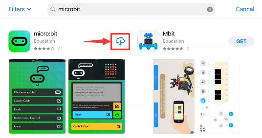

Pair the Micro:bit motherboard with a cellphone or iPad, then open th luetooth.

After installing APP successfully, click
t nter app. Plug in Micro:bit motherboard, click“Choose Micro:bit”t tart Bluetooth pairing.

Click“Pair a new Micro:bit”

Press and hold button A and B, then press and release the reset button ED dot matrix will show a pattern. At last, release the button A and  t same time and click“Next

Make the displayed pattern on Micro:bit board as same as the one o Pad, click“Next”.

Click“Next”and “pair “, after a few seconds, the pairing is successfu nd the LED dot matrix on the micro:bit motherboard displays the "√ attern.

After connecting successfully, design code via the APP .

Select“Creat ode”（Clickand the dialo oxwill appear ， clic cont nter the programming interface.

Set the code program name to "1", then clic cont ave the program.

Tap“Flash”to enter the upload code program interface. The default cod rogram is the program just saved with the name "1", then click
“Flash”to upload the code program "1".

If upload the program successfully, as shown below:

The LED dot matrix on the motherboard displays the jumping "heart attern.

## Microbit Robot Car Tutorial

### Project 13：RGB Module

1. Description

The RGB color mode is a color standard in the industry. It obtain arious colors by changing the three color channels of red (R), gree G), and blue (B) and integrating them. RGB denotes the three colors o ed, green and blue.

The monitors mostly adopt the RGB color standard, and all the colors o he computer screen are composed of the three colors of red, green an lue mixed in different proportions. A group of red, green and blue i he smallest display unit. Any color on the screen can be recorded an xpressed by a set of RGB values.

RGB color mixing is like having red, green and blue lamps. When thei ight is superimposed on each other, the colors are mixed, while th rightness is equal to the sum of the brightness of the three lamps. Th ore mixed, the higher the brightness, therefore, it is often calle even-color LED.

<table>
<colgroup>
<col style="width: 22%" />
<col style="width: 25%" />
<col style="width: 22%" />
<col style="width: 29%" />
</colgroup>
<tbody>
<tr class="odd">
<td>Color</td>
<td>RGB value（R,G,B）</td>
<td>Color</td>
<td>RGB value（R,G,B）</td>
</tr>
<tr class="even">
<td>Black</td>
<td>255,255,255</td>
<td>Red</td>
<td>0,255,255</td>
</tr>
<tr class="odd">
<td>Green</td>
<td>255,0,255</td>
<td>Blue</td>
<td>255,255,0</td>
</tr>
<tr class="even">
<td>Cyan</td>
<td>255,0,0</td>
<td>Dark red</td>
<td>0,255,0</td>
</tr>
<tr class="odd">
<td>Yellow</td>
<td>0,0,255</td>
<td>White</td>
<td>0,0,0</td>
</tr>
<tr class="even">
<td>......</td>
<td>.......</td>
<td>......</td>
<td>......</td>
</tr>
</tbody>
</table>

Since our LED lights are [common anode](javascript:;), 255 is the lowes alue and 0 is the brightest value.

In this project, we are going to make two experiments. One is to mak wo RGB lights light up seven colors of red, green, blue, cyan, purple ellow and white, the other is to make two RGB lights gradually displa ifferent colors.

2. Preparation

（1）Insert the micro: bit correctly into the expansion board

（2）Connect the battery holder to the expansion board

（3）Turn on the power switch（Slide the POWER switch to ON end）

（4）Connect the micro：bit and computer via a micro USB cable

（5）Open the Web version of Makecode

If you choose to load the project by importing the Hex file, you do
not need to manually add the Mini car extension library.

If you want to drag the code manually, add the Mini car extension
library first(you can refer to the "1. Development environment
configuration "file).

3. Schematic Diagram

Working Principle: Microbit, as the host, sends instructions to th lave STC8G1K08 through the IIC, then the slave outputs PWM to contro GB LED lights. This greatly saves the IO ports of the microbit board or the IIC enables to control two motors and two RGB LED lights.

4. Code Explanation

If you don't add the library file, then the MiniCar bar will not appear.

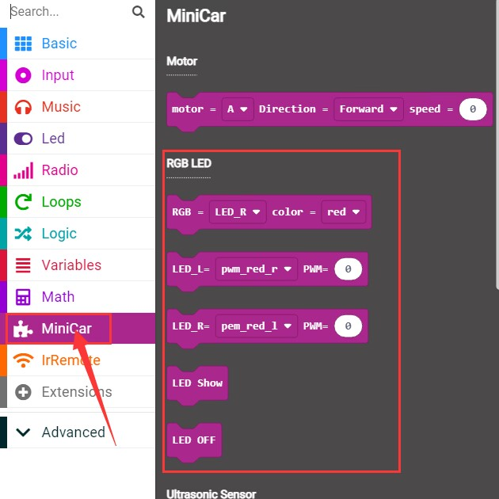

Thi s used for color setting, the first option is left and right RG ights, the second option is color, which has "red, green, blue, cyan urple, yellow, white and led off.

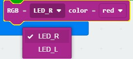

Thi s used to set the left RGB LED, you need to select the color, the nput a value from 0 to 255 at PWM. Since our LED lights are [commo node](javascript:;),the lower the pwm value, the brighter the light nd the higher the value, the darker the light.

Thi s used to set the right RGB LED

Thi s the breathing light display we have written in the library

Thi an be used to turn off all RGB LED lights. You can assign a value o 55 to the PWM of this lamp if you only want to turn a single light off.

5. Test Code

You can upload the code 1 directly from the tutorial (read th Development Environment Configuration" file if in doubt).

Or add the code blocks manually:

Enter“MiniCar”→“LED OFF”(turn off the front LED so as not to affect th urrent LED program)

Drag out the “set RGB color module”block in the “MiniCar”bar and set i s "LED_R" and "LED_L" respectively, and set the color to "red".

Find the delay code block in the "Basic" bar and add it, then set th elay time to 1s.

Add other colors in the same way

Complete Program：

After uploading the code, the RGB LED will switch every second in th rder of red, green and blue.

6. Breathing Lights

The code is as follows:

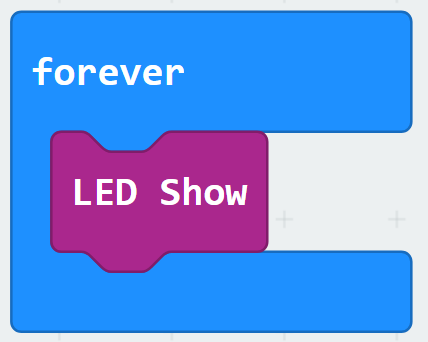

After uploading the code, the RGB LED will be red, and then green, the  mixture of red and green will appear. When the red light is off, th lue light will be on, then a mixture of blue and green will b isplayed.

However, when the green light is off, the red light will be on, then  ixture of blue and red will be shown. In closing the red and blu ights will be off.

7. Expanded Knowledge

1s = 1000ms ； 1ms = 1000us ；1us = 1000nm

Then the 1000 ms we used in the project is 1 s

Maybe you are capable of configuring the light color you want b ourself. You solely need to configure the red, green and blue PWM fo he RGB.

### Project 14: Motor Driving

1. Description

The robot car is equipped with two DC geared motors, which are develope n the ordinary DC motors. It enjoys a matching gear reduction box hich provides a lower speed but a larger torque. Furthermore, differen eduction ratios of the box can provide different speeds and torques.

The reduction motor is the integration of gearmotor and motor, which i pplied widely in steel and machine industry.

Moreover, the car boasts a STC8G1K08 and a HR8833MTE chip. To save th O ports, we send instructions to the STC8G1K08 chip through the IIC o he micro:bit, then the STC8G1K08 chip controls the HR8833MTE chi ccording to the corresponding instructions to control the rotatio irection and speed of the two DC reduction motors (the control proces s as follows).

2. Preparation

（1）Insert the micro: bit correctly into the expansion board

（2）Connect the battery holder to the expansion board

（3）Turn on the power switch（Slide the POWER switch to ON end）

（4）Connect the micro：bit and computer via a micro USB cable

（5）Open the Web version of Makecode

If you choose to load the project by importing the Hex file, you do
not need to manually add the Mini car extension library.

If you want to drag the code manually, add the Mini car extension
library first(you can refer to the "1. Development environment
configuration "file).

3. Circuit Diagram

4. Code Explanation

Drag the motor control module from the MiniCar bar to the programmin rea. If you don't add the library file, then the MiniCar bar will no ppear.

Code block for motor control:

①：It is used to select AB motors

②：It is used to select the direction of the motor

③：It is used to set the motor speed（range:0~255）. You can manuall nter the speed value or click the mouse under this area to set it.

5. Test Code

You can upload the code directly from the tutorial (read th Development Environment Configuration" file if in doubt).

Or add the code blocks manually:

The function we want to achieve is to control the car at a speed of 10 o go forward for 1s, go back for 1s, turn left for 1s, turn right fo s and stop for 1s. (combine the "4. Code blocks for motor control utorial)

Step 1：Set the code function to the car forward for 1s

Set“A”“B”motor to“Forward”, and the speed to“100”，then drag out th elay module in the basic bar and set the time to 1s.

Step 2：Set the code function to the car backward for 1s

Set“A”“B”motor to“Backward”, and the speed to“100”，then drag out th elay module in the basic bar and set the time to 1s.

Step 3：Set the code function to make the car turn left for 1s

Set motor“A”to“Backward”, and the speed to 100，“B”to“Forward”and th peed to 100，then drag out the delay module in the basic bar and se he time to 1s.

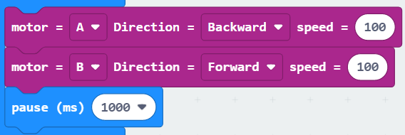

Step 4：Set the code function to make the car turn right for 1s

Set motor“B”to“Backward”, and the speed to 100，“A”to“Forward”and th peed to 100，then drag out the delay module in the basic bar and se he time to 1s.

Step 5： Set the code function to make the car stop

Set the speed of“A”“B”motor to“0”，and the delay time to 1s.

Complete Program：

6. Test Result

Upload the code to the micro:bit board, then turn on the switch at th ack of the car, then the car will go forward for 1s, backward for 1s urn left for 1s, turn right for 1s and stop for 1s.

7. Expanded Knowledge

How to make the motor turn left?

①Set the A motor to backward, the B motor to forward, which is a lef urn at the center of the distance between the two wheels.

②Set the A motor to stop, the B motor to forward, which is a left tur t the center of the left motor.

③Set the AB motors to forward, then set the speed of the motor on th eft to be smaller than that on the right. In this way, the car wil ove to the left when moving forward due to the speed difference, an he greater the speed difference, the greater the deviation.

④Set the AB motors to backward, then set the speed of the motor on th eft to be greater than that on the right. In this way, the car wil ove to the left when moving backward due to the speed difference, an he greater the speed difference, the greater the deviation.

The principle of making the car turn right is the same, you only need t witch the motor.

### Project 15: Light Tracking Smart Car

1. Description

Do you find that the street lights outside will light up when it get ark and goes off at dawn? Next, we will learn the main component tha auses this circumstance, which is "photoresistor".

Working Principle: It is a resistor made by the photoelectric effec f a semiconductor, which is very sensitive to ambient light, thus it esistance value will vary with different light intensity.

We seek to use this feature to design a circuit and generate  hotoresistor module. The signal end of the module is connected to th nalog port of the microcontroller.

When the light intensity increases, the resistance decreases, and th oltage of the analog port rises, that is, the analog value of th icrocontroller goes up. Otherwise, when the light intensity decreases he resistance increases, and the voltage of the analog port declines hat is, the analog value of the microcontroller becomes smaller herefore, we can use the photoresistor to read the corresponding analo alue and sense the light intensity in the environment.

It is commonly applied to light measurement, control and conversion ight control circuit as well.

In this project, we will use the left and right photoresistors t ontrol the car to find the light source.

2. Preparation

（1）Insert the micro: bit correctly into the expansion board

（2）Connect the battery holder to the expansion board

（3）Turn on the power switch（Slide the POWER switch to ON end）

（4）Connect the micro：bit and computer via a micro USB cable

（5）Open the Web version of Makecode

If you choose to load the project by importing the Hex file, you do
not need to manually add the Mini car extension library.

If you want to drag the code manually, add the Mini car extension
library first(you can refer to the "1. Development environment
configuration "file).

3. Circuit Diagram of Photoresistor

4. Code Explanation

Find "LDR_R" and "LDR_L" under "Photosensitive sensor" in the “Min ar”.

①“LDR_R”code block：It can obtain the value of the right photoresistor.

②“LDR_L”code block：It can obtain the value of the left photoresistor.

5. Read the Photoresistor

You can upload the code “1-ReadLight.hex”directly from the tutoria read the "Development Environment Configuration" file if in doubt).

Or add the code blocks manually:

Step 1：First, set up a code framework for serial port printing, the ind the "serial redirect to USB" code block in the "Serial" bar, an rag it into the "on start" block.

Step 2：Find the "serial write value" code block in the "Serial" bar nd put it into the“forever”module.

Enter“LDR_R:”in the “serial write value” block, and put it into th umeric area:

Add the left photoresistor in the same way, then place a delay of 1s.

Complete Program：

View the value printed by the serial port if your computer is Window 0.

If the operating system is less than Windows 10, the serial port tool i equired for printing. The software installation and tutorial ar ontained in the 3. Cool Term Software folder.

6. Flow Chart

7. Light Tracking Smart Car

Directly upload "2-LightFollow.hex" in the "Programs" folder.

Code“Detect the analog value of photoresistors”

Create two new variables in "Variables" and call them "led_l" an led_r"

Put the two setting variable module under the "forever" and assign th alue of "LDR_L" to "ldr_l" and the "LDR_R" to "ldr_r" respectively.

Find the "if" module in the "Logic" bar and add it to "forever" .

Code“The value on the left and the right are both greater than 650?”

Enter "Logic"→ "Boolean"→ "and", then put it into "if" .

Tap “Logic”→ “Comparison”→ “=”, then put it into the boxes on eithe ide of "and". Set the “=” on the left to“ldr_r” \> 650, the right “=”
to ldr_l” \> 650.

"ldr_r" and "ldr_l" modules are in the "Varlables" bar. The "=" can b witched to "\>" by clicking the mouse. Input 650 to the left of "=" .

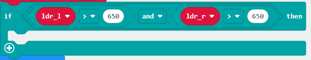

Code ”The car goes forward ”

If the value on the left and the right are both greater than 650, the he car goes forward. Add the “The car goes forward” code into "if" an et the speed to100.

If the condition is not met, "else if" will be executed. Taptwice to add "else if" .

Code“The value on the left is greater than 650 and the right is les han or equal to 650?”

Tap“ldr_r”statement→“=”，then change it to“≤”

Code ”The car turns left ”

If the value on the left is greater than 650 and the right is less tha r equal to 650, then the car will turn left. Add the “The car turn eft” code into "else if" and set the speed to 100.

If the condition is not met, "else if" will be executed. Tap t dd "else if" .

Code“The value on the left is less than or equal to 650 and the right i reater than 650?”

Tap“ldr_l”statement→“=”，then change it to“≤”

Code ”The car turns right ”

If the value on the left is less than or equal to 650 and the right i reater than 650, then the car turns right.

Add the “The car turns right” code into "else if" and set the speed t 00.

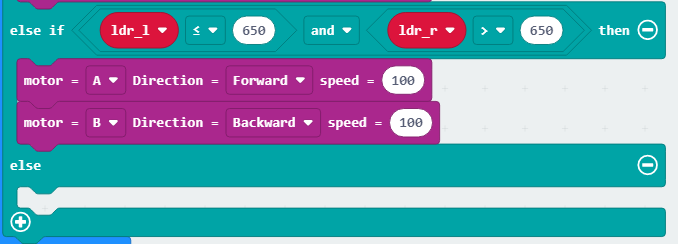

If the conditions are not met, the car will stop. Add the“The car stops” code into "else”.

Complete Program：

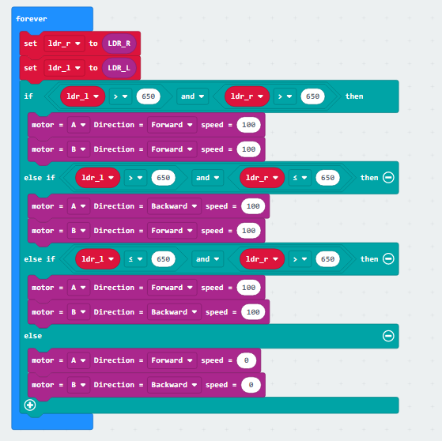

8. Test Result

After uploading the code, turn on the switch on the rear of the car hen you can use the flashlight to play with the car. It’s best used i  relatively dark environment. When the ambient light intensity is abov 50, the car will keep moving.

9. Expanded Knowledge

If you have questions about the code blocks, please tap it:

https://makecode.microbit.org/reference/

### Project 16: Line Tracking Smart Car

1. Description

The car comes with two line tracking sensors and two potentiometers.

Besides, it adopts a TCRT5000 IR tube, which contains an IR emittin ube and an IR receiving tube. When the infrared signals of the emittin ube is received by the receiving tube through reflection, th esistance of the receiving tube will change, which is generall eflected in the voltage change on the circuit.  

The resistance varies depending on the intensity of the infrared signal eceived by the receiving tube, which is often in the color of th eflecting surface and its distance of the receiving tube. At the tim f detection, black is high level active and white is low level active. 

Working Principle: When the car runs above a white road, the I mitting tube installed under the car emits infrared signals to detec he road and the receiving tube will receive signals sending back. The he output end outputs low level(0). When it detects black lines, i utputs high level(1).

Send the detected signal to the I/O port of the microcontroller. When i s high level (1), then the car is on the black line. Similarly, when i s low level (0), then the car is on the white ground.

The two line tracking sensors on the expansion board are controlled b 12 and P13 of the micro bit control board, the left one is controlle y P13, and the right is controlled by P12. Adjust the line trackin ensors, and place the car on a black ground, twist the potentiometer ntil the LED (D3,D2) is on, then adjust them until it is off.

2. Preparation

（1）Insert the micro: bit correctly into the expansion board

（2）Connect the battery holder to the expansion board

（3）Turn on the power switch（Slide the POWER switch to ON end）

（4）Connect the micro：bit and computer via a micro USB cable

（5）Open the Web version of Makecode

If you choose to load the project by importing the Hex file, you do
not need to manually add the Mini car extension library.

If you want to drag the code manually, add the Mini car extension
library first(you can refer to the "1. Development environment
configuration "file).

3. Circuit Diagram

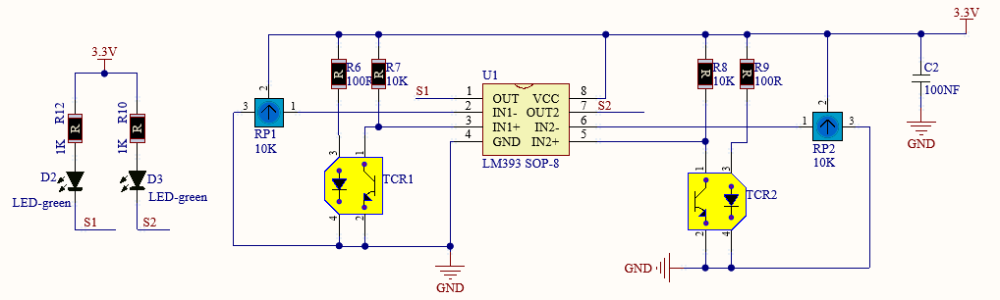

4. Read the Line Tracking Sensor

You can upload the code “1-ReadSensor.hex”directly from the tutoria read the "Development Environment Configuration" file if in doubt).

Or add the code blocks manually:

Step 1：Set up a code framework for serial port printing.

Go to“Serial”→“serial redirect to USB”，then put it into“on start”block.

Step 2：Tap“Serial”→“serial write value”, then put it into“forever”.

Enter“Pins”→“digital read pin P0 ”, then put it at 0 of the“serial writ alue “x”=0”block.

The left line tracking sensor is controlled by P13, and the right i ontrolled by P12. Here we take the right one as an example to read th igital signal.

Click the drop-down triangle button behind P0 to select P12 and chang x" to "digital signal".

Add a 1s delay

Check the value printed by the serial port if your computer is Window 0

If the operating system is less than Windows 10, the serial port tool i equired for printing. The software installation and tutorial ar ontained in the 3. Cool Term Software folder.

5. Flow Chart

6. Description of Line Tracking Sensor

If you don’t add the library file, then“MiniCar”will not appear.

“Line Tracking”is used to eliminate complex judgment expressions.

<table>
<colgroup>
<col style="width: 35%" />
<col style="width: 18%" />
<col style="width: 21%" />
<col style="width: 23%" />
</colgroup>
<tbody>
<tr class="odd">
<td>Value of Line Tracking</td>
<td>P13(Left）</td>
<td>P12（Right）</td>
<td>State of the car</td>
</tr>
<tr class="even">
<td>1</td>
<td>0</td>
<td>1</td>
<td>turn right</td>
</tr>
<tr class="odd">
<td>2</td>
<td>1</td>
<td>0</td>
<td>turn left</td>
</tr>
<tr class="even">
<td>3</td>
<td>1</td>
<td>1</td>
<td>go forward</td>
</tr>
<tr class="odd">
<td>0</td>
<td>0</td>
<td>0</td>
<td>stop</td>
</tr>
</tbody>
</table>

7. Test Code

You can upload the code “2-TrackingSmart.hex”directly from the tutoria read the "Development Environment Configuration" file if in doubt).

Or add the code blocks manually:

Code”Read the return value of the sensor”

Enter“Variable”bar to create a“value”variable, and put “set th alue”module into“forever”.

Tap“Mini Car”→“Line Tracking”, and put it at 0 of the “set th alue”module .

Code”Judge if the value=1”

Go to“Logic”→“if”, then put it into “forever”.

Tap“Logic”→“=”, then put it into true of“if”module.

Enter“Variable”→“value”, and put it in the left side of “=”, then inpu umber 1 at the right side of “=”.

Code”The car turns right”

If the value is equal to 1, the car will turn right.

Add ”The car turns right”code into "if" module and set the speed to 7 if you have any questions about the car drive, please refer to Projec 4)

if the value is not equal to 1, "else if" will be executed, then clicktwice to add it.

Code”Judge if the value=2”

Replicate the "=" code block into the "else if" diamond box and chang he number to "2" at the right side of the "="

Code”The car turns left”

If the value is equal to 2, the car will turn left.

Add ”The car turns left”code into "else if" and set the speed to 70.

If the value is not equal to 2, "else if" will be executed, then click t dd it.

Code”Judge if the value=3”

Replicate the "=" code block into the "else if" diamond box and chang he number to "3" at the right side of the "="

Code”The car goes forward”

If the value is equal to 3, the car will go forward.

Add ”The car goes forward”code into "else if" and set the speed to 70.

Code”The car stops”

If none of the above conditions are met, the stop code in else will b xecuted.

Complete Program：

8. Test Result

Upload the code and open the power switch on the car. Place the car o he line tracking paper, then it will follow the black line to move.

### Project 17: Ultrasonic Following and Obstacl voidance

1. Description

The ultrasonic sensor uses sonar to determine distance to an object lik ats do. It will emit the ultrasonic waves after trigger signals. Whe he ultrasonic waves encounter the object and are reflected back, th odule will output an echo signal, thus, it can determine the distanc f object from the time difference between trigger signal and ech ignal.

As the picture shown, it is like two eyes. One is transmitting end, th ther is receiving end.

In this project, we will learn ultrasonic ranging, ultrasonic followin nd ultrasonic obstacle avoidance.

2. Specifications

- Working voltage：DC 3.3V-5V

- Working current：50mA－100mA，normally is 65mA

- Maximum power：0.5W

- Maximum detection distance：3m

- Blind spot：less than 4cm

- Sensing angle：less than 15 degrees

- Interface：4pin interface with a spacing of 2.54mm

- Positioning hole ：3mm diameter

- Working temperature： -10℃ - +60℃

- Dimension：49mm\*22mm\*19mm

3. Working Principle

(1)Pull down TRIG then trigger high level signals with least 10us;

(2)After triggering, the module will automatically send eight 40KH ltrasonic pulses and detect whether there is a signal return;

(3)If there is a signal return, when ECHO outputs a high level, then th uration of the high level is the time from transmission to reception o he ultrasonic waves. Then test distance = high level duration
\*340m/s\*0.5. 

4. Preparation

（1）Insert the micro: bit correctly into the expansion board

（2）Connect the battery holder to the expansion board

（3）Turn on the power switch（Slide the POWER switch to ON end）

（4）Connect the micro：bit and computer via a micro USB cable

（5）Open the Web version of Makecode

(6 ) Install the ultrasonic to the expansion board

If you choose to load the project by importing the Hex file, you do no eed to manually add the Mini car extension library.

If you want to drag the code manually, add the Mini car extensio ibrary first(you can refer to the "1. Development environmen onfiguration "file).

5. Code Explanation

If you don’t add the library file, then“MiniCar”will not appear.

“Ultrasonic "can be used to obtain the distance of ultrasonic induction 14 is Trig and P15 is Echo.

6. Code for Ultrasonic Ranging

Upload the“code-1.hex”file directly from the tutorial

Complete Program：

Check the value printed by the serial port if your computer is Window 0

If the operating system is less than Windows 10, the serial port tool i equired for printing. The software installation and tutorial ar ontained in the 3. Cool Term Software folder.

7. Flow Chart of Ultrasonic Following

8. Code for Ultrasonic Following

You can upload the code “code-2.hex”directly from the tutorial (read th Development Environment Configuration" file if in doubt).

Or add the code blocks manually:

Code ”Assign the value detected by ultrasonic to distance“

Create a new variable named "distance" and assign the value measured b he ultrasonic sensor to it.

Add“if”block

Code ”Distance≥10 and≤30?“

Add "and" to the condition box of the "if" block, and add "=" to bot ides of "and" , then change the left "=" to "distance ≥ 10", the "=" o he right to "distance ≤ 30".

Code ”The car goes forward“

If distance≥10 and≤30, then the car goes forward.

Add the ”The car goes forward“ Code into “if“, and set the speed to 100.

If the condition is not met, "else if" will be executed, then clicktwic o add it.

Code ”Distance≤ 6?“

Add "=" into else if and set it to“distance ≤ 6”

Code ”The car goes backward“

If distance≤6, then the car goes backward.

Add the ”The car goes backward“ Code into “else if“, and set the spee o 100.

If the condition is not met, "else if" will be executed, click t dd it.

Code ”Distance \>6 and \<10 or \>30?“

Add“or”block into else if, then add “distance ＞ 30”at “or”on the righ ide.

Add“and”to the right side of“or”

Add“＞”to the left side of “and”, add “＜”to the right side

Set the left side of the "and" code block to "distance \> 6" and th ight side to "distance \< 10".

Code ”The car stops“

If distance \>6 and \<10 or \>30, the the car will stop.

Add Code ”The car stops“ into else if and set delay time to 300ms.

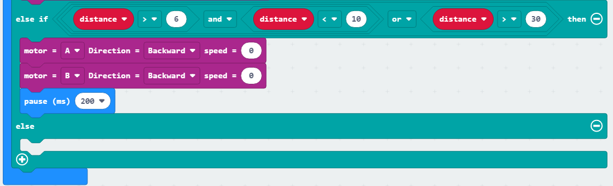

Tapto delete the else

Complete Program：

  . Flow Chart of Ultrasonic Obstacle Avoidance

10. Code for Ultrasonic Obstacle Avoidance

Upload the code“code-3.hex” directly from the tutorial

Code ”Assign the value detected by ultrasonic to distance“

Create a new variable named "distance" and assign the value measured b he ultrasonic sensor to it.

Code ”Distance \>10？“

Add if code block and set the condition to distance \>10

If the distance \>10, then the car will go forward.

Add the speed to 70

If the condition is not met, click
 t dd else, and add the car turns left code to it and set the speed to 70 elay in 200ms.

Complete Program：

Upload the code and open the power switch on the car. If there is a bstacle in front of the car within 10cm, the car will turn left.

### Project 18: IR Remote Control Smart Car

1. Description

There is no doubt that infrared remote control is ubiquitous in dail ife. It is used to control various household appliances, such as TVs tereos, video recorders and satellite signal receivers. It is compose f infrared transmitting and infrared receiving systems, that is, a nfrared remote control, an infrared receiving module and a single-chi icrocomputer capable of decoding.​

The 38K infrared carrier signal emitted by remote controller is encode y the encoding chip in the remote controller. It is composed of  ection of pilot code, user code, user inverse code, data code, and dat nverse code. The time interval of the pulse is used to distinguis hether it is a 0 or 1 signal and the encoding is made up of these 0,  ignals.

The user code of the same remote control is unchanged. The data code ca istinguish the key.

When the remote control button is pressed, the remote control sends ou n infrared carrier signal. When the IR receiver receives the signal he program will decode the carrier signal and determines which key i ressed. The MCU decodes the received 01 signal, thereby judging wha ey is pressed by the remote control.

Infrared receiver we use is an infrared receiver module. Mainly compose f an infrared receiver head, it is a device that integrates reception mplification, and demodulation. Its internal IC has complete emodulation, and can achieve from infrared reception to output and b ompatible with TTL signals. Additionally, it is suitable for infrare emote control and infrared data transmission.

The infrared receiver module on the expansion board of the car i ontrolled by the P16 of the micro bit control board.

2. Specifications

- Working Voltage：3.3-5V（DC）

- Interface：3PIN

- Output Signal：Digital signal

- Receiving Angle：90 degrees

- Frequency：38khz

- Receiving Distance: about 5m

3. Circuit Diam

4. Preparation

（1）Insert the micro: bit correctly into the expansion board

（2）Connect the battery holder to the expansion board

（3）Turn on the power switch（Slide the POWER switch to ON end）

（4）Connect the micro：bit and computer via a micro USB cable

（5）Open the Web version of Makecode

If you choose to load the project by importing the Hex file, you do no eed to manually add the Mini car extension library.

If you want to drag the code manually, add the Mini car extensio ibrary first(you can refer to the "1. Development environmen onfiguration "file).

5. Code for Receiving IR Signal

Upload the code“code-1.hex” directly from the tutorial

Or add them manually:

Put the IR pin setting into “on start”, and set the pin to P16

Complete Program：

Check the value printed by the serial port if your computer is Window 0

If the operating system is less than Windows 10, the serial port tool i equired for printing. The software installation and tutorial ar ontained in the 3. Cool Term Software folder.

Through the obtained values, we made an key value table for the infrare emote control:

6. Flow Chart

7. Code for IR Remote Control Smart Car

Upload the code“code-2.hex” directly from the tutorial

Or add them manually:

Code ”Assign the signal received by the IR receiver to Value”

Put the IR pin setting into “on start”, and set the pin to P16, the reate a variable named value.

Assign the value received of the IR receiver to Value in“forever”

Add “if”into “forever”, then tap fo  times, then click.

Enter“value = 70”in the first if box，then add the car goes forwar ode, set the speed to 100.

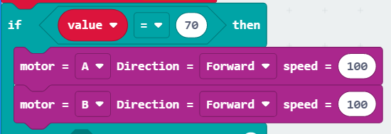

Enter“value = 68”in the second if box，then add the car turns left code et the speed to A：70，B：130.

Enter“value = 67”in the third if box，then add the car turns right code et the speed to A：130，B：70.

Enter“value = 21”in the next if box，then add the car goes backwar ode, set the speed to 100.

Enter“value = 64”in the last if box，then add the car stops code, se he speed to 0.

After uploading the code, then we can use the IR remote control t ontrol the car to move.

### Project 19: Multi-purpose Bluetooth Smar ar

1. Description

The micro:bit control board boasts a Bluetooth, which enables to contro nd communicate with the micro:bit. Furthermore, it supports bot ndroid and IOS devices (phones and ipads) and the micro:bit can sen ignals back to a mobile phone or computer via it.

Moreover, it can communicate with the mobile phone Bluetooth APP, whic s a software that empowers to control the micro:bit external device.

In this project, we will learn its interface and function of every ico nd use it to connect the Bluetooth of the micro:bit in a way that read he control characters sent by each button.

- （Bluetooth Antenna and Chip）

2. Preparation

（1）Insert the micro: bit correctly into the expansion board

（2）Connect the battery holder to the expansion board

（3）Turn on the power switch（Slide the POWER switch to ON end）

（4）Connect the micro：bit and computer via a micro USB cable

（5）Open the Web version of Makecode

If you choose to load the project by importing the Hex file, you do no eed to manually add the Mini car extension library.

If you want to drag the code manually, add the Mini car extensio ibrary first(you can refer to the "1. Development environmen onfiguration "file).

3. Add the Library File of Bluetooth

Tap“Extensions”

Enter "bluetooth" in the search box, then click the first bluetooth luetooth and radio can not work together due to micro:bit hardware hus their extension libraries are incompatible. When you install th luetooth extension library, please remove the radio extension.

4. Code for Bluetooth Receiving Data

Import the“Read-the-data-of-Bluetooth-1.hex” file

Or you could edit code step by step in the editing area.

1)  Enter“Advanced” →“Serial” → “serial redirect t    USB”

Place it into“on start”

2)  Click“Bluetooth”→“on bluetooth connected”

Go to“Basic”to move“show icon”block into“on bluetooth connected” block.

3)  Click“Variables”→“Make a Variable...”→“New variable name：”dialo    box.

Input“connected” and click “OK” to create variable“connected”.

Drag“set connected to 0” under block “show icon” and change 0 into 1.

4)  Go to“Loops”to move block“while true do...”into“on bluetoot    connected”block.

Enter“Logic”to drag out “=”block.

Click“Variables” to drag “connected” into left box of “=” block an hange 0 into 1.

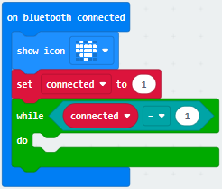

5)  Then we generate variable“rec_data”in same way.

Then drag out“set rec_data to 0”and place it into block“whil onnected=1 do...”block.

Click“Bluetooth” →“more” →“bluetooth uart read until new line( )”

Keep it into 0 box and click triangle button to select \#.

6)  Go to“Advanced”→“Serial”→“serial write string”

Move it below“set rec_data...until#” block

And combine variable“rec_data”with“serial write string”block.

7)  Click“Advanced” →“Serial” →“serial write line” and edit code strin    as follows:

8)  Go to“Bluetooth”→“on bluetooth disconnected”

Copy“show icon”block and keep it into block“on bluetooth disconnected”

Click triangle button t elect“”pattern.

Complete Program

Click “Setting”→“Project Settings”, and input“Read the data o luetooth”, then set No Pairing to on.(Only drag code blocks manuall equires this operation)

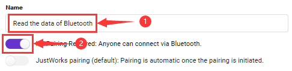

Check the value printed by the serial port if your computer is Window 0

S

If the operating system is less than Windows 10, the serial port tool i equired for printing. The software installation and tutorial ar ontained in the 3. Cool Term Software folder.

5. Download APP

Android System：

Find "keyes mini car" in the Google Store

Tap install

IOS System：

Open App Store

Search keyes mini car，then download the APP to your phone.

6. Introduction of APP

①Click“connect” to find“BCC micro:bit”Bluetooth.

If "is connected" is displayed, the connection is successful

②Disconnect the Bluetooth

③It is used to control the car to go forward. Press:“F” Release:“S”

④It is used to control the car to turn left. Press:“L” Release:“S”

⑤It is used to control the car to turn right. Press:“R”Release:“S”

⑥It is used to control the car to go backward. Press:“B”Release:“S”

⑦This is the button of car function mode. After clicking, four pattern ill appear, as follows:

The first is obstacle avoidance button, the second is following button he third is the line tracking button, the fourth is the light trackin utton.

⑧It is used to control the RGB，tap it then colors will appear：red reen, blue，yellow， cyan，purple and black.

⑨It is used to control the speaker，tap it then piano keys will appear：

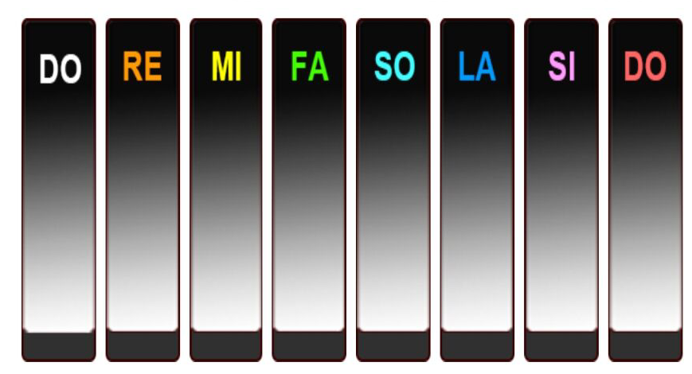

<table>
<colgroup>
<col style="width: 20%" />
<col style="width: 22%" />
<col style="width: 57%" />
</colgroup>
<tbody>
<tr class="odd">
<td>Letter</td>
<td>Sound</td>
<td><a href="javascript:;">Numbered Musical Notation</a></td>
</tr>
<tr class="even">
<td>C</td>
<td>D0</td>
<td>1</td>
</tr>
<tr class="odd">
<td>D</td>
<td>RE</td>
<td>2</td>
</tr>
<tr class="even">
<td>E</td>
<td>MI</td>
<td>3</td>
</tr>
<tr class="odd">
<td>F</td>
<td>FA</td>
<td>4</td>
</tr>
<tr class="even">
<td>G</td>
<td>SO</td>
<td>5</td>
</tr>
<tr class="odd">
<td>A</td>
<td>LA</td>
<td>6</td>
</tr>
<tr class="even">
<td>B</td>
<td>SI</td>
<td>7</td>
</tr>
</tbody>
</table>

7. Flow Chart

8. Code for Multi-purpose Bluetooth Smar ar

This part of the code is a combination of the previous projects:

Code Explanation：

“Q”: Obstacle avoidance mode “W”: Following mode

“E”: Line tracking mode “T”: Light tracking mode “A”: Stop mode

“LED OFF“ module is used to clear the LED status of the previous code

If the bluetooth is disconnected, the micro：bit wil isplay

If the bluetooth is connected, the，micro：bit wil isplay

The control function is used for Bluetooth controls car. If th luetooth receives the character "F", the car will go forward . You ca lick the arrow on the right to check the code

1\. LED_RGB function is used to control the RGB LEDs. When receivin r", LED will be red, if "g" appears, it will be green, when receivin b" , it will be blue, when receiving "y" , it will be yellow, whe eceiving "c", it will be cyan, when receiving "p", it will be purple hen receiving "x" , it will be off.

2\. LightFollow function is used for light tracking

3\. Music function is used to control the speaker. When receiving“1” he buzzer will sound“DO”，when receiving“2”, it will sound“RE”，whe eceiving“3”, it will sound“MI”，when receiving“4”, it wil ound“FA”，when receiving“5”, it will sound “SO”，when receiving“6”, i ill sound“LA”，when receiving“7”, it will sound“SI”，when receiving“8” t will sound“DO”，when receiving“9”, it will won’t work..

4\. LineTracking function is used for line tracking

5\. Avoid function is used for obstacle avoidance

6\. UltrasonicFollow is used for following

7\. Speed buffer function is used for speed buffer. The car move orward suddenly in the static state, the head of the car will be lifte ue to the inertia, thus a buffer action of speed is needed (no buffe s needed if the speed is below 100).

