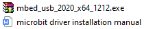
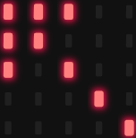
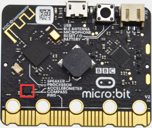
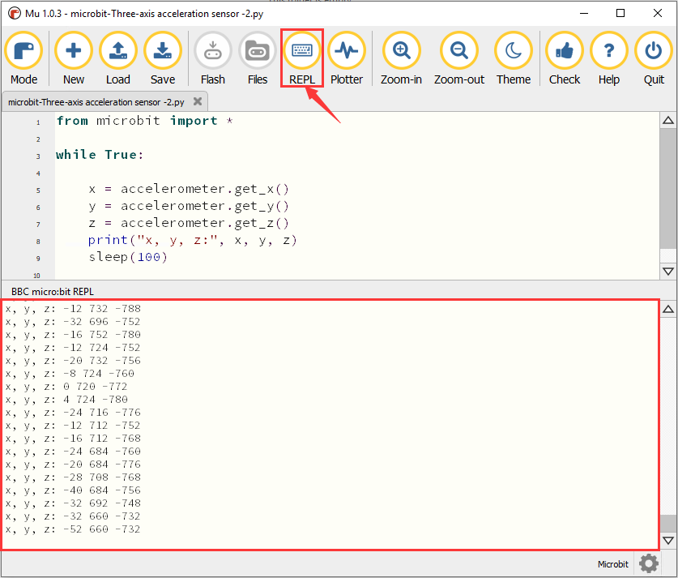
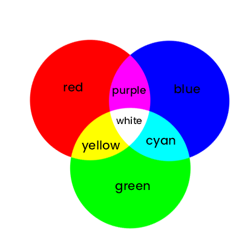
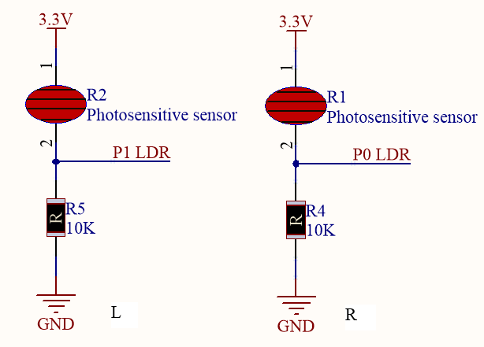
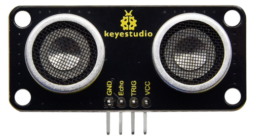

# 6. Python Tutorial

Install IDE

**Mu**

Official website of
Mu：[<u>https://codewith.mu/</u>](https://codewith.mu/)

Mu is a Python code editor for beginning programmers based on teachers
and students. The easiest way to get Mu is through the official
installer for Windows or Mac OSX (Mu no longer supports 32-bit Windows).
The current recommended version is Mu 1.0-beta 2.

Step 1- Determine the version and download the Mu installer

Find out if your computer runs Windows or Mac OSX, and open the
Explorer, click "This PC", then select Properties to know your Windows
system is 32-bit or 64-bit.


View the system type:


Open the link：<https://codewith.mu/en/download> to download the
corresponding Mu software version.


Step 2-Run the installer：

Locate the installer you just downloaded (it may be in your download
folder) and double-click to open the installer file.


Download Link of Mac OSX
System：[<u>https://codewith.mu/en/howto/1.1/install_macos</u>](https://codewith.mu/en/howto/1.1/install_macos)

<span class="mark">Windows 10 System</span>

Tap“More info”


Enter“Run anyway”


Step 3-Protocol：

Check the license, then click Install.


Step 4-Installation：

It will take a few seconds to install the Mu on your computer.


Step 5-Finish：

Tap Finish


Step 6-Start the Mu：

You can launch Mu by clicking on the icon in the Start menu, or by
typing Mu in the search box (both methods are shown below).


The main interface of Mu is shown below:


2.  **<span class="mark">Install the Driver</span>**

Micro:bit can be used without installing a driver. If your computer can
not recognize the micro:bit mainboard, then you need to install the
micro:bit driver. The micro:bit driver file
 and
the micro:bit driver installation manual are in the folder "Micro:bit
Driver Download and Installation".

You can install the micro:bit driver by going to the relevant folder and
following the instructions in the micro:bit driver installation manual.
Refer to the folder Install Microbit Driver.



3.  **<span class="mark">Compiler Setup and Toolbar
    Introduction</span>**

Set“mode”to micro bit first

Open the Mu software, click the Mode button in the menu bar and select
"BBC micro: bit" , then tap "OK".


Details about the Mu operation
page：https://codewith.mu/en/tutorials/1.1/start

More tutorials on using
Mu：[<u>https://codewith.mu/en/tutorials/</u>](https://codewith.mu/en/tutorials/)

4.  **<span class="mark">Install the Library File</span>**

Before importing the library, you need to upload a.py code to microbit.
Here we take the RGB module "code_1.py" in the tutorial as an example.

Import“keyes_MiniCar.py“file

The default directory for saving Mu is "Mu_code" file, which is located
in the root of the user directory.

Reference
links:[<u>https://codewith.mu/en/tutorials/1.0/files</u>](https://codewith.mu/en/tutorials/1.0/files)

For example, in windows, if your system is installed on the C drive of
your computer and the user name is Administrator, the path to the
mu_code directory is C:\Users\Administrator\mu\_ code. On Linux, the
path is ~/home/mu_code.

**Enter the“mu_code”file**


Replicate "keyes_MiniCar.py" library file to "mu_code" folder. The code
path is as follows:


Open the Mu software and connect the micro:bit to your computer, then
click the "Files" button and drag the "keyes_MiniCar.py" library file
into the micro:bit.


After the import is successful, you will see it in the left box.


Tap “Check”to check the code for errors. If a line appears with a cursor
or an underscore, there is an error in the program for that line.


These tips are just warnings, not code error tips.


You also need to make sure that the micro USB cable is connected to the
micro:bit and the computer, and then click the "Flash" button to
download the code to the micro:bit.


If there is an error after clicking the "Flash" button, please confirm
whether you have imported the library file to micro:bit.

Note:

If you have downloaded other programs on the micro:bit board, except the
"keyes_MiniCar.py" library file. Before programming in Micropython, you
need to import the library file into the micro: bit.

If you always use the same micro: bit board for Micropython programming,
you do not need to send the it to the micro: bit again.

5.  **<span class="mark">Add Code to Compiler</span>**

We take the first project of the basic tutorial "Heartbeat" as an
example, open the "Program" folder in the first project folder and
locate the file "microbit-Heartbeat.


Or open the Mu software and tap“microbit-Heartbeat.py”file, then drag it
to the Mu software:


as shown below:


6.  **<span class="mark">Download Code to Micro:bit</span>**

Connect the micro：bit board and the computer via the micro USB cable.

Tap “Flash” to download the code to micro：bit.


<span class="mark"></span>


If there is an error in code, you can download the code to the micro:
bit successfully, but it won't work. If sleep is sleeps, click "Flash" ,
and the code will also be downloaded to micro: bit.


After downloading, if the led matrix prompts some error messages, tap
the "REPL" button, then press the reset button of the micro: bit (not
the A and B keys) and the error message will be displayed in the REPL
box as follows:


Click the“REPL”again, the REPL mode will be turned off, and you can
refresh the new code. To make sure the code is correct, tap "Check" when
you are done to check the code for errors, as shown below, then Mu will
indicate the error in the code.


Correct the code according to the error prompt. Then click "Check" again
and Mu shows no problem on the bar below:


For more tutorials on using Mu, refer to the link：

<https://codewith.mu/en/tutorials/>


## Microbit Basic Projects

### Project 1：Heart Beat

1. Description

The sensor modules and LED dot matrix of the Microbit basic projec omes with the micro: bit mainboard.

Prepare a Micro:bit board and a USB cable. Next we will conduct a basi xperiment that a heartbeat pattern flashes on the micro:bit board.

2. Components Needed

<table>
<colgroup>
<col style="width: 32%" />
<col style="width: 33%" />
<col style="width: 33%" />
</colgroup>
<tbody>
<tr class="odd">
<td>


</td>
<td>


</td>
<td></td>
</tr>
<tr class="even">
<td>Micro:bit * 1</td>
<td>USB Cable * 1</td>
<td></td>
</tr>
</tbody>
</table>

3. Test Code

You can upload the code directly from the tutorial (read th Development Environment Configuration" file if in doubt).

Code:

```python
from microbit import *

while True:
    display.show(Image.HEART)
    sleep(500)
    display.show(Image.HEART_SMALL)
    sleep(500)

```


4. Code Explanation

<table>
<colgroup>
<col style="width: 48%" />
<col style="width: 51%" />
</colgroup>
<tbody>
<tr class="odd">
<td><strong><mark>from</mark></strong> microbit <strong>import</strong>
*</td>
<td>Import the library file of micro：bit</td>
</tr>
<tr class="even">
<td><strong>while True:</strong></td>
<td>This is a permanent loop that make the micro: bit execute the cod n the loop forever.</td>
</tr>
<tr class="odd">
<td>display.show(Image.HEART)</td>
<td>LED dot matrix displays“”</td>
</tr>
<tr class="even">
<td>sleep(500)</td>
<td>Delay in 500ms</td>
</tr>
<tr class="odd">
<td>display.show(Image.HEART_SMALL)</td>
<td>LED dot matrix displays“”</td>
</tr>
</tbody>
</table>

5. Test Result

Upload the code to the micro:bit and plug in it via a USB cable, the he LED dot matri isplays
and .

If download unsuccessfully, disconnect the micro:bit and reboot it


6. Expanded Knowledge

You can see that "Image.HEART" is equa o;
"Image.HEART_SMALL" is equal to
 his is actually written in microbit, you can directly use it.

The following is a list of built-in images. If you are interested, yo an replace "Image.HEART" in the function show () with one of th ollowing images.

• Image.HEART

• Image.HEART_SMALL

• Image.HAPPY

• Image.SMILE

• Image.SAD

• Image.CONFUSED

• Image.ANGRY

• Image.ASLEEP

• Image.SURPRISED

• Image.SILLY

• Image.FABULOUS

• Image.MEH

• Image.YES

• Image.NO

• Image.CLOCK12, Image.CLOCK11, Image.CLOCK10, Image.CLOCK9 mage.CLOCK8, Image.CLOCK7, Image.CLOCK6, Image.CLOCK5,

Image.CLOCK4, Image.CLOCK3, Image.CLOCK2,Image.CLOCK1

• Image.ARROW_N, Image.ARROW_NE, Image.ARROW_E, Image.ARROW_SE mage.ARROW_S, Image.ARROW_SW, Image.ARROW_W, Image.ARROW_NW

• Image.TRIANGLE

• Image.TRIANGLE_LEFT

• Image.CHESSBOARD

• Image.DIAMOND

• Image.DIAMOND_SMALL

• Image.SQUARE

• Image.SQUARE_SMALL

• Image.RABBIT

• Image.COW

• Image.MUSIC_CROTCHET

• Image.MUSIC_QUAVER

• Image.MUSIC_QUAVERS

• Image.PITCHFORK

• Image.PACMAN

• Image.TARGET

• Image.TSHIRT

• Image.ROLLERSKATE

• Image.DUCK

• Image.HOUSE

• Image.TORTOISE

• Image.BUTTERFLY

• Image.STICKFIGURE

• Image.GHOST

• Image.SWORD

• Image.GIRAFFE

• Image.SKULL

• Image.UMBRELLA

• Image.SNAKE，Image.ALL_CLOCKS，Image.ALL_ARROWS


### Project 2: Light Up A Single LED：

1. Description

Micro:bit motherboard consists of 25 light-emitting diodes, 5 pcs in  roup, which correspond to x and y axis, forging a 5\*5 matrix oreover, every diode locates at the point of x and y axis.

Virtually, we could control an LED by setting coordinate points. Fo nstance, set coordinate point（0，0）to turn on the LED at row 1 an olumn 1; light up LED at the row 1 and column 3, we could set （2，0 nd so on.


2. Components Needed

<table>
<colgroup>
<col style="width: 32%" />
<col style="width: 33%" />
<col style="width: 33%" />
</colgroup>
<tbody>
<tr class="odd">
<td>


</td>
<td>


</td>
<td></td>
</tr>
<tr class="even">
<td>Micro:bit * 1</td>
<td>USB Cable * 1</td>
<td></td>
</tr>
</tbody>
</table>

3. Test Code

You can upload the code directly from the tutorial (read th Development Environment Configuration" file if in doubt).

Code:

```python
from microbit import *

val1 = Image("09000:""00000:""00000:""00000:""00000:")
val2 = Image("00000:""00000:""00000:""00000:""00090:")
val3 = Image("00000:""00000:""00000:""00000:""00000:")

while True:
    display.show(val1)
    sleep(500)
    display.show(val3)
    sleep(500)
    display.show(val2)
    sleep(500)
    display.show(val3)
    sleep(500)

```

4. Code Explanation

<table>
<colgroup>
<col style="width: 48%" />
<col style="width: 51%" />
</colgroup>
<tbody>
<tr class="odd">
<td><strong>from</strong> microbit <strong>import</strong> *</td>
<td>Import the library file of micro：bit</td>
</tr>
<tr class="even">
<td><p>val1 = Image("09000:""00000:""00000:""00000:""00000:")</p>
<p>val2 = Image("00000:""00000:""00000:""00000:""00090:")</p>
<p>val3 = Image("00000:""00000:""00000:""00000:""00000:")</p></td>
<td><p>Set Image() to val1</p>
<p>Set pixel of LED on micro:bit to the value in 0~9</p>
<p>Pixel of each LED on micro:bit can be set in one of ten values</p>
<p>If set pixel to 0 (zero) ，which means in close state, literally,  s brightness, 9 is best brightness</p>
<p>Set Image() to val2</p>
<p>Set Image() to val3</p></td>
</tr>
<tr class="odd">
<td><strong>while True:</strong></td>
<td>This is a permanent loop that makes micro:bit execute the code o t.</td>
</tr>
<tr class="even">
<td><p>display.show(val1)</p>
<p>sleep(500)</p>
<p>display.show(val3)</p>
<p>sleep(500)</p></td>
<td>LED at (1,0) blinks for 0.5s</td>
</tr>
<tr class="odd">
<td><p>display.show(val2)</p>
<p>sleep(500)</p>
<p>display.show(val3)</p>
<p>sleep(500)</p></td>
<td>LED at (3,4) flashes for 0.5s</td>
</tr>
</tbody>
</table>

5. Test Result

After downloading code, plug in power with a USB cable, you will see th ED at(1,0) flashes for 0.5s then the LED at (3,4) blinks for 0.5s, i oop way.


### Project 3: 5 x 5 LED Dot Matrix

1. Description

Dot matrix gains popularity in our life, such as LED screen, bus statio nd the mini TV in the lift.

The dot matrix of Micro:bit board consists of 25 light emitting diodes n previous lesson, we control LED of Micro:bit board to form patterns umbers and character strings by setting the coordinate points oreover, we could adopt another way to complete the display o atterns, numbers and character strings.

2. Components Needed

<table>
<colgroup>
<col style="width: 32%" />
<col style="width: 33%" />
<col style="width: 33%" />
</colgroup>
<tbody>
<tr class="odd">
<td>


</td>
<td>


</td>
<td></td>
</tr>
<tr class="even">
<td>Micro:bit * 1</td>
<td>USB Cable * 1</td>
<td></td>
</tr>
</tbody>
</table>

Test Code

```python
from microbit import *

val = Image("00900:""00900:""90909:""09990:""00900")

display.show(val)

```

Code 2：

```pyhon
from microbit import *
val = Image("00900:""00900:""90909:""09990:""00900")
display.show('1')
sleep(500)
display.show('2')
sleep(500)
display.show('3')
sleep(500)
display.show('4')
sleep(500)
display.show('5')
sleep(500)
display.show(val)
sleep(500)
display.scroll("hello!")
sleep(200)
display.show(Image.HEART)
sleep(500)
display.show(Image.ARROW_NE)
sleep(500)
display.show(Image.ARROW_SE)
sleep(500)
display.show(Image.ARROW_SW)
sleep(500)
display.show(Image.ARROW_NW)
sleep(500)
display.clear()
```


4. Code Explanation

<table>
<colgroup>
<col style="width: 51%" />
<col style="width: 48%" />
</colgroup>
<tbody>
<tr class="odd">
<td><strong>from</strong> microbit <strong>import</strong> *</td>
<td>import the library file of micro:bit</td>
</tr>
<tr class="even">
<td>val = Image("09000:""00000:""00000:""00000:""00000:")</td>
<td>Set Image() to variable val</td>
</tr>
<tr class="odd">
<td>display.show(val)</td>
<td>micro:bit shows“→”</td>
</tr>
<tr class="even">
<td>display.show('1')</td>
<td>micro:bit shows“1”</td>
</tr>
<tr class="odd">
<td>sleep(500)</td>
<td>Delay in 500ms</td>
</tr>
<tr class="even">
<td>display.scroll("hello!")</td>
<td>micro:bit scrolls to show“hello!”</td>
</tr>
<tr class="odd">
<td>display.show(Image.HEART)</td>
<td>micro:bit displays“❤”</td>
</tr>
<tr class="even">
<td><p>display.show(Image.ARROW_NE) display.show(Image.ARROW_SE isplay.show(Image.ARROW_SW)</p>
<p>display.show(Image.ARROW_NW)</p></td>
<td><p>micro:bit shows“Northeast”arrow</p>
<p>micro:bit displays“Southeast”arrow</p>
<p>micro:bit shows“Southwest”arrow</p>
<p>micro:bit displays“Northwest”arrow</p></td>
</tr>
<tr class="odd">
<td>display.clear()</td>
<td>The LED dot matrix of micro:bit clears</td>
</tr>
</tbody>
</table>

5. Test Result

Download code 2 to micro:bit, then the LED dot matrix wil isplay“1”,“2”,“3”,“4”,“5”,“↓”,“hello!”,“❤”,
,
,
 and
patterns ach interval is 500ms.


### Project 4: Programmable Buttons

1. Description

The button can control the on and off of the circuit, which is attache o the circuit. The circuit is disconnected when the button is no ressed. The circuit is connected as soon as it is pressed, but it i isconnected after being released.

Both ends of button are like two mountains. There is a river in between.

The internal metal piece connect the two sides to let the current pass ust like building a bridge to connect the two mountains.


-   （Internal Structure）

Working Principle：Before pressing the button, 1, 2 , 3 and 4 ar witched on, but 1, 3 or 1, 4 or 2, 3 or 2, 4 is disconnected (blocked) hich will be on when the button is pressed.

Micro:bit board has three buttons, the reset button is on the back an wo programmable buttons are on the front. Press A, B and AB at the sam ime respectively, and the corresponding screen displays the espectively.

2. Components Needed

<table>
<colgroup>
<col style="width: 32%" />
<col style="width: 33%" />
<col style="width: 33%" />
</colgroup>
<tbody>
<tr class="odd">
<td>


</td>
<td>


</td>
<td></td>
</tr>
<tr class="even">
<td>Micro:bit * 1</td>
<td>USB Cable * 1</td>
<td></td>
</tr>
</tbody>
</table>

3. Test Code

You can upload the code directly from the tutorial (read th Development Environment Configuration" file if in doubt).

Code1:

```python
from microbit import *

while True:
    if button_a.is_pressed():
        display.show("A")
    elif button_a.is_pressed() and button_b.is_pressed():
        display.scroll("AB")
    elif button_b.is_pressed():
        display.show("B")
```


Test Result**：**Upload code 1 and plug in micro:bit via USB cable ress“A”on Micro:bit board, character“A”will be displayed；in case tha  is pressed，letter“B”will appear. “AB”will be displayed if you press  nd B buttons simultaneously.

Code2:

```python
from microbit import *
a = 0
b = 0
val1 = Image("00000:""00000:""00000:""00000:""00900")
val2 = Image("00000:""00000:""00000:""00900:""99999")
val3 = Image("00000:""00000:""00900:""99999:""99999")
val4 = Image("00000:""00900:""99999:""99999:""99999")
val5 = Image("00900:""99999:""99999:""99999:""99999")
val6 = Image("99999:""99999:""99999:""99999:""99999")
display.show(val1)

while True:
    while button_a.is_pressed() == True:
        sleep(10)
        if button_a.is_pressed() == False:
            a = a + 1
            if(a >= 5):
                a = 5
            break
    while button_b.is_pressed() == True:
        sleep(10)
        if button_b.is_pressed() == False:
            a = a - 1
            if(a <= 0):
                a = 0
            break
    if a == 0:
        display.show(val1)
    if a == 1:
        display.show(val2)
    if a == 2:
        display.show(val3)
    if a == 3:
        display.show(val4)
    if a == 4:
        display.show(val5)
    if a == 5:
        display.show(val6)
```


Test Result**：**Upload code 2 and plug in board via USB cable. Pres utton A, the number of rows lit by the LED dot matrix will increase hen B is pressed, the number of rows lit by the LED dot matrix wil ecrease.

4. Code Explanation

<table>
<colgroup>
<col style="width: 51%" />
<col style="width: 48%" />
</colgroup>
<tbody>
<tr class="odd">
<td><strong>from</strong> microbit <strong>import</strong> *</td>
<td>Import the library file of micro:bit</td>
</tr>
<tr class="even">
<td><strong>while True:</strong></td>
<td>This is a permanent loop that makes micro:bit execute the code o t.</td>
</tr>
<tr class="odd">
<td><p><strong>if</strong> button_a.is_pressed():</p>
<p>display.show("A")</p>
<p><strong>elif</strong> button_a.is_pressed() <strong>and</strong>
button_b.is_pressed(): display.scroll("AB")</p>
<p><strong>elif</strong> button_b.is_pressed():</p>
<p>display.show("B")</p></td>
<td><p>If button A is pressed</p>
<p>micro:bit shows“A”</p>
<p>If button A and B are pressed at same time</p>
<p>micro:bit displays“AB”</p>
<p>If button B is pressed</p>
<p>micro:bit shows“B”</p></td>
</tr>
<tr class="even">
<td><p><strong>while</strong> button_a.is_pressed() ==
<strong>True</strong>:</p>
<p>sleep(10)</p>
<p><strong>if</strong> button_a.is_pressed() ==
<strong>False</strong>:</p>
<p>a = a + 1</p>
<p><strong>if</strong>(a &gt;= 5):</p>
<p>a = 5</p>
<p>break</p>
<p><strong>while</strong> button_b.is_pressed() ==
<strong>True</strong>:</p>
<p>sleep(10)</p>
<p><strong>if</strong> button_b.is_pressed() ==
<strong>False</strong>:</p>
<p>a = a - 1</p>
<p><strong>if</strong>(a &lt;= 0):</p>
<p>a = 0</p>
<p>break</p>
<p><strong>if</strong> a == 0:</p>
<p>display.show(val1)</p>
<p><strong>if</strong> a == 1:</p>
<p>display.show(val2)</p>
<p><strong>if</strong> a == 2:</p>
<p>display.show(val3)</p>
<p><strong>if</strong> a == 3:</p>
<p>display.show(val4)</p>
<p><strong>if</strong> a == 4:</p>
<p>display.show(val5)</p>
<p><strong>if</strong> a == 5:</p>
<p>display.show(val6)</p></td>
<td><p>When the button A is pressed</p>
<p>Delay in 10ms to eliminate the shaking of button A</p>
<p>when button A is released,</p>
<p>Variable a adds 1</p>
<p>If variable a≥5</p>
<p>Variable a=5</p>
<p>exit the loop</p>
<p>when button B is pressed</p>
<p>Delay in 10ms to eliminate the shaking of button B</p>
<p>When the button B is released</p>
<p>Variable a reduces 1 gradually</p>
<p>When a≤0</p>
<p>Variable a=0</p>
<p>exit the loop</p>
<p>When a=0</p>
<p>micro:bit shows pattern val1</p>
<p>When a=1</p>
<p>micro:bit displays pattern val2</p>
<p>When a=2</p>
<p>micro:bit shows pattern val3</p>
<p>If a=3</p>
<p>micro:bit displays pattern val4</p>
<p>If a=4</p>
<p>micro:bit shows pattern val5</p>
<p>If a=5</p>
<p>micro:bit displays pattern val6</p></td>
</tr>
</tbody>
</table>


### Project 5: Temperature Measurement

1. Description

Micro:bit main board doesn’t come with temperature sensor actually, bu etect temperature through built-in temperature of NFR51822 chip hereby, the detected temperature is more close to chip’s temperature.

In this project, we will use the sensor to test the temperature in th urrent environment, and display the test results in the display dat equipment), then set the temperature range detected by the sensor in  ay that controls the LED dot matrix to display different patterns.


（Temperature Sensor**）**

2. Components Needed

<table>
<colgroup>
<col style="width: 32%" />
<col style="width: 33%" />
<col style="width: 33%" />
</colgroup>
<tbody>
<tr class="odd">
<td>


</td>
<td>


</td>
<td></td>
</tr>
<tr class="even">
<td>Micro:bit * 1</td>
<td>USB Cable * 1</td>
<td></td>
</tr>
</tbody>
</table>

3. Test Code

You can upload the code directly from the tutorial (read th Development Environment Configuration" file if in doubt).

Code1:

```python
from microbit import *
while True:
    Temperature = temperature()
    print("Temperature:", Temperature, "C")
    sleep(500)
```


Test Result**：**After downloading test code 1 to micro:bit board, kee SB connected and click**“REPL”and press the reset button o icro:bit.** Then REPL window will show the ambient temperature value s shown below:(C stands for temperature unit)


Code2:

```python
from microbit import *
while True:
    if temperature() >= 35:
        display.show(Image.HEART)
    else:
        display.show(Image.HEART_SMALL)
```


Test Result**：**Upload the code 2 plug in micro:bit via USB cable, whe he ambient temperature is less than 35℃, 5\*5LED wil how hen the temperature is equivalent to or greater than 35℃, th attern
will appear.

4. Code Explanation

<table>
<colgroup>
<col style="width: 52%" />
<col style="width: 47%" />
</colgroup>
<tbody>
<tr class="odd">
<td><strong>from</strong> microbit <strong>import</strong> *</td>
<td>Import the library file of micro:bit</td>
</tr>
<tr class="even">
<td><strong>while True:</strong></td>
<td>This is a permanent loop that makes micro:bit execute the code o t.</td>
</tr>
<tr class="odd">
<td>Temperature = temperature()</td>
<td>Set temperature() to Temperature</td>
</tr>
<tr class="even">
<td>print("Temperature:", Temperature, "C")</td>
<td>BBC micro:bit REPL prints temperature value</td>
</tr>
<tr class="odd">
<td>sleep(500)</td>
<td>Delay in 500ms</td>
</tr>
<tr class="even">
<td><p><strong>if</strong> temperature() &gt;= 35:
display.show(Image.HEART)</p>
<p><strong>else</strong>:</p>
<p>display.show(Image.HEART_SMALL)</p></td>
<td><p>If temperature value ≥35℃</p>
<p>micro:bit shows“”</p>
<p>If temperature value&lt;35℃</p>
<p>micro:bit displays“”</p></td>
</tr>
</tbody>
</table>


### Project 6: Compass

1. Description

This project mainly introduces the use of the Micro:bit’s compass. I an be used to determine the direction. We need to calibrate th icro:bit board when magnetic sensor works. The correct calibratio ethod is to rotate the Micro:bit board.

In addition, the objects nearby may affect the accuracy of readings an alibration.



(Compass)

2. Components Needed

<table>
<colgroup>
<col style="width: 32%" />
<col style="width: 33%" />
<col style="width: 33%" />
</colgroup>
<tbody>
<tr class="odd">
<td>


</td>
<td>


</td>
<td></td>
</tr>
<tr class="even">
<td>Micro:bit * 1</td>
<td>USB Cable * 1</td>
<td></td>
</tr>
</tbody>
</table>

3. Test Code

You can upload the code directly from the tutorial (read th Development Environment Configuration" file if in doubt).

Code1:

```python
from microbit import *
compass.calibrate()
while True:
    if button_a.is_pressed():
        display.scroll(compass.heading())
```


Code Explanation：We need to calibrate micro：bit due to differen agnetic field in different areas. Micro:bit will prompt you t alibrate when you use it first time.

Transfer code 1 to micro:bit, plug in micro:bit via USB cable and pres utton A. “TILT TO FILL SCREEN”appears on micro:bit. Then enter th alibration interface, the calibration method is to rotate the micro:bi oard and display a full square pattern(25 LEDs are on), as shown in th ollowing figure:


The calibration is finished until you view the smil attern.

The serial monitor will show 0°, 90°, 180°and 270° when pressing A.

Code2:

```python
from microbit import *
compass.calibrate()
x = 0
while True:
    x = compass.heading()
    if x >= 293 and x < 338:
        display.show(Image("00999:""00099:""00909:""09000:""90000"))
    elif x >= 23 and x < 68:
        display.show(Image("99900:""99000:""90900:""00090:""00009"))
    elif x >= 68 and x < 113:
        display.show(Image("00900:""09000:""99999:""09000:""00900"))
    elif x >= 113 and x < 158:
        display.show(Image("00009:""00090:""90900:""99000:""99900"))
    elif x >= 158 and x < 203:
        display.show(Image("00900:""00900:""90909:""09990:""00900"))
    elif x >= 203 and x < 248:
        display.show(Image("90000:""09000:""00909:""00099:""00999"))
    elif x >= 248 and x < 293:
        display.show(Image("00900:""00090:""99999:""00090:""00900"))
    else:
        display.show(Image("00900:""09990:""90909:""00900:""00900"))
```


Make micro: bit board point to the north, south, east and wes orizontally , LED dot matrix displays the corresponding directio atterns.

As shown below, the arrow pointing to the upper right when the valu anges from 292.5 to 337.5. 0.5 can’t be input in the code, thereby, th alues we get are 293 and 338


Upload code 2 onto micro:bit board and don’t plug off USB cable. Afte alibration, tilt Micro:bit board, the LED dot matrix displays th irection signs.

4. Code Explanation

<table>
<colgroup>
<col style="width: 48%" />
<col style="width: 51%" />
</colgroup>
<tbody>
<tr class="odd">
<td><strong>from</strong> microbit <strong>import</strong> *</td>
<td>Import the library file of micro:bit</td>
</tr>
<tr class="even">
<td>compass.calibrate()</td>
<td>Compass calibration</td>
</tr>
<tr class="odd">
<td><strong>while True:</strong></td>
<td>This is a permanent loop, which makes micro:bit execute the code o t.</td>
</tr>
<tr class="even">
<td><p><strong>if</strong> button_a.is_pressed():</p>
<p>display.scroll(compass.heading())</p></td>
<td><p>When the button A is pressed</p>
<p>Micro:bit scrolls to show the value of compass</p></td>
</tr>
<tr class="odd">
<td>x = 0</td>
<td>Set variable x=0</td>
</tr>
<tr class="even">
<td>x = compass.heading()</td>
<td>Set the value of compass to variable x</td>
</tr>
<tr class="odd">
<td><strong>if</strong>...<strong>elif</strong>...<strong>else</strong></td>
<td>Set the value of compass to variable x</td>
</tr>
<tr class="even">
<td><p>display.show(Image("00999:""00099:""00909:""09000:""90000"))</p>
<p>display.show(Image("99900:""99000:""90900:""00090:""00009"))</p>
<p>display.show(Image("00900:""09000:""99999:""09000:""00900"))</p>
<p>display.show(Image("00009:""00090:""90900:""99000:""99900"))</p>
<p>display.show(Image("00900:""00900:""90909:""09990:""00900"))</p>
<p>display.show(Image("90000:""09000:""00909:""00099:""00999"))</p>
<p>display.show(Image("00900:""00090:""99999:""00090:""00900"))</p>
<p>display.show(Image("00900:""09990:""90909:""00900:""00900"))</p></td>
<td><p>Micro:bit shows the Northeast arrow sign</p>
<p>Micro:bit shows the Northwest arrow sign</p>
<p>Micro:bit shows the west arrow sign</p>
<p>Micro:bit shows the Southwest arrow sign</p>
<p>Micro:bit shows the Southeast arrow sign</p>
<p>Micro:bit shows the South arrow sign</p>
<p>Micro:bit shows the East arrow sign</p>
<p>Micro:bit shows the North arrow sign</p></td>
</tr>
</tbody>
</table>


### Project 7: Accelerometer

1. Description

The Micro:bit board has a built-in LSM303AGR acceleration senso accelerometer). It has a resolution of 8,10 and 12 bits, and th rogram sets the measuring range to 1g, 2g, 4g, and 8g.

We often use the accelerometer to detect the attitude of machines.

In this project, we will introduce the detection of several specia ostures by the accelerometer, then view the triaxial raw data output b he it.

2. Components Needed

<table>
<colgroup>
<col style="width: 32%" />
<col style="width: 33%" />
<col style="width: 33%" />
</colgroup>
<tbody>
<tr class="odd">
<td>


</td>
<td>


</td>
<td></td>
</tr>
<tr class="even">
<td>Micro:bit * 1</td>
<td>USB Cable * 1</td>
<td></td>
</tr>
</tbody>
</table>

3. Test Code

You can upload the code directly from the tutorial (read th Development Environment Configuration" file if in doubt).

Code1:


```python
from microbit import *

while True:
    gesture = accelerometer.current_gesture()

    if gesture == "shake":
        display.show("1")
    if gesture == "up":
        display.show("2")
    if gesture == "down":
        display.show("3")
    if gesture == "face up":
        display.show("4")
    if gesture == "face down":
        display.show("5")
    if gesture == "left":
        display.show("6")
    if gesture == "right":
        display.show("7")
    if gesture == "freefall":
        display.show("8")
```


Test Result：Download code 1 to micro:bit board and plug in powe ith USB cable, then shake the Micro:bit board, the number 1 appears.

When the logo is up, the number 2 is displayed:


When the logo is down, the number 3 is displayed:


When the screen is up, the number 4 is shown.


On the contrary, the number 5 is displayed when the screen is down.

When Micro:bit board is tilt to the left, number 6 is shown.


When Micro:bit board is inclined to the right, number 7 is displayed.


When it is free fall, number 8 will appear on dot matrix.（Note：w on’t recommend you to make it free fall, it will cause board damage)

Code1:

```python
from microbit import *
while True:

    x = accelerometer.get_x()
    y = accelerometer.get_y()
    z = accelerometer.get_z()
    print("x, y, z:", x, y, z)
    sleep(100)
```


Test Result**：Download code 2 to micro:bit board and plug in powe ith USB cable, click**“REPL”and press the reset button on micro:bit.
Then REPL window will show the breakdown of the micro: bit acceleratio long the X, Y, and Z axes, as shown below:



4. Code Explanation

<table>
<colgroup>
<col style="width: 49%" />
<col style="width: 50%" />
</colgroup>
<tbody>
<tr class="odd">
<td><strong>from</strong> microbit <strong>import</strong> *</td>
<td>Import the library file of micro:bit</td>
</tr>
<tr class="even">
<td>gesture = accelerometer.current_gesture()</td>
<td>Set accelerometer.current_gesture() to gesture</td>
</tr>
<tr class="odd">
<td><strong>while True:</strong></td>
<td>This is a permanent loop that makes micro:bit execute the code o t.</td>
</tr>
<tr class="even">
<td><p><strong>if</strong> gesture == "shake":</p>
<p>display.show("1")</p>
<p><strong>if</strong> gesture == "up":</p>
<p>display.show("2")</p>
<p><strong>if</strong> gesture == "down":</p>
<p>display.show("3")</p>
<p><strong>if</strong> gesture == "face up":</p>
<p>display.show("4")</p>
<p><strong>if</strong> gesture == "face down":</p>
<p>display.show("5")</p>
<p><strong>if</strong> gesture == "left":</p>
<p>display.show("6")</p>
<p><strong>if</strong> gesture == "right":</p>
<p>display.show("7")</p>
<p><strong>if</strong> gesture == "freefall":</p>
<p>display.show("8")</p></td>
<td><p>Shaking micro:bit board, number 1 will appear</p>
<p>When log points to the North, number 2 will show up.</p>
<p>When log points to the South, number 3 will be shown</p>
<p>When the LED dot matrix is upward, the number 4 is shown.</p>
<p>the number 5 is displayed when the LED dot matrix is downward.</p>
<p>When Micro:bit board is tilt to the left, number 6 is shown.</p>
<p>When micro:bit is tilt to the right</p>
<p>When Micro:bit board is inclined to the right, number 7 i isplayed.</p>
<p>When it is free fall(accidentally making it fall), number 8 appear n dot matrix.</p></td>
</tr>
<tr class="odd">
<td><p>x = accelerometer.get_x()</p>
<p>y = accelerometer.get_y()</p>
<p>z = accelerometer.get_z()</p></td>
<td><p>Read the acceleration value on x axis，the return value i nteger, and set x= the read value on x axis</p>
<p>Read the acceleration value on y axis，the return value is integer nd set y= the read value on y axis</p>
<p>Read the acceleration value on z axis，the return value is integer nd set z= the read value on z axis</p></td>
</tr>
<tr class="even">
<td>print("x, y, z:", x, y, z)</td>
<td>The value of acceleration will be shown</td>
</tr>
<tr class="odd">
<td>sleep(100)</td>
<td>Delay in 100ms</td>
</tr>
</tbody>
</table>


### Project 8: Detect Light Intensity

1. Description

This project will introduce how Micro:bit detects the external ligh ntensity. Since Micro:bit doesn’t come with a photosensitive sensor he detection of light intensity is completed through the LED matrix.

The LED matrix is used to sense the surrounding light and repeatedl onverts the LED into input and samples the voltage decay time. Th ight intensity detected is a relative value.


（Light Intensity Area）

2. Components Needed

<table>
<colgroup>
<col style="width: 32%" />
<col style="width: 33%" />
<col style="width: 33%" />
</colgroup>
<tbody>
<tr class="odd">
<td>


</td>
<td>


</td>
<td></td>
</tr>
<tr class="even">
<td>Micro:bit * 1</td>
<td>USB Cable * 1</td>
<td></td>
</tr>
</tbody>
</table>

3. Test Code

You can upload the code directly from the tutorial (read th Development Environment Configuration" file if in doubt).

Code:

```python
from microbit import *

while True:
    Lightintensity = display.read_light_level()
    print("Light intensity:", Lightintensity)
    sleep(100)
```


4. Code Explanation

<table>
<colgroup>
<col style="width: 44%" />
<col style="width: 55%" />
</colgroup>
<tbody>
<tr class="odd">
<td><strong>from</strong> microbit <strong>import</strong> *</td>
<td>Import the library file of micro:bit</td>
</tr>
<tr class="even">
<td>gesture = accelerometer.current_gesture()</td>
<td>Set accelerometer.current_gesture() to gesture</td>
</tr>
<tr class="odd">
<td><strong>while True:</strong></td>
<td>This is permanent loop, and micro bit executes the code</td>
</tr>
<tr class="even">
<td>Lightintensity = display.read_light_level()</td>
<td>Set display.read_light_level() to Lightintensity</td>
</tr>
<tr class="odd">
<td>print("Light intensity:", Lightintensity)</td>
<td>BBC microbit REPL prints the detected light intensity value</td>
</tr>
<tr class="even">
<td>sleep(100)</td>
<td>Delay in 100ms</td>
</tr>
</tbody>
</table>

5. Test Result

Download code onto micro:bit board, don’t plug off USB cable. Click
“REPL”and press the reset buttons, the light intensity value will b isplayed, as shown below.

Covering the LED dot matrix, the intensity value is 0; on the contrary he intensity value increases when placing micro:bit board under th un.


### Project 9: Speaker

1. Description

The micro:bit motherboard has a built-in speaker, which makes it ver asy to add a sound to your project. The speaker can be programmed t mit a variety of tones, such as writing a song: Ode to Joy, and pla t.


（ Speaker
）

2. Components Needed

<table>
<colgroup>
<col style="width: 32%" />
<col style="width: 33%" />
<col style="width: 33%" />
</colgroup>
<tbody>
<tr class="odd">
<td>


</td>
<td>


</td>
<td></td>
</tr>
<tr class="even">
<td>Micro:bit * 1</td>
<td>USB Cable * 1</td>
<td></td>
</tr>
</tbody>
</table>

3. Test Code

You can upload the code directly from the tutorial (read th Development Environment Configuration" file if in doubt).

Code:


```python
from microbit import *

import audio

display.show(Image.MUSIC_QUAVER)

while True:
    audio.play(Sound.GIGGLE)
    sleep(1000)
    audio.play(Sound.HAPPY)
    sleep(1000)
    audio.play(Sound.HELLO)
    sleep(1000)
    audio.play(Sound.YAWN)
    sleep(1000)
```


4. Code Explanation

<table>
<colgroup>
<col style="width: 54%" />
<col style="width: 45%" />
</colgroup>
<tbody>
<tr class="odd">
<td><strong>from</strong> microbit <strong>import</strong> *</td>
<td>Import the library file of micro:bit</td>
</tr>
<tr class="even">
<td><strong>import</strong> audio</td>
<td>audio library file</td>
</tr>
<tr class="odd">
<td><strong>while True:</strong></td>
<td>This is permanent loop, and micro bit executes the code</td>
</tr>
<tr class="even">
<td>audio.play(Sound.GIGGLE)</td>
<td>Make a giggle sound</td>
</tr>
<tr class="odd">
<td>sleep(1000)</td>
<td>Delay in 1000ms</td>
</tr>
</tbody>
</table>

5. Test Result

Download code onto micro:bit board, don’t plug off USB cable, then th peaker will emit a sound and the LED dot matrix will display a musi ogo pattern.


### Project 10: Touch-sensitive Logo

1. Description

If you have a micro:bit mainboard, it makes sense to use a gol ouch-sensitive logo as another input in your project, which is like a xtra button. It uses a capacitive touch sensor that detects smal hanges in electric fields when you press (or touch) it with you inger. When you touch it, you can control the micro:bit board t erform certain functions.


（Touch-sensitive Region）

2. Components Needed

<table>
<colgroup>
<col style="width: 32%" />
<col style="width: 33%" />
<col style="width: 33%" />
</colgroup>
<tbody>
<tr class="odd">
<td>


</td>
<td>


</td>
<td></td>
</tr>
<tr class="even">
<td>Micro:bit * 1</td>
<td>USB Cable * 1</td>
<td></td>
</tr>
</tbody>
</table>

3. Test Code

You can upload the code directly from the tutorial (read th Development Environment Configuration" file if in doubt).

Code:


```python
from microbit import *
time = 0
start = 0
running = False

while True:

    if button_a.was_pressed():
        running = True
        start = running_time()
    if button_b.was_pressed():
        if running:
            time += running_time() - start
        running = False
    if pin_logo.is_touched():
        if not running:
            display.scroll(int(time/1000))

    if running:
        display.show(Image.HEART)
        sleep(300)
        display.show(Image.HEART_SMALL)
        sleep(300)
    else:
        display.show(Image.ASLEEP)
```


4. Code Explanation

（1）Micro:bit records the time in ms (thousands of minutes per second hen it is started. This is called the running time.

（2）When you press button A, a variable called start is set to th urrent running time.

（3）When you press button B, the start time will be subtracted from th ew running time to figure out how much time has passed since yo tarted the stopwatch. This difference is added to the total time, whic s stored in a variable called time.

（4）If you press the gold LOGO icon, the program displays the tota ime elapsed on the LED display. It converts time from ms (thousandth f a second) to seconds by dividing by 1000. It uses the intege ivision operator to give the result of an integer.

（5）The program also uses a Boolean variable named running to contro he program. Boolean variables only boast two values :true or false. I unning is true, the stopwatch is started. If running is false, th topwatch is not started or stopped.

（6）If running is true, the beating heart is displayed on the LED do creen.

（7）If the stopwatch has stopped, if "running" is false, it will onl how the time when you press the gold LOGO icon.

（8）If the stopwatch is already started, if "running" is true, the cod lso prevents false readings by ensuring that the time variable change nly when button B is pressed.

5. Test Result

Upload the code and plug in micro:bit via a USB cable. Press button A t tart the stopwatch. When the timer is timed, the LED dot matri isplays a beating heart, tap button B can stop it. It will keep addin ime, like a real stopwatch.

Press the gold LOGO logo on the front of the micro:bit can display th easured time in seconds. To reset the time to zero, press the Rese utton on the back of the micro:bit board.


### Project 11: Microphone

1. Description

The micro:bit motherboard boasts a built-in microphone, which can b sed to measure the ambient sound level. When you clap, the LE ndicator on the micro:bit motherboard will turn on. It can measure th ntensity of sound. In this connection, you can make a sound level char r disco lights that are in tune with the music.


（Sound input hole of microphone）（Microphone）

2. Components Needed

<table>
<colgroup>
<col style="width: 32%" />
<col style="width: 33%" />
<col style="width: 33%" />
</colgroup>
<tbody>
<tr class="odd">
<td>


</td>
<td>


</td>
<td></td>
</tr>
<tr class="even">
<td>Micro:bit * 1</td>
<td>USB Cable * 1</td>
<td></td>
</tr>
</tbody>
</table>

3. Test Code

You can upload the code directly from the tutorial (read th Development Environment Configuration" file if in doubt).

Code 1:


```python
from microbit import *

while True:
    if microphone.current_event() == SoundEvent.LOUD:
        display.show(Image.HEART)
        sleep(200)
    if microphone.current_event() == SoundEvent.QUIET:
        display.show(Image.HEART_SMALL)

```


Test Result: Download code 1 to micro:bit board and keep the US able connected, when applauding, the LED dot matrix displays the
❤ pattern. When the outside world is quiet, i ill display the

pattern.

Code 2:


```python
from microbit import *
maxSound = 0
lights = Image("11111:"
              "11111:"
              "11111:"
              "11111:"
              "11111")
### ignore first sound level reading
soundLevel = microphone.sound_level()
sleep(200)

while True:
    if button_a.is_pressed():
        display.scroll(maxSound)
    else:
        soundLevel = microphone.sound_level()
        display.show(lights * soundLevel)
        if soundLevel > maxSound:
            maxSound = soundLevel
```


Test Result: Download code 2 to micro:bit board and keep the US able connected. When you press the A button on the micro:bi otherboard, the LED dot matrix displays the detected maximum soun evel value in the environment at this time (Note: reset the maximu alue by pressing the reset button on the back of the micro:bit). Whe pplauding, the louder the detected sound, the brighter the 25 LEDs.

4. Code Explanation

<table>
<colgroup>
<col style="width: 46%" />
<col style="width: 53%" />
</colgroup>
<tbody>
<tr class="odd">
<td><strong>from</strong> microbit <strong>import</strong> *</td>
<td>Import the library file of micro:bit</td>
</tr>
<tr class="even">
<td><strong>while True:</strong></td>
<td>This is permanent loop, and micro bit executes the code</td>
</tr>
<tr class="odd">
<td><p><strong>if</strong> microphone.current_event() ==
SoundEvent.LOUD:</p>
<p>display.show(Image.HEART)</p>
<p>sleep(200)</p>
<p><strong>if</strong> microphone.current_event() ==
SoundEvent.QUIET:</p>
<p>display.show(Image.HEART_SMALL)</p></td>
<td><p>If the microphone detects the sound,</p>
<p>LED dot matrix displays <mark>❤</mark></p>
<p>Delay in 200ms</p>
<p>If it detects the outside world is quiet,</p>
<p>LED dot matrix displays</p></td>
</tr>
<tr class="even">
<td>print("Light intensity:", Lightintensity)</td>
<td>BBC microbit REPL window prints the value of the light brightnes etected by the light sensor</td>
</tr>
<tr class="odd">
<td>maxSound = 0</td>
<td>maxSound has an initial value of 0</td>
</tr>
<tr class="even">
<td>lights = Image("11111:""11111:""11111:""11111:""11111")</td>
<td>Set Image() to variable lights</td>
</tr>
<tr class="odd">
<td>soundLevel = microphone.sound_level()</td>
<td>Set microphone.sound_level() to variable soundLevel</td>
</tr>
<tr class="even">
<td><p><strong>if</strong> button_a.is_pressed():</p>
<p>display.scroll(maxSound)</p>
<p><strong>else:</strong></p>
<p>soundLevel = microphone.sound_level()</p>
<p>display.show(lights * soundLevel)</p></td>
<td><p>If button A is pressed, LED dot matrix displays the value of th ound level.</p>
<p>Otherwise,</p>
<p>Set microphone.sound_level() to variable soundLevel</p>
<p>The 25 LEDs are like breathing lights as the sound leve hanges</p></td>
</tr>
</tbody>
</table>


### Project 12: Bluetooth Wireles ommunication

1. Description

Although the micro:bit enjoys a low-power Bluetooth module that can mak luetooth connections and send data, it only boasts 16k RAM. The BL tack takes up 12k RAM, which means there is not enough space to ru icroPython, thus only one microPython or Bluetooth service can b unning at a time.

<https://microbit-micropython.readthedocs.io/en/latest/ble.html>

The above projects uses the built-in modules of micro: bit and LED do atrix, however, the following are all extended experiments between th ensor modules on the micro:bit and smart car such as an IR remot ontrol (microPython is not currently supported), an ultrasonic,  ervo, WS2812 RGB lights and seven-color lights.

（Note：Disconnect the USB cable from the micro:bi nd turn off the power on the bottom board (flip the POWER switch to th FF end) before installing the micro:bit on the expansion board so as t revent burning out the micro:bit board. Similarly, do the same befor emoving the micro: bit from the expansion board.)


## Microbit Robot Car Tutorial

### Project 13：RGB Module

1. Description

The RGB color mode is a color standard in the industry. It obtain arious colors by changing the three color channels of red (R), gree G), and blue (B) and integrating them. RGB denotes the three colors o ed, green and blue.

The monitors mostly adopt the RGB color standard, and all the colors o he computer screen are composed of the three colors of red, green an lue mixed in different proportions. A group of red, green and blue i he smallest display unit. Any color on the screen can be recorded an xpressed by a set of RGB values.



RGB color mixing is like having red, green and blue lamps. When thei ight is superimposed on each other, the colors are mixed, while th rightness is equal to the sum of the brightness of the three lamps. Th ore mixed, the higher the brightness, therefore, it is often calle even-color LED.

<table>
<colgroup>
<col style="width: 22%" />
<col style="width: 25%" />
<col style="width: 22%" />
<col style="width: 29%" />
</colgroup>
<tbody>
<tr class="odd">
<td>Color</td>
<td>RGB value（R,G,B）</td>
<td>Color</td>
<td>RGB value（R,G,B）</td>
</tr>
<tr class="even">
<td>Black</td>
<td>255,255,255</td>
<td>Red</td>
<td>0,255,255</td>
</tr>
<tr class="odd">
<td>Green</td>
<td>255,0,255</td>
<td>Blue</td>
<td>255,255,0</td>
</tr>
<tr class="even">
<td>Cyan</td>
<td>255,0,0</td>
<td>Dark red</td>
<td>0,255,0</td>
</tr>
<tr class="odd">
<td>Yellow</td>
<td>0,0,255</td>
<td>White</td>
<td>0,0,0</td>
</tr>
<tr class="even">
<td>......</td>
<td>.......</td>
<td>......</td>
<td>......</td>
</tr>
</tbody>
</table>

Since our LED lights are [common anode](javascript:;), 255 is the lowes alue and 0 is the brightest value.

In this project, we are going to make two experiments. One is to mak wo RGB lights light up three colors of red, green and blue, the othe s to make two RGB lights gradually display different colors.

2. Preparation

（1）Insert the micro: bit correctly into the expansion board

（2）Connect the battery holder to the expansion board

（3）Turn on the power switch（Slide the POWER switch to ON end）

（4）Connect the micro：bit and computer via a micro USB cable

（5）Open the Web version of Makecode

If you want to add the Mini car extension library(you can refer to the
"1. Development environment configuration "file).

3. Schematic Diagram


Working Principle: Microbit, as the host, sends instructions to th lave STC8G1K08 through the IIC, then the slave outputs PWM to contro GB LED lights. This greatly saves the IO ports of the microbit board or the IIC enables to control two motors and two RGB LED lights.

4. Code Explanation

Functions of RGB LEDs in Keyes_MiniCar.py file:

Left.red(0-255): Set the left RGB to red，0 is the brightest and 255 i he darkest.

Left.green（0-255): Set the left RGB to green，0 is the brightest an 55 is the darkest.

Left.blue（0-255）: Set the left RGB to blue，0 is the brightest and 25 s the darkest.

right.red（0-255）: Set the right RGB to red，0 is the brightest and 25 s the darkest.

right.green（0-255）: Set the right RGB to green，0 is the brightest an 55 is the darkest.

right.blue（0-255）: Set the right RGB to blue，0 is the brightest an 55 is the darkest.

5. Test Code

You can upload the “**code_1.py**”file directly from the tutorial (rea he "Development Environment Configuration" file if in doubt).

Code 1:

```python
from microbit import *
from keyes_MiniCar import *
minicar = MiniCar()

while True:
    minicar.left_red(0)
    minicar.right_red(0)
    sleep(1000)
    minicar.led_off()
    minicar.left_green(0)
    minicar.right_green(0)
    sleep(1000)
    minicar.led_off()
    minicar.left_blue(0)
    minicar.right_blue(0)
    sleep(1000)
    minicar.led_off()
```


Test Result: After uploading the code, the RGB LED will switch ever econd in the order of red, green and blue.

Import the “**code_2.py**”file

Code 2:


```python
from microbit import *
from keyes_MiniCar import *
minicar = MiniCar()

while True:
    for num in range(0 , 255):
        num += 1
        minicar.left_red(255 - num)
        minicar.right_red(255 - num)
        sleep(10)

    for num in range(0 , 255):
        num += 1
        minicar.left_green(255 - num)
        minicar.right_green(255 - num)
        sleep(10)

    for num in range(0 , 255):
        num += 1
        minicar.left_red(num)
        minicar.right_red(num)
        sleep(10)

    for num in range(0 , 255):
        num += 1
        minicar.left_blue(255 - num)
        minicar.right_blue(255 - num)
        sleep(10)

    for num in range(0 , 255):
        num += 1
        minicar.left_red(255 - num)
        minicar.right_red(255 - num)
        sleep(10)

    for num in range(0 , 255):
        num += 1
        minicar.left_green(num)
        minicar.right_green(num)
        sleep(10)

    for num in range(0 , 255):
        num += 1
        minicar.left_red(num)
        minicar.right_red(num)
        sleep(10)

    for num in range(0 , 255):
        num += 1
        minicar.left_blue(num)
        minicar.right_blue(num)
        sleep(10)
```


Test Result: After uploading the code, the RGB LED will be red, an hen green, then a mixture of red and green will appear. When the re ight is off, the blue light will be on, then a mixture of blue an reen will be displayed.

However, when the green light is off, the red light will be on, then  ixture of blue and red will be shown. In closing the red and blu ights will be off.

6. Expanded Knowledge

1s = 1000ms ； 1ms = 1000us ；1us = 1000nm

Then the 1000 ms we used in the project is 1 s


Maybe you are capable of configuring the light color you want b ourself. You solely need to configure the red, green and blue PWM fo he RGB.


### Project 14: Motor Driving

1. Description

The robot car is equipped with two DC geared motors, which are develope n the ordinary DC motors. It enjoys a matching gear reduction box hich provides a lower speed but a larger torque. Furthermore, differen eduction ratios of the box can provide different speeds and torques.

The reduction motor is the integration of gearmotor and motor, which i pplied widely in steel and machine industry.

Moreover, the car boasts a STC8G1K08 and a HR8833MTE chip. To save th O ports, we send instructions to the STC8G1K08 chip through the IIC o he micro:bit, then the STC8G1K08 chip controls the HR8833MTE chi ccording to the corresponding instructions to control the rotatio irection and speed of the two DC reduction motors (the control proces s as follows).


2. Preparation

（1）Insert the micro: bit correctly into the expansion board

（2）Connect the battery holder to the expansion board

（3）Turn on the power switch（Slide the POWER switch to ON end）

（4）Connect the micro：bit and computer via a micro USB cable

（5）Open the Web version of Makecode

If you want to add the Mini car extension library(you can refer to the
"1. Development environment configuration "file).

3. Circuit Diagram


4. Code Explanation

Functions in Keyes_MiniCar.py file：

Motor_L(1, 70): The left wheels will advance with a speed of PWM70

Motor_L(0, 70): The left wheels will move back with a speed of PWM70

Motor_R(1, 70): The right wheels will advance with a speed of PWM70

Motor_R(0, 70): The right wheels will move back with a speed of PWM70

Motor_stop(): The car will stop

5. Test Code

You can upload the“**motor.py**”code directly from the tutorial (rea he "Development Environment Configuration" file if in doubt).

Code:


```python
from microbit import *
from keyes_MiniCar import *
minicar = MiniCar()

while True:
    #Forward
    minicar.Motor_L(1, 70)
    minicar.Motor_R(1, 70)
    sleep(1000)
    #back
    minicar.Motor_L(0, 70)
    minicar.Motor_R(0, 70)
    sleep(1000)
    #turn left
    minicar.Motor_L(0, 70)
    minicar.Motor_R(1, 70)
    sleep(1000)
    #turn right
    minicar.Motor_L(1, 70)
    minicar.Motor_R(0, 70)
    sleep(1000)
    minicar.Motor_stop()
    sleep(1000)
```


6. Test Result

Upload the code to the micro:bit board, then turn on the switch at th ack of the car, then the car will go forward for 1s, backward for 1s urn left for 1s, turn right for 1s and stop for 1s.

7. Expanded Knowledge

How to make the motor turn left?

①Set the A motor to backward, the B motor to forward, which is a lef urn at the center of the distance between the two wheels.

②Set the A motor to stop, the B motor to forward, which is a left tur t the center of the left motor.

③Set the AB motors to forward, then set the speed of the motor on th eft to be smaller than that on the right. In this way, the car wil ove to the left when moving forward due to the speed difference, an he greater the speed difference, the greater the deviation.

④Set the AB motors to backward, then set the speed of the motor on th eft to be greater than that on the right. In this way, the car wil ove to the left when moving backward due to the speed difference, an he greater the speed difference, the greater the deviation.

The principle of making the car turn right is the same, you only need t witch the motor.


### Project 15: Light Tracking Smart Car

1. Description

Do you find that the street lights outside will light up when it get ark and goes off at dawn? Next, we will learn the main component tha auses this circumstance, which is "photoresistor".

Working Principle: It is a resistor made by the photoelectric effec f a semiconductor, which is very sensitive to ambient light, thus it esistance value will vary with different light intensity.

We seek to use this feature to design a circuit and generate  hotoresistor module. The signal end of the module is connected to th nalog port of the microcontroller.

When the light intensity increases, the resistance decreases, and th oltage of the analog port rises, that is, the analog value of th icrocontroller goes up. Otherwise, when the light intensity decreases he resistance increases, and the voltage of the analog port declines hat is, the analog value of the microcontroller becomes smaller herefore, we can use the photoresistor to read the corresponding analo alue and sense the light intensity in the environment.

It is commonly applied to light measurement, control and conversion ight control circuit as well.

In this project, we will use the left and right photoresistors t ontrol the car to find the light source.

2. Preparation

（1）Insert the micro: bit correctly into the expansion board

（2）Connect the battery holder to the expansion board

（3）Turn on the power switch（Slide the POWER switch to ON end）

（4）Connect the micro：bit and computer via a micro USB cable

（5）Open the Web version of Makecode

If you want to add the Mini car extension library(you can refer to the
"1. Development environment configuration "file).

3. Circuit Diagram



4. Read the Photoresistor

You can upload the code “**code_1.py”** directly from the tutorial (rea he "Development Environment Configuration" file if in doubt).

Code 1：

```python
from microbit import *

while True:
    LDR_L = pin1.read_analog()
    LDR_R = pin0.read_analog()
    print("LDR_L:", LDR_L)
    print("LDR_R:", LDR_R)
    sleep(1000)
```

Test Result: Download code 1 onto micro:bit board, don’t plug off US able. Click“REPL”and press the reset button, then the BBC microbit REP indow displays the ambient light intensity detected by th hotoresistor on the expansion board. As the external light intensit nd gradually decreases, the analog value gradually decreases. On th ontrary, the analog value is gradually increasing.


6. Flow Chart


7. Light Tracking Smart Car

You can upload the code “**code_2.py”** directly from the tutorial (rea he "Development Environment Configuration" file if in doubt).


```python
from microbit import *
from keyes_MiniCar import *
minicar = MiniCar()

while True:
    LDR_L = pin1.read_analog()
    LDR_R = pin0.read_analog()
    if LDR_L > 650 and LDR_R > 650:
        minicar.Motor_L(1, 70)
        minicar.Motor_R(1, 70)
    elif LDR_L > 650 and LDR_R <= 650:
        minicar.Motor_L(0, 70)
        minicar.Motor_R(1, 70)
    elif LDR_L <= 650 and LDR_R > 650:
        minicar.Motor_L(1, 70)
        minicar.Motor_R(0, 70)
    else:
        minicar.Motor_stop()
```


7. Test Result

After uploading the code, turn on the switch on the rear of the car hen you can use the flashlight to play with the car. It’s best used i  relatively dark environment. When the ambient light intensity is abov 50, the car will keep moving.


### Project 16: Line Tracking Smart Car

1. Description

The car comes with two line tracking sensors and two potentiometers.

Besides, it adopts a TCRT5000 IR tube, which contains an IR emittin ube and an IR receiving tube. When the infrared signals of the emittin ube is received by the receiving tube through reflection, th esistance of the receiving tube will change, which is generall eflected in the voltage change on the circuit.  

The resistance varies depending on the intensity of the infrared signal eceived by the receiving tube, which is often in the color of th eflecting surface and its distance of the receiving tube. At the tim f detection, black is high level active and white is low level active. 

Working Principle: When the car runs above a white road, the I mitting tube installed under the car emits infrared signals to detec he road and the receiving tube will receive signals sending back. The he output end outputs low level(0). When it detects black lines, i utputs high level(1).

Send the detected signal to the I/O port of the microcontroller. When i s high level (1), then the car is on the black line. Similarly, when i s low level (0), then the car is on the white ground.

The two line tracking sensors on the expansion board are controlled b 12 and P13 of the micro bit control board, the left one is controlle y P13, and the right is controlled by P12. Adjust the line trackin ensors, and place the car on a black ground, twist the potentiometer ntil the LED (D3,D2) is on, then adjust them until it is off.

2. Preparation

（1）Insert the micro: bit correctly into the expansion board

（2）Connect the battery holder to the expansion board

（3）Turn on the power switch（Slide the POWER switch to ON end）

（4）Connect the micro：bit and computer via a micro USB cable

（5）Open the Web version of Makecode

If you want to add the Mini car extension library(you can refer to the
"1. Development environment configuration "file).

3. Circuit Diagram


4. Read the Line Tracking Sensor

You can upload the code “**code_1.py**”directly from the tutorial (rea he "Development Environment Configuration" file if in doubt).

Code 1:

```python
from microbit import *
pin12.set_pull(pin12.PULL_UP)
pin13.set_pull(pin13.PULL_UP)
sensor_L = 0
sensor_R = 0

while True:
    sensor_L = pin13.read_digital()
    sensor_R = pin12.read_digital()
    print("sensor_L:", sensor_L)
    print("sensor_R:", sensor_R)
    sleep(1000)
```


Test Result: Download code 1 onto micro:bit board, don’t plug of SB cable. Click“REPL”and press the reset button, the readings detecte y the line tracking sensor will be displayed on monitor.

When the line tracking sensor detects white object, 0 will be shown an 2, D3 will be on; when no white objects and only black object ar etected, 1 will be displayed and D2, D3 will be off, as shown below.


5. Flow Chart


6. Test Code:

You can upload the code “**code_2.py**”directly from the tutorial (rea he "Development Environment Configuration" file if in doubt).

Code 2:

```python
from microbit import *
from keyes_MiniCar import *
minicar = MiniCar()
pin12.set_pull(pin12.PULL_UP)
pin13.set_pull(pin13.PULL_UP)
sensor_L = 0
sensor_R = 0

while True:
    sensor_L = pin13.read_digital()
    sensor_R = pin12.read_digital()
    print("sensor_L:", sensor_L)
    print("sensor_R:", sensor_R)
    if sensor_L == 1 and sensor_R == 1:
        minicar.Motor_L(1, 100)
        minicar.Motor_R(1, 100)
    elif sensor_L == 0 and sensor_R == 1:
        minicar.Motor_L(1, 100)
        minicar.Motor_R(0, 100)
    elif sensor_L == 1 and sensor_R == 0:
        minicar.Motor_L(0, 100)
        minicar.Motor_R(1, 100)
    else:
        minicar.Motor_stop()
```


Test Result: Upload the code 2 and open the power switch on the car lace the car on the line tracking paper, then it will follow the blac ine to move.


### Project 17: Ultrasonic Following and Obstacl voidance

1. Description

The ultrasonic sensor uses sonar to determine distance to an object lik ats do. It will emit the ultrasonic waves after trigger signals. Whe he ultrasonic waves encounter the object and are reflected back, th odule will output an echo signal, thus, it can determine the distanc f object from the time difference between trigger signal and ech ignal.

As the picture shown, it is like two eyes. One is transmitting end, th ther is receiving end.

In this project, we will learn ultrasonic ranging, ultrasonic followin nd ultrasonic obstacle avoidance.



2. Specifications

- Working voltage：DC 3.3V-5V

- Working current：50mA－100mA，normally is 65mA

- Maximum power：0.5W

- Maximum detection distance：3m

- Blind spot：less than 4cm

- Sensing angle：less than 15 degrees

- Interface：4-pin interface of a spacing of 2.54mm

- Positioning hole ：3mm diameter

- Working temperature： -10℃ - +60℃

- Dimension：49mm\*22mm\*19mm

- Environmental protection attributes: ROHS

3. Working Principle


(1)Pull down TRIG then trigger high level signals with least 10us;

(2)After triggering, the module will automatically send eight 40KH ltrasonic pulses and detect whether there is a signal return;

(3)If there is a signal return, when ECHO outputs a high level, then th uration of the high level is the time from transmission to reception o he ultrasonic waves. Then test distance = high level duration
\*340m/s\*0.5. 

4. Preparation

（1）Insert the micro: bit correctly into the expansion board

（2）Connect the battery holder to the expansion board

（3）Turn on the power switch（Slide the POWER switch to ON end）

（4）Connect the micro：bit and computer via a micro USB cable

（5）Open the Web version of Makecode

(6 ) Install the ultrasonic to the expansion board

If you want to add the Mini car extension library(you can refer to the
"1. Development environment configuration "file).

5. Code for Ultrasonic Ranging

Upload the“code-1.py” file directly from the tutorial

Code 1:

```python
from microbit import *
from keyes_MiniCar import *
minicar = MiniCar()
distance = 0

while True:
    distance = minicar.get_distance()
    print("distance:", distance)
    sleep(1000)
```

After downloading code, keep USB cable connected, click**“REPL”butto nd press the reset button.** REPL window shows the distance valu etween the ultrasonic sensor and the obstacle(as shown below):


6. Flow Chart of Ultrasonic Following


7. Code for Ultrasonic Following

Upload the“code-2.py” file directly from the tutorial

Code 2:

```python
from microbit import *
from keyes_MiniCar import *
minicar = MiniCar()

while True:
    distance = 0
    distance = minicar.get_distance()
    if distance >= 10 and distance <= 30:
        minicar.Motor_L(1, 100)
        minicar.Motor_R(1, 100)
        sleep(50)
    elif distance <= 6:
        minicar.Motor_L(0, 100)
        minicar.Motor_R(0, 100)
        sleep(50)
    elif (distance > 6 and distance < 10) or distance > 30:
        minicar.Motor_stop()
        sleep(50)
```


Test Result:Upload the code and open the power switch on the car. I here is an obstacle in the place larger than 10cm and less than 30cm i ront of the car, the car moves forward, if the obstacle appears withi cm, the car will back up, and it stops when it is greater than 6cm an ess than 10cm or greater than 30cm.

8. Flow Chart of Ultrasonic Obstacl voidance


9. Code for Ultrasonic Obstacle Avoidance

Upload the“code-3.py” file directly from the tutorial

Code 3:

```python
from microbit import *
from keyes_MiniCar import *
minicar = MiniCar()

while True:
    distance = 0
    distance = minicar.get_distance()
    if distance > 10:
        minicar.Motor_L(1, 70)
        minicar.Motor_R(1, 70)
        sleep(50)
    else:
        minicar.Motor_L(0, 70)
        minicar.Motor_R(1, 70)
        sleep(50)
```


Test Result: Upload the code and open the power switch on the car. I he distance is larger than 10cm, the car will go forward, if withi 0cm, it will turn left.


