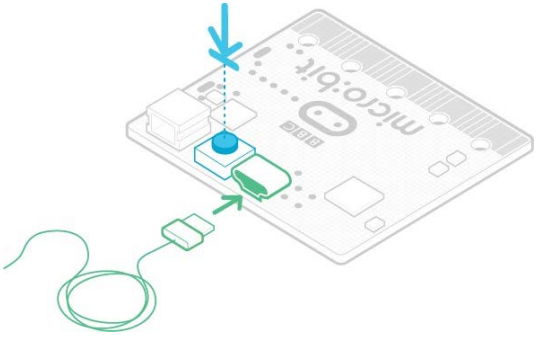

# How to Update the Firmware

**1.Overview**

Firmware is a special piece of software that makes a device run
properly. You can think of it as a software that makes the machine
behave the way it does.

Micro:bit boasts two chips on the back. One runs your code, while the
other runs firmware to help you to program the device. It can be used
with the accompanying firmware, thus, if you don't need to update it,
please go back to our micro :bit feature guide.

However, if you want to update the firmware to use new features , this
page will show you how to do it.

**2.Checking your firmware version**

ind out what version of the firmware you have on your micro:bit, **Plug
it in via USB**, open up the **DETAILS.TXT** file from the **MICROBIT**
drive and look for the number on the line that begins 'Interface
Version'.

\# DAPLink Firmware - see https://daplink.io

Build ID: v0257-gc782a5ba (gcc)

Unique ID: 9906360200052820f988c7fc2ec74011000000006e052820

HIC ID: 6e052820

Auto Reset: 1

Automation allowed: 0

Overflow detection: 0

Incompatible image detection: 1

Page erasing: 0

Daplink Mode: Interface

Interface Version: 0257

Bootloader Version: 0257

Git SHA: c782a5ba907377658bc28aa8d132a0fa44543687

Local Mods: 0

USB Interfaces: MSD, CDC, HID, WebUSB

Bootloader CRC: 0x725bea7d

Interface CRC: 0xe561f1de

Remount count: 0

URL: https://microbit.org/device/?id=9906&v=0257

URL: https://microbit.org/device/?id=9904&v=0254

**3.How to update the firmware**

1\. Download the hexadecimal file from this page to your computer.

Link to download the latest micro:bit 2.2 firmware -0257:

<https://www.microbit.org/get-started/user-guide/firmware/>

2.  Remove the battery pack and connect the micro USB cable to the
    computer.

Hold the reset button at the back of the micro:bit and plug the micro
USB cable into the device. You should see a drive appear in your file
manager called **MAINTENANCE.**

3.  Drag and drop the new firmware .HEX file you downloaded from this
    page onto the micro:bit and wait for the yellow LED on the back of
    the device to stop flashing. When the upgrade is completed, the
    micro:bit will reset, ejecting itself from the computer and
    re-appear in normal **MICROBIT** drive mode.

4.  Finally, check the **DETAILS.TXT** file on the **MICROBIT** drive
    and make sure that it has the same version number as the .HEX
    firmware you just downloaded and flashed to the interface chip.
