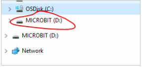
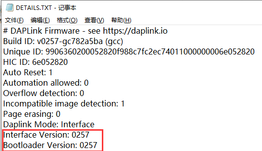

# Troubleshooting downloads with WebUSB

**1.Check your cable**

Make sure that your micro:bit is connected to your computer with a micro
USB cable. You should see a **MICROBIT** drive in Windows Explorer when
it’s connected.

**If you can see the MICROBIT drive go to step 2**.

If you can’t see the drive:

- Make sure that the USB cable is working. \>Does the cable work on
  another computer? If not, find a different cable to use. Some cables
  may only provide a power connection and don’t actually transfer data.

- Try another USB port on your computer.

Is the cable good but you still can’t see the **MICROBIT** drive? You
might have a problem with your micro:bit. Try the additional steps
described in the [falut
finding](https://support.microbit.org/support/solutions/articles/19000024000-fault-finding-with-a-micro-bit)page
at microbit.org. If this doesn’t help, you can create a [support
ticket](https://support.microbit.org/support/tickets/new) to notify the
Micro:bit Foundation of the problem. **Skip the rest of these steps**.

**2.Check your firmware version**

It’s possible that the firmware version on the micro:bit needs to
update. Let’s check:

1.  Go to the **MICROBIT** drive.

2.  Open the **DETAILS.TXT** file.

Look for a line in the file that shows the version number. It should
show **Version: ...**

If the version is **0234**, **0241**, **0243,** then you **NEED** to
update the [firmware](https://makecode.microbit.org/device/firmware) on
your micro:bit. Go to **Step 3** and follow the upgrade instructions.

If the version is **0249**, **0250** or higher, **you have the right
firmware,** go to step **4**.

**3.Update the firmware**

1.  Put your micro:bit into **MAINTENANCE Mode**. To do this, unplug the
    USB cable from the micro:bit and then re-connect the USB cable while
    you hold down the reset button. Once you insert the cable, you can
    release the reset button. You should now see a **MAINTENANCE** drive
    instead of the **MICROBIT** drive. Also, a yellow LED light will
    stay on next to the reset button.

2.  Download firmware .hex file

(<https://microbit.org/guide/firmware/>)

3.  Drag and drop that file onto the **MAINTENANCE** drive.

4\. The yellow LED will flash while the HEX file is copying. When the
copy finishes, the LED will go off and the micro:bit resets. The
**MAINTENANCE** drive now changes back to **MICROBIT**.

5\. The upgrade is complete! You can open the **DETAILS.TXT** file to
check the firmware version has been changed to match the version of the
**HEX** file you copied.

If you want to know more about connecting the board, MAINTENANCE Mode,
and upgrading the firmware, read about it in the [Firmware
guide](https://microbit.org/guide/firmware/).

**4.Check over version of Browser**

WebUSB is a fairly new feature and may require you to update your
browser. Check that your browser version matches one of these:

Chrome 65+ for Android, Chrome OS, Linux, macOS and Windows 10.

**5.Pair device**

Once you’ve updated the firmware, open the **Chrome Browser**, go to the
editor and click on **Pair Device** in the gearwheel menu. See
[WebUSB](https://makecode.microbit.org/device/usb/webusb) for pairing
instructions.
