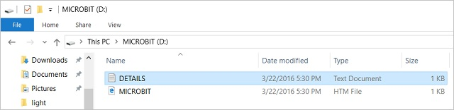
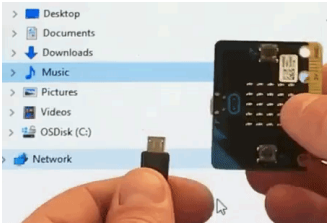

# FAQ

## How to Update the Firmware

**1.Overview**

Firmware is a special piece of software that makes a device run
properly. You can think of it as a software that makes the machine
behave the way it does.

Micro:bit boasts two chips on the back. One runs your code, while the
other runs firmware to help you to program the device. It can be used
with the accompanying firmware, thus, if you don't need to update it,
please go back to our micro :bit feature guide.

However, if you want to update the firmware to use new features , this
page will show you how to do it.

**2.Checking your firmware version**

ind out what version of the firmware you have on your micro:bit, **Plug
it in via USB**, open up the **DETAILS.TXT** file from the **MICROBIT**
drive and look for the number on the line that begins 'Interface
Version'.

\## DAPLink Firmware - see https://daplink.io

Build ID: v0257-gc782a5ba (gcc)

Unique ID: 9906360200052820f988c7fc2ec74011000000006e052820

HIC ID: 6e052820

Auto Reset: 1

Automation allowed: 0

Overflow detection: 0

Incompatible image detection: 1

Page erasing: 0

Daplink Mode: Interface

Interface Version: 0257

Bootloader Version: 0257

Git SHA: c782a5ba907377658bc28aa8d132a0fa44543687

Local Mods: 0

USB Interfaces: MSD, CDC, HID, WebUSB

Bootloader CRC: 0x725bea7d

Interface CRC: 0xe561f1de

Remount count: 0

URL: https://microbit.org/device/?id=9906&v=0257

URL: https://microbit.org/device/?id=9904&v=0254

**3.How to update the firmware**

1\. Download the hexadecimal file from this page to your computer.

Link to download the latest micro:bit 2.2 firmware -0257:

<https://www.microbit.org/get-started/user-guide/firmware/>

2.  Remove the battery pack and connect the micro USB cable to the
    computer.

Hold the reset button at the back of the micro:bit and plug the micro
USB cable into the device. You should see a drive appear in your file
manager called **MAINTENANCE.**

3.  Drag and drop the new firmware .HEX file you downloaded from this
    page onto the micro:bit and wait for the yellow LED on the back of
    the device to stop flashing. When the upgrade is completed, the
    micro:bit will reset, ejecting itself from the computer and
    re-appear in normal **MICROBIT** drive mode.

4.  Finally, check the **DETAILS.TXT** file on the **MICROBIT** drive
    and make sure that it has the same version number as the .HEX
    firmware you just downloaded and flashed to the interface chip.

## Troubleshooting downloads with WebUSB

**1.Check your cable**

Make sure that your micro:bit is connected to your computer with a micro
USB cable. You should see a **MICROBIT** drive in Windows Explorer when
it’s connected.

**If you can see the MICROBIT drive go to step 2**.

If you can’t see the drive:

- Make sure that the USB cable is working. \>Does the cable work on
  another computer? If not, find a different cable to use. Some cables
  may only provide a power connection and don’t actually transfer data.

- Try another USB port on your computer.

Is the cable good but you still can’t see the **MICROBIT** drive? You
might have a problem with your micro:bit. Try the additional steps
described in the [falut
finding](https://support.microbit.org/support/solutions/articles/19000024000-fault-finding-with-a-micro-bit)page
at microbit.org. If this doesn’t help, you can create a [support
ticket](https://support.microbit.org/support/tickets/new) to notify the
Micro:bit Foundation of the problem. **Skip the rest of these steps**.

**2.Check your firmware version**

It’s possible that the firmware version on the micro:bit needs to
update. Let’s check:

1.  Go to the **MICROBIT** drive.

2.  Open the **DETAILS.TXT** file.

Look for a line in the file that shows the version number. It should
show **Version: ...**

If the version is **0234**, **0241**, **0243,** then you **NEED** to
update the [firmware](https://makecode.microbit.org/device/firmware) on
your micro:bit. Go to **Step 3** and follow the upgrade instructions.

If the version is **0249**, **0250** or higher, **you have the right
firmware,** go to step **4**.

**3.Update the firmware**

1.  Put your micro:bit into **MAINTENANCE Mode**. To do this, unplug the
    USB cable from the micro:bit and then re-connect the USB cable while
    you hold down the reset button. Once you insert the cable, you can
    release the reset button. You should now see a **MAINTENANCE** drive
    instead of the **MICROBIT** drive. Also, a yellow LED light will
    stay on next to the reset button.

2.  Download firmware .hex file

(<https://microbit.org/guide/firmware/>)

3.  Drag and drop that file onto the **MAINTENANCE** drive.

4\. The yellow LED will flash while the HEX file is copying. When the
copy finishes, the LED will go off and the micro:bit resets. The
**MAINTENANCE** drive now changes back to **MICROBIT**.

5\. The upgrade is complete! You can open the **DETAILS.TXT** file to
check the firmware version has been changed to match the version of the
**HEX** file you copied.

If you want to know more about connecting the board, MAINTENANCE Mode,
and upgrading the firmware, read about it in the [Firmware
guide](https://microbit.org/guide/firmware/).

**4.Check over version of Browser**

WebUSB is a fairly new feature and may require you to update your
browser. Check that your browser version matches one of these:

Chrome 65+ for Android, Chrome OS, Linux, macOS and Windows 10.

**5.Pair device**

Once you’ve updated the firmware, open the **Chrome Browser**, go to the
editor and click on **Pair Device** in the gearwheel menu. See
[WebUSB](https://makecode.microbit.org/device/usb/webusb) for pairing
instructions.

## Troubleshooting for MAINTENANCE Mode

**1.Problem**

Recently, many users encounter the issue that Micro:bit board doesn’t
respond when connected to computer.

If the way you operate is correct, maybe you accidentally press the
reset button and enter the Maintenance mode or lead to lose the firmware
due to misoperation.

Plug in Micro:bit board, the“MAINTENANCE”drive appears. That means the
program can’t be downloaded.

**2.Solution**

Download the hex file from this page to your computer.

Download the latest firmware---0257:

<https://www.microbit.org/get-started/user-guide/firmware/>

After the latest firmware is downloaded, then drag it into
the“MAINTENANCE”drive as follows, which makes Micro:bit come back to
normal mode.

**3.How to avoid to enter“MAINTENANCE”mode？**

1.  Make sure the Reset button is not pressed when plugging the board by
    USB cable.

2.  Don't unplug the cable suddenly during downloading micro:bit
    program, otherwise, the firmware will be lost and enter
    in“MAINTENANCE”mode

3.  n the experiment, wrong wiring also cause short circuit or losing
    the firmware.

## Common Problems

1.  The car has no reaction

<!-- -->

1.  Please check whether the batteries are sufficient

2.  Please check whether the power switch is turned on

3.  Please check whether the upload the relevant code of the motor

successfully. If the motor controlled by the Bluetooth or IR remote

control does not rotate, you can upload the code of the motor driving

project to test it separately

4.  If you are using code of Python tutorial, verify that you have

successfully added the Python library file "keyes_MiniCar.py"

2.  Computers can't recognize the USB port

Please ensure whether the microbit driver is installed

Please check whether the USB wire is in good condition.

3.  The piano keys are suddenly silent

This can only be restored by pressing the reset button, for other
functions are normal, just the buzzer does not work.
