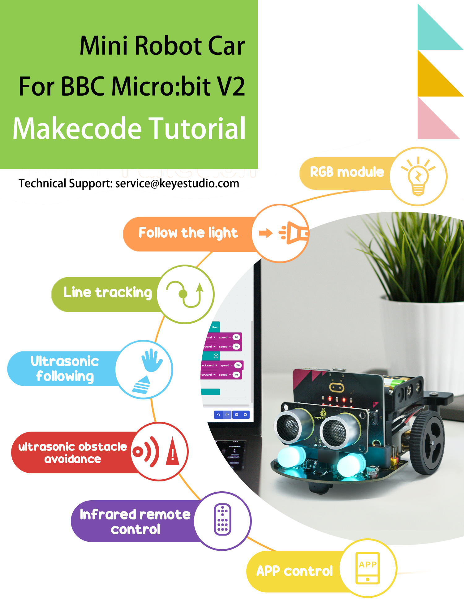
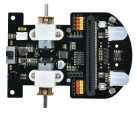
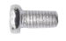
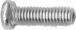
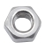
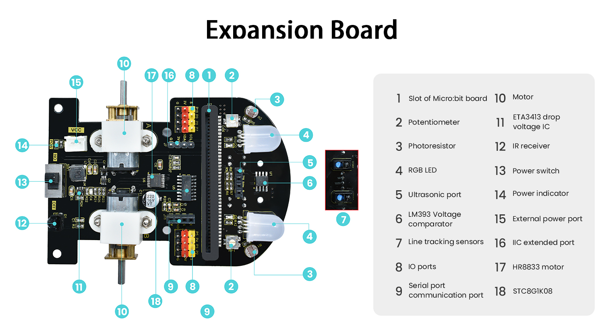

# Introductie

Keyestudio Mini Robot Car is een multifunctionele auto gebaseerd op BBC micro:bit. Het is uitgerust met een schat aan sensoren en randapparatuur om u te helpen begrijpen hoe u de micro:bit moet gebruiken en meer te leren over elektronica.

Bovendien laat het veel universele aansluitingen van bouwsteenopeningen over voor eenvoudige verbinding met andere randapparatuur, u kunt uw ervaring en verbeelding gebruiken om interessantere uitvindingen te creëren.

[Makecode Handleiding](./Makecode_Resource.7z)

[MiroPython Handleiding](./MiroPython_Resource.7z)

## Kitlijst

| # | Afbeelding             | Componenten               | AANTAL |
|---|------------------------|---------------------------|--------|
| 1 |   | Uitbreidingskaart         | 1      |
| 2 |   | Acrylplaat                | 1      |
| 3 |   | Ultrasone Sensor          | 1      |
| 4 |   | Universeel Wiel           | 1      |
| 5 |   | Wielen                    | 2      |
| 6 |   | M3\*20mm Nylon Kolom      | 4      |
| 7 |   | 3AAA Batterijhouder       | 1      |
| 8 |   | M3\*6MM Platte Kopschroeven | 4      |
| 9 |   | M3\*10MM Platte Kopschroeven | 6      |
| 10|  | M3 Vernikkelde Moeren     | 2      |
| 11|  | Sleufschroevendraaier     | 1      |
| 12|  | Kruiskopschroevendraaier  | 1      |
| 13|  | IR Afstandsbediening      | 1      |

Opmerking: De volgende items zijn niet inbegrepen in deze kit en moeten door u worden geleverd.

1). Microbit V2 (deze moet u zelf kopen)

2). Drie AAA-batterijen (deze moet u zelf kopen)

## Parameters

**Opmerking:** de twee gekleurde koplampen, twee lichtgevoelige sensoren, de IR-ontvanger en twee motoren zijn al geïntegreerd in de bodemplaat van de auto.

Ingang connectorpoort: DC 4.5V

Bedrijfsspanning sensoren: 3V

Motorsnelheid: 200RPM

Werktemperatuurbereik: 0-50℃

Afmeting:`99*78*58` mm

Milieubeschermingskenmerken: ROHS

De motorsnelheid kan worden aangepast via de PWM

Vanwege het kleine aantal IO-poorten van micro:bit, stuurt de micro:bit-kaart controle-instructies naar STC8G1K08 via de IIC, en vervolgens stuurt ST8G1K08 PWM om de HR8833-motor te besturen om de IC aan te sturen, waardoor de motor wordt gecontroleerd om te draaien. LED RGB wordt op dezelfde manier als hierboven bestuurd.
