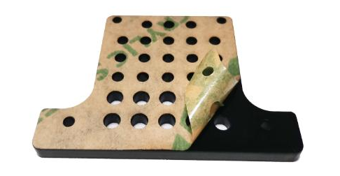
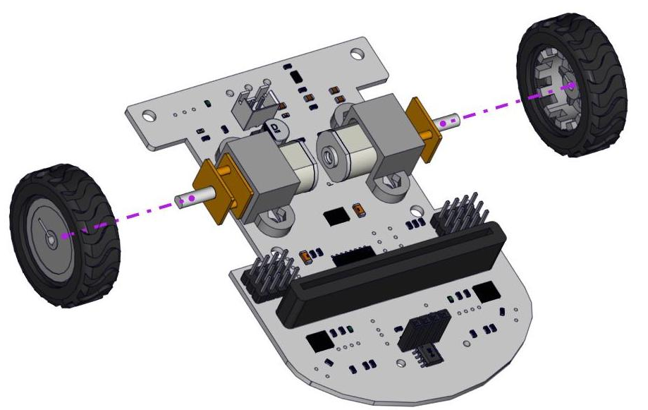
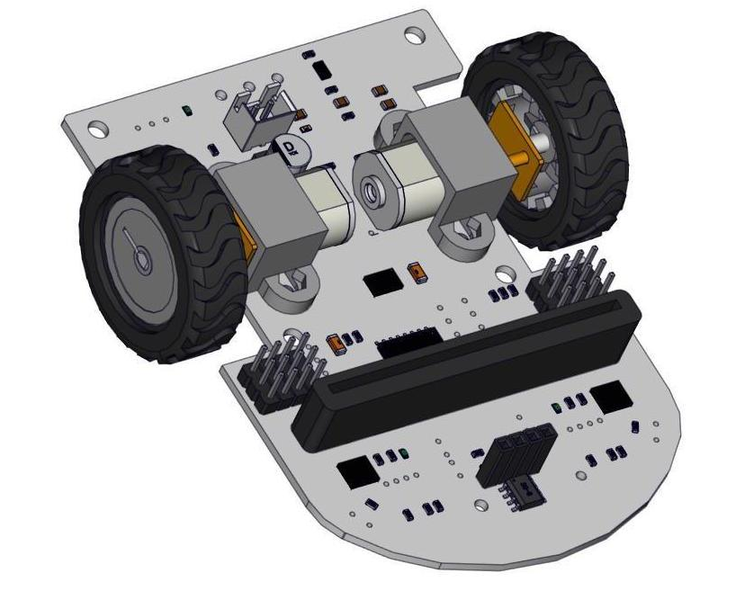
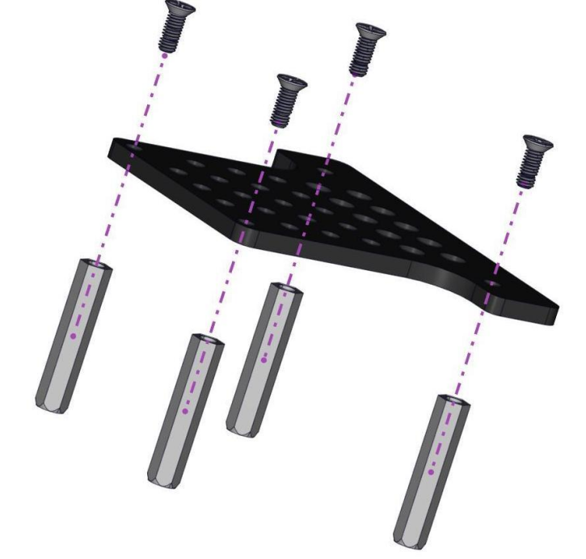
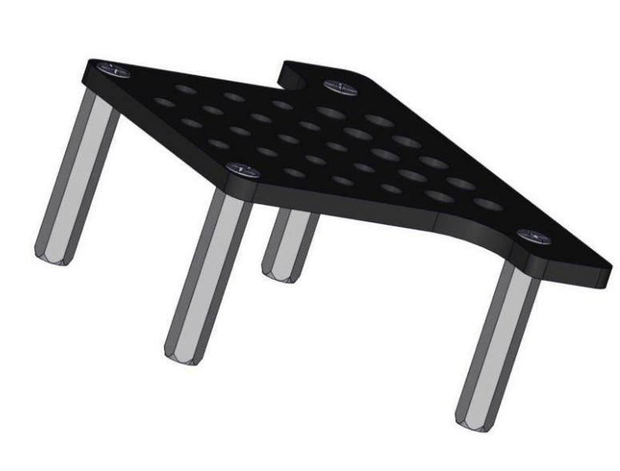
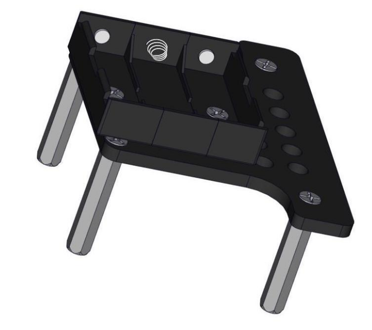
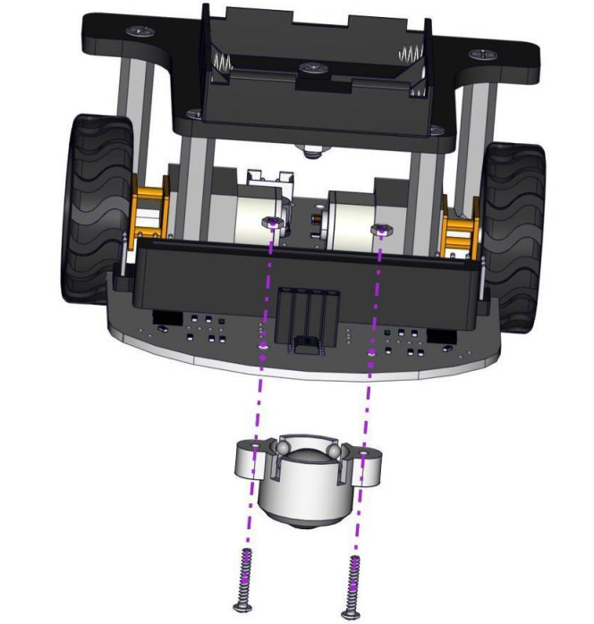
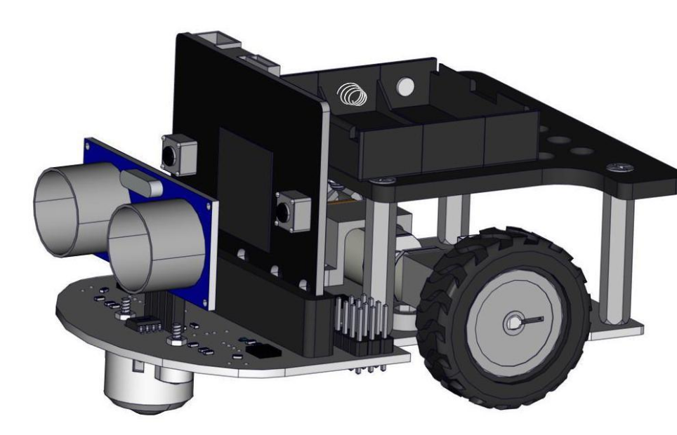
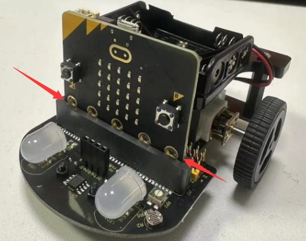
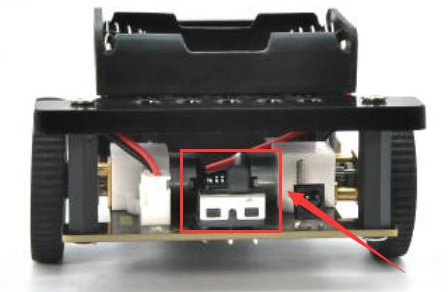

### Assembler la voiture robot

Avant l'assemblage, veuillez retirer le film protecteur des plaques acryliques.

1. Installer les roues sur la base de la voiture

Accoupler l'extrémité saillante de la roue avec l'arbre du moteur

2. Installer la plaque acrylique et le boîtier de batterie

Remarque : Avant de procéder à l'installation ultérieure, connectez d'abord les fils d'alimentation du boîtier de batterie comme indiqué sur le diagramme.

3. Installer la roue universelle

4. Installer le module ultrasonique et le micro:bit

La matrice LED du micro:bit est orientée vers l'avant

**Points à noter avant de démarrer le projet robot :**

1. Pour éviter un mauvais contact entre le micro:bit et le robot, assurez-vous que le Microbit est correctement inséré dans l'interface Microbit du châssis de la voiture. Le connecteur doit couvrir le bord du trou rond du Microbit.

La matrice LED du micro:bit est orientée vers l'avant.

2. Insérez les piles AAA dans le boîtier de piles et connectez le boîtier au connecteur VCC de la base de la voiture.

3. Éteignez l'interrupteur à glissière qui contrôle l'alimentation des piles.

