# Tutoriel MicroPython

## Télécharger le fichier de code

<span style="color:red;font-size:15px;">Note : Tout le code du cours est disponible en téléchargement ici. Les liens de téléchargement ne seront pas fournis ultérieurement. Pour éviter d'oublier, nous vous recommandons de télécharger le code maintenant pour l'apprentissage futur du tutoriel.</span>

[Cliquer pour télécharger](./MiroPython_Resource.7z)

## 1. IDE MU

### 1. 1 Installer MU IDE

Mu est un éditeur de code Python pour les programmeurs débutants, basé sur les enseignants et les étudiants. Le moyen le plus simple d'obtenir Mu est via l'installateur officiel pour Windows ou Mac OSX (Mu ne prend plus en charge Windows 32 bits). La version recommandée actuelle est Mu 1.0-beta 2.

#### Étape 1 - Déterminer la version et télécharger l'installateur Mu

Ouvrez le lien : [https://codewith.mu/en/download](https://codewith.mu/en/download) pour télécharger la version correspondante du logiciel Mu.

Déterminez si votre ordinateur fonctionne sous Windows ou Mac OSX, puis ouvrez l'Explorateur, cliquez sur "Ce PC", puis sélectionnez Propriétés pour savoir si votre système Windows est 32 bits ou 64 bits.


**Afficher le type de système :**

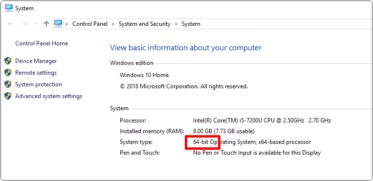


#### Étape 2 - Exécuter l'installateur

Localisez l'installateur que vous venez de télécharger (il peut se trouver dans votre dossier de téléchargements) et double-cliquez pour ouvrir le fichier d'installation.

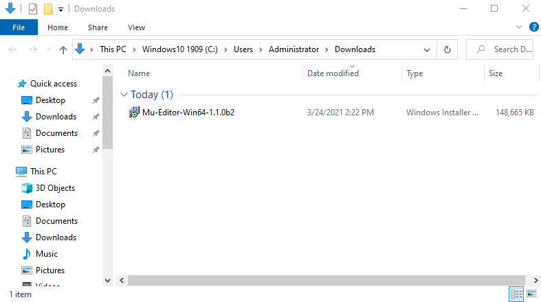

Lien de téléchargement du système Mac OSX : [https://codewith.mu/en/howto/1.1/install_macos](https://codewith.mu/en/howto/1.1/install_macos)

**Système Windows 10**

Appuyez sur "Plus d'informations"

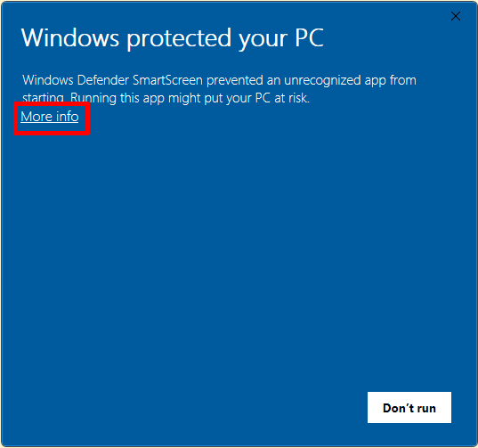

Entrez "Exécuter quand même"

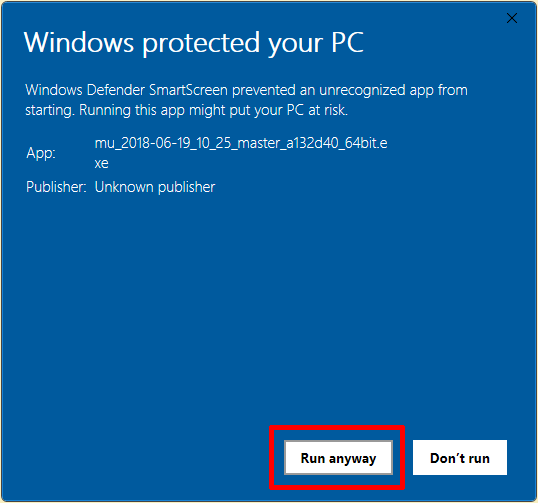

#### Étape 3 - Protocole

Cochez la licence, puis cliquez sur Installer.


#### Étape 4 - Installation

L'installation de Mu sur votre ordinateur prendra quelques secondes.


#### Étape 5 - Terminer

Appuyez sur Terminer

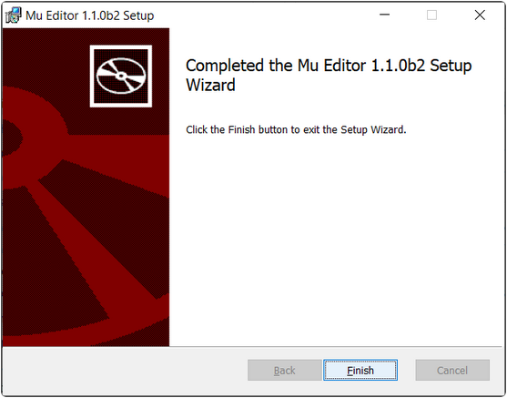

#### Étape 6 - Démarrer Mu

Vous pouvez lancer Mu en cliquant sur l'icône dans le menu Démarrer, ou en tapant Mu dans la barre de recherche (les deux méthodes sont présentées ci-dessous).


L'interface principale de Mu est présentée ci-dessous :

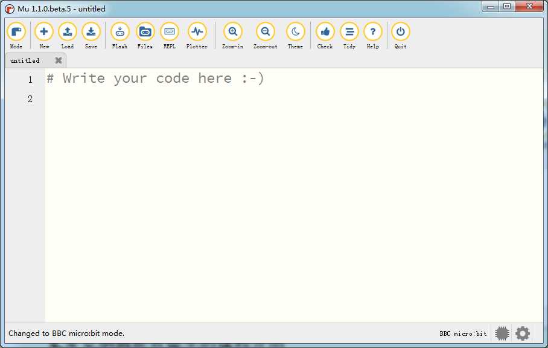

### 1.2 Configuration du compilateur et introduction à la barre d'outils

Réglez d'abord le "mode" sur micro:bit.

Ouvrez le logiciel Mu, cliquez sur le bouton Mode dans la barre de menu et sélectionnez "BBC micro:bit", puis appuyez sur "OK".

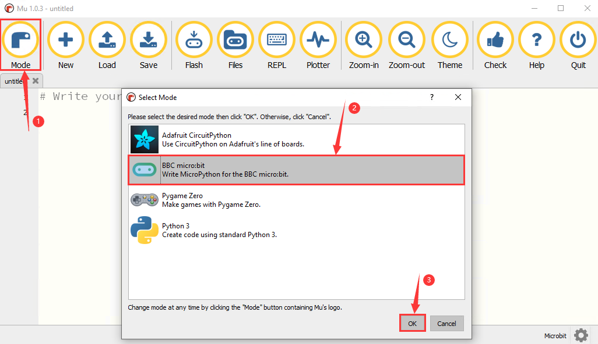

### 1.3 Installer le fichier de bibliothèque

Avant d'importer la bibliothèque, vous devez télécharger un code .py sur micro:bit. Ici, nous prenons l'exemple du module RGB "code_1.py" du tutoriel.

Importer le fichier "keyes_MiniCar.py"

Le répertoire par défaut pour la sauvegarde de Mu est le fichier "Mu_code", qui se trouve à la racine du répertoire utilisateur.

Par exemple, sous Windows, si votre système est installé sur le lecteur C de votre ordinateur et que le nom d'utilisateur est Administrateur, le chemin du répertoire mu_code est C:\Users\Administrator\mu_code. Sous Linux, le chemin est ~/home/mu_code.

**Entrez le fichier "mu_code"**

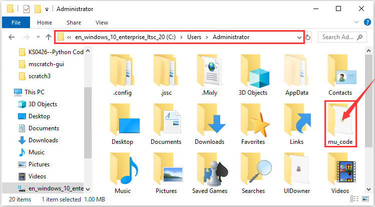

Copiez le fichier de bibliothèque "keyes_MiniCar.py" dans le dossier "mu_code". Le chemin du code est le suivant :

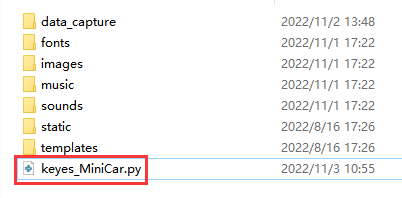

Ouvrez le logiciel Mu et connectez le micro:bit à votre ordinateur, puis cliquez sur le bouton "Files" et faites glisser le fichier de bibliothèque "keyes_MiniCar.py" dans le micro:bit.

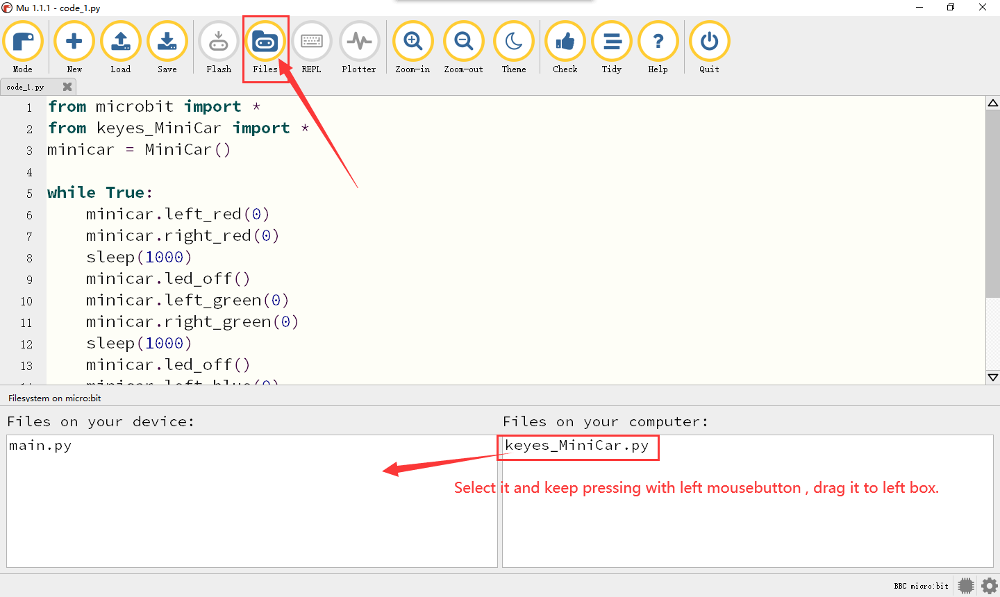

Une fois l'importation réussie, vous le verrez dans la boîte de gauche.

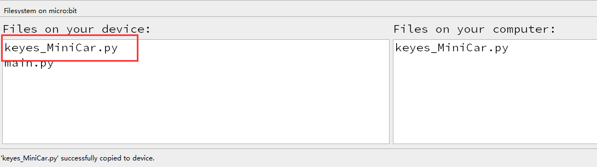

Appuyez sur "Check" pour vérifier les erreurs dans le code. Si une ligne apparaît avec un curseur ou un trait de soulignement, il y a une erreur dans le programme pour cette ligne.


Ces conseils ne sont que des avertissements, pas des conseils d'erreur de code.

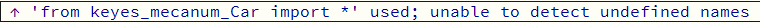


Vous devez également vous assurer que le câble micro USB est connecté au micro:bit et à l'ordinateur, puis cliquez sur le bouton "Flash" pour télécharger le code sur le micro:bit.

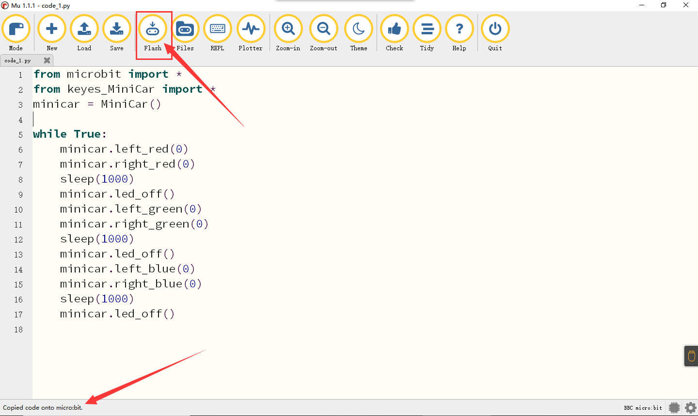

S'il y a une erreur après avoir cliqué sur le bouton "Flash", veuillez confirmer si vous avez importé le fichier de bibliothèque sur micro:bit.

Note:

Si vous avez téléchargé d'autres programmes sur la carte micro:bit, à l'exception du fichier de bibliothèque "keyes_MiniCar.py". Avant de programmer en Micropython, vous devez importer le fichier de bibliothèque dans le micro:bit.

Si vous utilisez toujours la même carte micro:bit pour la programmation Micropython, vous n'avez pas besoin de l'envoyer à nouveau au micro:bit.

### 1.4 Ajouter du code au compilateur

Nous prenons comme exemple le premier projet du tutoriel de base "Heartbeat", ouvrez le dossier "Program" dans le premier dossier de projet et localisez le fichier "microbit-Heartbeat".


Ou ouvrez le logiciel Mu et appuyez sur le fichier "microbit-Heartbeat.py", puis faites-le glisser vers le logiciel Mu :

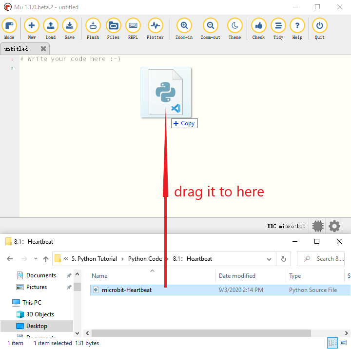

comme indiqué ci-dessous :


### 1.5 Télécharger le code sur Micro:bit

Connectez la carte micro:bit et l'ordinateur via le câble micro USB.

Appuyez sur "Flash" pour télécharger le code sur micro:bit.


S'il y a une erreur dans
| display.show(val1)<br/>sleep(500)<br/>display.show(val3)<br/>sleep(500) | La LED en (1,0) clignote pendant 0,5s |
| display.show(val2)<br/>sleep(500)<br/>display.show(val3)<br/>sleep(500) | La LED en (3,4) clignote pendant 0,5s |

#### 2.2.5 Résultat du test

Après avoir téléchargé le code, branchez l'alimentation avec un câble USB, vous verrez la LED en (1,0) clignoter pendant 0,5s, puis la LED en (3,4) clignoter pendant 0,5s, en boucle.

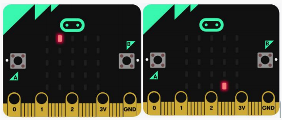

### 2.3 Matrice de points LED 5 x 5

#### 2.3.1 Description

La matrice de points gagne en popularité dans notre vie, comme les écrans LED, les arrêts de bus et les mini-téléviseurs dans les ascenseurs.

La matrice de points de la carte Micro:bit est composée de 25 diodes électroluminescentes. Dans la leçon précédente, nous avons contrôlé les LED de la carte Micro:bit pour former des motifs, des chiffres et des chaînes de caractères en définissant les points de coordonnées. De plus, nous pourrions adopter une autre méthode pour réaliser l'affichage de motifs, de chiffres et de chaînes de caractères.

#### 2.3.2 Composants nécessaires

| 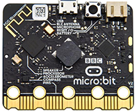 | 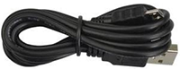 |
| :-----------------------: | :------------------: |
|       Micro:bit * 1       |    Micro:bit * 1     |

#### 2.3.3 Code de test

Vous pouvez télécharger le code directement depuis le tutoriel (lisez le fichier "Configuration de l'environnement de développement" en cas de doute).


```python
from microbit import *
val = Image("00900:""00900:""90909:""09990:""00900")
display.show(val)
```

**Résultat du test :** Téléchargez `2.3-5× 5 LED Dot Matrix-1.py` sur micro:bit, puis une flèche vers le bas apparaîtra.


```python
from microbit import *
val = Image("00900:""00900:""90909:""09990:""00900")
display.show('1')
sleep(500)
display.show('2')
sleep(500)
display.show('3')
sleep(500)
display.show('4')
sleep(500)
display.show('5')
sleep(500)
display.show(val)
sleep(500)
display.scroll("hello!")
sleep(200)
display.show(Image.HEART)
sleep(500)
display.show(Image.ARROW_NE)
sleep(500)
display.show(Image.ARROW_SE)
sleep(500)
display.show(Image.ARROW_SW)
sleep(500)
display.show(Image.ARROW_NW)
sleep(500)
display.clear()
```


#### 2.3.4 Explication du code

| code | Explication |
| :----------------------------------------------------------- | :----------------------------------------------------------- |
| from microbit import * | importe le fichier de bibliothèque de micro:bit |
| val =<br/>Image("09000:""00000:""00000:""0000<br/>0:""00000:") | Définit Image() sur la variable val |
| display.show(val) | micro:bit affiche "→" |
| display.show('1') | display.show('1') |
| sleep(500) | sleep(500) |
| display.scroll("hello!") | micro:bit fait défiler pour afficher "hello!" |
| display.show(Image.HEART) | micro:bit affiche "❤" |
| display.show(Image.ARROW_NE)<br/>display.show(Image.ARROW_SE)<br/>display.show(Image.ARROW_SW)<br/>display.show(Image.ARROW_NW) | micro:bit affiche la flèche "Nord-Est"<br/>micro:bit affiche la flèche "Sud-Est"<br/>micro:bit affiche la flèche "Sud-Ouest"<br/>micro:bit affiche la flèche "Nord-Ouest" |
| display.clear() | La matrice de points LED de micro:bit s'efface |

#### 2.3.5 Résultat du test

Téléchargez `2.3-5×5 LED Dot Matrix-2.py` sur micro:bit, puis la matrice de points LED affichera "1", "2",

"3", "4", "5", "↓", "hello!", "❤", 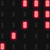, , 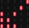, 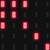. Chaque intervalle est de 500ms.

### 2.4 Boutons programmables

#### 2.4.1 Description

Le bouton peut contrôler l'activation et la désactivation du circuit, auquel il est attaché. Le circuit est déconnecté lorsque le bouton n'est pas enfoncé. Le circuit est connecté dès qu'il est enfoncé, mais il est déconnecté après avoir été relâché.

Les deux extrémités du bouton sont comme deux montagnes. Il y a une rivière entre les deux. La pièce métallique interne relie les deux côtés pour laisser passer le courant, tout comme la construction d'un pont pour relier les deux montagnes.


**Principe de fonctionnement** : Avant d'appuyer sur le bouton, 1, 2, 3 et 4 sont allumés, mais 1, 3 ou 1, 4 ou 2, 3 ou 2, 4 sont déconnectés (bloqués), ce qui sera activé lorsque le bouton est enfoncé.

La carte Micro:bit dispose de trois boutons, le bouton de réinitialisation est à l'arrière et deux boutons programmables sont à l'avant. Appuyez respectivement sur A, B et AB en même temps, et l'écran correspondant les affichera respectivement.

#### 2.4.2 Composants nécessaires

|  |  |
| :-----------------------: | :------------------: |
|       Micro:bit * 1       |    Micro:bit * 1     |

#### 2.4.3 Code de test

Vous pouvez télécharger le code directement depuis le tutoriel (lisez le fichier "Configuration de l'environnement de développement" en cas de doute).


```python
from microbit import *
while True:
if button_a.is_pressed():
display.show("A")
elif button_a.is_pressed() and button_b.is_pressed():
display.scroll("AB")
elif button_b.is_pressed():
display.show("B")
```

**Résultat du test :** Téléchargez `2.4-Programmable Buttons-1.py` et branchez micro:bit via un câble USB, appuyez sur "A" sur la carte Micro:bit, le caractère "A" s'affichera ; si B est pressé, la lettre "B" apparaîtra. "AB" s'affichera si vous appuyez simultanément sur les boutons A et B.

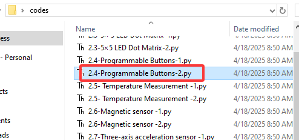

```python
from microbit import *
a = 0
b = 0
val1 = Image("00000:""00000:""00000:""00000:""00900")
val2 = Image("00000:""00
| sleep(500)                                                   | Délai de 500 ms                                              |
| **if** temperature() >= 35:<br/>display.show(Image.HEART)<br/>**else**:<br/>display.show(Image.HEART_SMALL) | Si la valeur de la température ≥ 35℃ <br/>micro:bit affiche “ 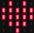”<br/>Si la valeur de la température < 35℃<br/>micro:bit affiche “ ” |

### 2.6 Boussole

#### 2.6.1 Description

Ce projet présente principalement l'utilisation de la boussole du Micro:bit. Elle peut être utilisée pour déterminer la direction. Nous devons calibrer la carte Micro:bit lorsque le capteur magnétique fonctionne. La méthode de calibration correcte consiste à faire pivoter la carte Micro:bit.

<span style="color:red;">De plus, les objets à proximité peuvent affecter la précision des lectures et de la calibration.</span>

#### 2.6.2 Composants nécessaires

|  |  |
| :-----------------------: | :------------------: |
|       Micro:bit * 1       |    Micro:bit * 1     |

#### 2.6.3 Code de test

Vous pouvez télécharger le code directement depuis le tutoriel (lisez le fichier "Configuration de l'environnement de développement" en cas de doute).


```python
from microbit import *
compass.calibrate()
while True:
if button_a.is_pressed():
display.scroll(compass.heading())
```

**Explication du code :** Nous devons calibrer le micro:bit en raison des différents champs magnétiques dans différentes zones. Le Micro:bit vous invitera à calibrer lors de la première utilisation.

Transférez `2.6-Magnetic sensor-1.py` vers le micro:bit, branchez le micro:bit via un câble USB et appuyez sur le bouton A. "TILT TO FILL SCREEN" apparaît sur le micro:bit. Entrez ensuite dans l'interface de calibration, la méthode de calibration consiste à faire pivoter la carte micro:bit et à afficher un motif carré complet (25 LED allumées), comme indiqué sur la figure suivante :

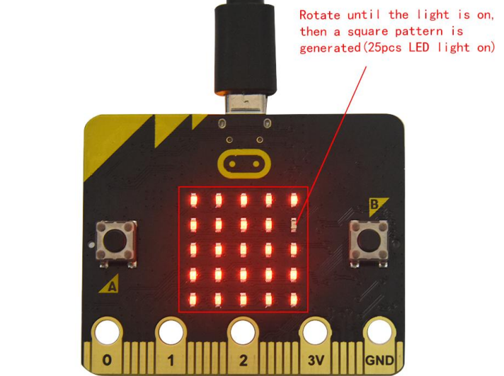

La calibration est terminée lorsque vous voyez le motif de sourire .

Le moniteur série affichera 0°, 90°, 180° et 270° lorsque vous appuyez sur A.

--------


```python
from microbit import *
compass.calibrate()
x = 0
while True:
x = compass.heading()
if x >= 293 and x < 338:
display.show(Image("00999:""00099:""00909:""09000:""90000"))
elif x >= 23 and x < 68:
display.show(Image("99900:""99000:""90900:""00090:""00009"))
elif x >= 68 and x < 113:
display.show(Image("00900:""09000:""99999:""09000:""00900"))
elif x >= 113 and x < 158:
display.show(Image("00009:""00090:""90900:""99000:""99900"))
elif x >= 158 and x < 203:
display.show(Image("00900:""00900:""90909:""09990:""00900"))
elif x >= 203 and x < 248:
display.show(Image("90000:""09000:""00909:""00099:""00999"))
elif x >= 248 and x < 293:
display.show(Image("00900:""00090:""99999:""00090:""00900"))
else:
display.show(Image("00900:""09990:""90909:""00900:""00900"))
```

Orientez la carte micro:bit horizontalement vers le nord, le sud, l'est et l'ouest, la matrice de points LED affiche les motifs de direction correspondants.

Comme indiqué ci-dessous, la flèche pointe vers le haut à droite lorsque la valeur est comprise entre 292,5 et 337,5. 0,5 ne peut pas être saisi dans le code, par conséquent, les valeurs que nous obtenons sont 293 et 338.

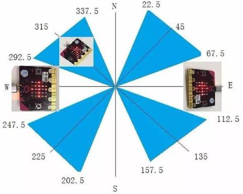

Téléchargez `2.6-Magnetic sensor-2.py` sur la carte micro:bit et ne débranchez pas le câble USB. Après la calibration, inclinez la carte Micro:bit, la matrice de points LED affiche les signes de direction.

#### 2.6.4 Explication du code

| code                                                         | Explication                                                  |
| ------------------------------------------------------------ | ------------------------------------------------------------ |
| from microbit import *                                       | Importe le fichier de bibliothèque de micro:bit               |
| compass.calibrate()                                          | Calibration de la boussole                                   |
| while True:                                                  | C'est une boucle permanente, qui fait que<br/>micro:bit exécute le code. |
| **if** button_a.is_pressed():<br/>display.scroll(compass.heading()) | Lorsque le bouton A est pressé<br/>Micro:bit fait défiler la valeur de la<br/>boussole |
| x = 0                                                        | Définit la variable x=0                                      |
| x = compass.heading()                                        | Définit la valeur de la boussole à la variable x             |
| **if**...**elif**...**else**                                 | Définit la valeur de la boussole à la variable x             |
| display.show(Image("00999:""0009<br/>9:""00909:""09000:""90000"))<br/>display.show(Image("99900:""9900<br/>0:""90900:""00090:""00009"))<br/>display.show(Image("00900:""0900<br/>0:""99999:""09000:""00900"))<br/>display.show(Image("00009:""0009<br/>0:""90900:""99000:""99900"))<br/>display.show(Image("00900:""0090<br/>0:""90909:""09990:""00900"))<br/>display.show(Image("90000:""0900<br/>0:""00909:""00099:""00999"))<br/>display.show(Image("00900:""0009<br/>0:""99999:""00090:""00900"))<br/>display.show(Image("00900:""0999<br/>0:""90909:""00900:""00900")) | Micro:bit affiche le signe de la flèche Nord-Est<br/>Micro:bit affiche le signe de la flèche Nord-Ouest<br/>Micro:bit affiche le signe de la flèche Ouest<br/>Micro:bit affiche le signe de la flèche Sud-Ouest<br/>Micro:bit affiche le signe de la flèche Sud-Est<br/>Micro:bit affiche le signe de la flèche Sud<br/>Micro:bit affiche le signe de la flèche Est<br/>Micro:bit affiche le signe de la flèche Nord |


| from microbit import * | Importe le fichier de bibliothèque de micro:bit |
| gesture = accelerometer.current_gesture() | Définit accelerometer.current_gesture() sur gesture |
| while True: | C'est une boucle permanente, et micro:bit exécute le code |
| Lightintensity = display.read_light_level() | Définit display.read_light_level() sur Lightintensity |
| print("Light intensity:", Lightintensity) | Le REPL du BBC micro:bit affiche la valeur d'intensité lumineuse détectée |
| sleep(100) | Délai de 100ms |

#### 2.8.5 Résultat du test

Téléchargez le code sur la carte micro:bit, ne débranchez pas le câble USB. Cliquez sur "REPL" et appuyez sur les boutons de réinitialisation, la valeur d'intensité lumineuse s'affichera, comme indiqué ci-dessous.

En couvrant la matrice de points LED, la valeur d'intensité est de 0 ; au contraire, la valeur d'intensité augmente lorsque la carte micro:bit est placée sous le soleil.

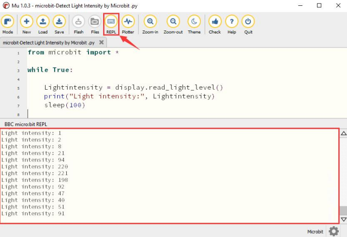

### 2.9 Haut-parleur

#### 2.9.1 Description

La carte mère micro:bit dispose d'un haut-parleur intégré, ce qui facilite grandement l'ajout de son à votre projet. Le haut-parleur peut être programmé pour émettre une variété de tonalités, comme écrire une chanson : l'Ode à la Joie, et la jouer.

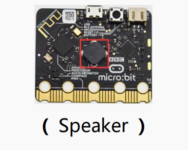

#### 2.9.2 Composants nécessaires

|  |  |
| :-----------------------: | :------------------: |
|       Micro:bit * 1       |    Micro:bit * 1     |

#### 2.9.3 Code de test

Vous pouvez télécharger le code directement depuis le tutoriel (lisez le fichier "Configuration de l'environnement de développement" en cas de doute).


```python
from microbit import *
import audio
display.show(Image.MUSIC_QUAVER)
while True:
audio.play(Sound.GIGGLE)
sleep(1000)
audio.play(Sound.HAPPY)
sleep(1000)
audio.play(Sound.HELLO)
sleep(1000)
audio.play(Sound.YAWN)
sleep(1000)
```

#### 2.9.4 Explication du code

| code | Explication |
| ------------------------ | ------------------------------------------------------- |
| from microbit import * | Importe le fichier de bibliothèque de micro:bit |
| import audio | fichier de bibliothèque audio |
| while True: | C'est une boucle permanente, et micro:bit exécute le code |
| audio.play(Sound.GIGGLE) | Émet un son de rire |
| sleep(1000) | Délai de 1000ms |

#### 2.9.5 Résultat du test

Téléchargez le code sur la carte micro:bit, ne débranchez pas le câble USB, puis le haut-parleur émettra un son et la matrice de points LED affichera un motif de logo musical.

### 2.10 Logo tactile

#### 2.10.1 Description

Si vous avez une carte mère micro:bit, il est judicieux d'utiliser un logo tactile doré comme entrée supplémentaire dans votre projet, ce qui est comme un bouton supplémentaire. Il utilise un capteur tactile capacitif qui détecte de petits changements dans les champs électriques lorsque vous le pressez (ou le touchez) avec votre doigt. Lorsque vous le touchez, vous pouvez contrôler la carte micro:bit pour qu'elle exécute certaines fonctions.

#### 2.10.2 Composants nécessaires

|  |  |
| :-----------------------: | :------------------: |
|       Micro:bit * 1       |    Micro:bit * 1     |

#### 2.10.3 Code de test

Vous pouvez télécharger le code directement depuis le tutoriel (lisez le fichier "Configuration de l'environnement de développement" en cas de doute).


```python
from microbit import *
time = 0
start = 0
running = False
while True:
if button_a.was_pressed():
running = True
start = running_time()
if button_b.was_pressed():
if running:
time += running_time() - start
running = False
if pin_logo.is_touched():
if not running:
display.scroll(int(time/1000))
if running:
display.show(Image.HEART)
sleep(300)
display.show(Image.HEART_SMALL)
sleep(300)
else:
display.show(Image.ASLEEP)
```

#### 2.10.4 Explication du code

（1）Micro:bit enregistre le temps en ms (milliers de minutes par seconde) lorsqu'il est démarré. C'est ce qu'on appelle le temps d'exécution.

（2）Lorsque vous appuyez sur le bouton A, une variable appelée `start` est définie sur le temps d'exécution actuel.

（3）Lorsque vous appuyez sur le bouton B, le temps de début sera soustrait du nouveau temps d'exécution pour déterminer combien de temps s'est écoulé depuis que vous avez démarré le chronomètre. Cette différence est ajoutée au temps total, qui est stocké dans une variable appelée `time`.

（4）Si vous appuyez sur l'icône LOGO dorée, le programme affiche le temps total écoulé sur l'écran LED. Il convertit le temps de ms (millièmes de seconde) en secondes en divisant par 1000. Il utilise l'opérateur de division entière pour donner le résultat d'un entier.

（5）Le programme utilise également une variable booléenne nommée `running` pour contrôler le programme. Les variables booléennes n'ont que deux valeurs : vrai ou faux. Si `running` est vrai, le chronomètre est démarré. Si `running` est faux, le chronomètre n'est pas démarré ou est arrêté.

（6）Si `running` est vrai, le cœur battant est affiché sur l'écran à points LED.

（7）Si le chronomètre est arrêté, si "running" est faux, il n'affichera le temps que lorsque vous appuyez sur l'icône LOGO dorée.

（8）Si le chronomètre est déjà démarré, si "running" est vrai, le code empêche également les fausses lectures en s'assurant que la variable `time` ne change que lorsque le bouton B est pressé.

#### 2.10.5 Résultat du test

Téléchargez le code et branchez le micro:bit via un câble USB. Appuyez sur le bouton A pour démarrer le chronomètre. Lorsque le chronomètre est en marche, la matrice de points LED affiche un cœur battant, appuyez sur le bouton B pour l'arrêter. Il continuera à ajouter du temps, comme un vrai chronomètre.

Appuyez sur le logo LOGO doré à l'avant du micro:bit pour afficher le temps mesuré en secondes. Pour remettre le temps à zéro, appuyez sur le bouton Reset à l'arrière de la carte micro:bit.

### 2.11 Microphone

#### 2.11.1 Description

La carte mère micro:bit dispose d'un microphone intégré, qui peut être utilisé pour mesurer le niveau sonore ambiant. Lorsque vous applaudissez, l'indicateur LED de la carte mère micro:bit s'allume. Il peut mesurer l'intensité du son. À cet égard, vous pouvez créer un graphique de niveau sonore ou des lumières disco qui sont en phase avec la musique.

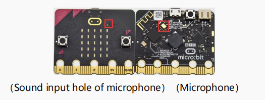

#### 2.11.2 Composants nécessaires

|  |  |
| :-----------------------: | :------------------: |
|       Micro:bit * 1       |    Micro:bit * 1     |

#### 2.11.3 Code de test

Vous pouvez télécharger le code directement depuis le tutoriel (lisez le fichier "Configuration de l'environnement de développement" en cas de doute).


```python

| ------ | ------------------ | -------- | ------------------ |
| Noir   | 255,255,255        | Rouge    | 0,255,255          |
| Vert   | 255,0,255          | Bleu     | 255,255,0          |
| Cyan   | 255,0,0            | Rouge foncé | 0,255,0            |
| Jaune  | 0,0,255            | Blanc    | 0,0,0              |
| ...... | .......            | ......   | ......             |

<span style="color:red;">Étant donné que nos lumières LED sont à anode commune, 255 est la valeur la plus basse et 0 est la valeur la plus brillante.</span>

Dans ce projet, nous allons réaliser deux expériences. La première consiste à faire allumer deux lumières RVB en trois couleurs : rouge, vert et bleu. La seconde consiste à faire afficher progressivement différentes couleurs par deux lumières RVB.

#### 3.1.2 Préparation

(1) Insérez correctement le micro:bit dans la carte d'extension.

(2) Connectez le porte-piles à la carte d'extension.

(3) Allumez l'interrupteur d'alimentation (<span style="color:red;">Faites glisser l'interrupteur POWER sur ON</span>).

(4) Connectez le micro:bit et l'ordinateur via un câble micro USB.

(5) Ouvrez l'IDE MU.

Si vous souhaitez ajouter la bibliothèque d'extension Mini car (vous pouvez vous référer au fichier "1.4 Installer le fichier de bibliothèque").

#### 3.1.3 Schéma

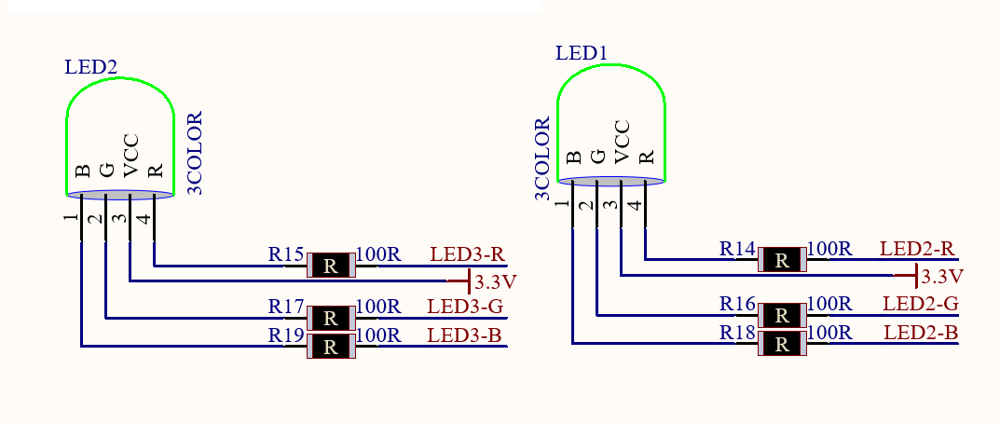

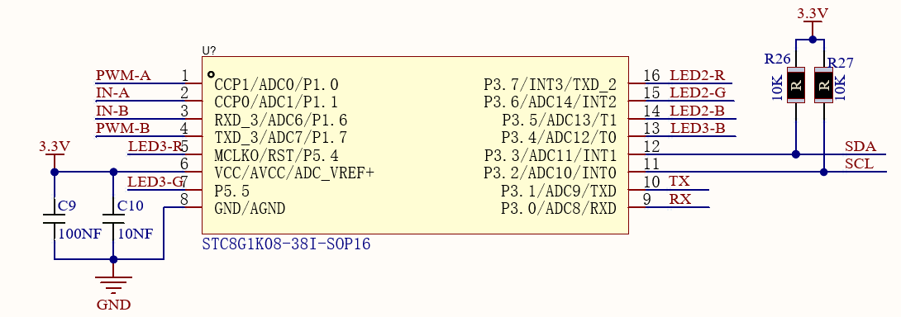

**Principe de fonctionnement :** Le Microbit, en tant qu'hôte, envoie des instructions à l'esclave STC8G1K08 via l'IIC, puis l'esclave émet un signal PWM pour contrôler les lumières LED RVB. Cela permet d'économiser considérablement les ports IO de la carte microbit, car l'IIC permet de contrôler deux moteurs et deux lumières LED RVB.

#### 3.1.4 Explication du code

Fonctions des LED RVB dans le fichier Keyes_MiniCar.py :

Left.red(0-255) : Définit le RVB gauche sur rouge, 0 est le plus lumineux et 255 est le plus sombre.

Left.green(0-255) : Définit le RVB gauche sur vert, 0 est le plus lumineux et 255 est le plus sombre.

Left.blue(0-255) : Définit le RVB gauche sur bleu, 0 est le plus lumineux et 255 est le plus sombre.

right.red(0-255) : Définit le RVB droit sur rouge, 0 est le plus lumineux et 255 est le plus sombre.

right.green(0-255) : Définit le RVB droit sur vert, 0 est le plus lumineux et 255 est le plus sombre.

right.blue(0-255) : Définit le RVB droit sur bleu, 0 est le plus lumineux et 255 est le plus sombre.

#### 3.1.5 Code de test

Vous pouvez télécharger le fichier `3.1-RGB LED-1.py` directement depuis le tutoriel (lisez le fichier "Configuration de l'environnement de développement" en cas de doute).


```python
from microbit import *
from keyes_MiniCar import *
minicar = MiniCar()

while True:
    minicar.left_red(0)
    minicar.right_red(0)
    sleep(1000)
    minicar.led_off()
    minicar.left_green(0)
    minicar.right_green(0)
    sleep(1000)
    minicar.led_off()
    minicar.left_blue(0)
    minicar.right_blue(0)
    sleep(1000)
    minicar.led_off()
```

**Résultat du test :** Après avoir téléchargé le code, la LED RVB changera toutes les secondes dans l'ordre rouge, vert et bleu.

-------

Importez le fichier `3.1-RGB LED-2.py`

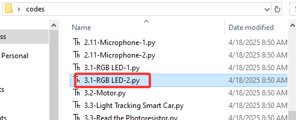

```python
from microbit import *
from keyes_MiniCar import *
minicar = MiniCar()

while True:
    for num in range(0 , 255):  		#It is a loop statement, the range is 0 to 255
        num += 1					#It is equal to num = num + 1 
        minicar.left_red(255 - num)
        minicar.right_red(255 - num)
        sleep(10)
        
    for num in range(0 , 255):
        num += 1
        minicar.left_green(255 - num)
        minicar.right_green(255 - num)
        sleep(10)
        
    for num in range(0 , 255):
        num += 1
        minicar.left_red(num)
        minicar.right_red(num)
        sleep(10)
        
    for num in range(0 , 255):
        num += 1
        minicar.left_blue(255 - num)
        minicar.right_blue(255 - num)
        sleep(10)
    
    for num in range(0 , 255):
        num += 1
        minicar.left_red(255 - num)
        minicar.right_red(255 - num)
        sleep(10)
    
    for num in range(0 , 255):
        num += 1
        minicar.left_green(num)
        minicar.right_green(num)
        sleep(10)
        
    for num in range(0 , 255):
        num += 1
        minicar.left_red(num)
        minicar.right_red(num)
        sleep(10)
    
    for num in range(0 , 255):
        num += 1
        minicar.left_blue(num)
        minicar.right_blue(num)
        sleep(10)
```

**Résultat du test :** Après avoir téléchargé le code, la LED RVB sera rouge, puis verte, puis un mélange de rouge et de vert apparaîtra. Lorsque la lumière rouge est éteinte, la lumière bleue s'allumera, puis un mélange de bleu et de vert sera affiché.

Cependant, lorsque la lumière verte est éteinte, la lumière rouge s'allumera, puis un mélange de bleu et de rouge sera affiché. Enfin, les lumières rouge et bleue s'éteindront.

#### 3.1.6 Connaissances approfondies

1s = 1000ms ; 1ms = 1000us ; 1us = 1000nm

Donc les 1000 ms que nous avons utilisées dans le projet correspondent à 1 s.

Vous êtes peut-être capable de configurer vous-même la couleur de lumière que vous souhaitez. Il vous suffit de configurer le PWM rouge, vert et bleu pour le RVB.

### 3.2 Commande de moteur

#### 3.2.1 Description

La voiture robot est équipée de deux moteurs à courant continu à engrenages, qui sont développés à partir de moteurs à courant continu ordinaires. Elle dispose d'une boîte de réduction d'engrenages assortie, qui offre une vitesse plus faible mais un couple plus important. De plus, différents rapports de réduction de la boîte peuvent fournir différentes vitesses et couples.

Le motoréducteur est l'intégration d'un motoréducteur et d'un moteur, largement utilisé dans l'industrie sidérurgique et mécanique.

De plus, la voiture est équipée d'une puce STC8G1K08 et d'une puce HR8833MTE. Pour économiser les ports IO, nous envoyons des instructions à la puce STC8G1K08 via l'IIC du micro:bit, puis la puce STC8G1K08 contrôle la puce HR883
```python
        minicar.Motor_L(1, 70)			#It is a code of advance
        minicar.Motor_R(1, 70)
    elif LDR_L > 650 and LDR_R <= 650: #Judge if the left brightness＞650，right≤650
        minicar.Motor_L(0, 70)			#Left turn code
        minicar.Motor_R(1, 70)
    elif LDR_L <= 650 and LDR_R > 650: #Judge if the left side of the car≤650，right＞650
        minicar.Motor_L(1, 70) 			#The car turns right
        minicar.Motor_R(0, 70)
    else:
        minicar.Motor_stop()           #The car stops
```

#### 3.3.7 Résultat du test

Après avoir téléchargé le code, allumez l'interrupteur à l'arrière de la voiture, puis vous pouvez utiliser la lampe de poche pour jouer avec la voiture. Il est préférable de l'utiliser dans un environnement relativement sombre. Lorsque l'intensité lumineuse ambiante est supérieure à 650, la voiture continuera à avancer.

### 3.4 Voiture intelligente suiveuse de ligne

#### 3.4.1 Description

La voiture est équipée de deux capteurs de suivi de ligne et de deux potentiomètres.

De plus, elle utilise un tube IR TCRT5000, qui contient un tube émetteur IR et un tube récepteur IR. Lorsque les signaux infrarouges du tube émetteur sont reçus par le tube récepteur par réflexion, la résistance du tube récepteur change, ce qui se reflète généralement dans le changement de tension sur le circuit.

La résistance varie en fonction de l'intensité des signaux infrarouges reçus par le tube récepteur, qui dépend souvent de la couleur de la surface réfléchissante et de sa distance par rapport au tube récepteur. Au moment de la détection, le noir est actif à l'état haut et le blanc est actif à l'état bas.

**Principe de fonctionnement :** Lorsque la voiture roule sur une route blanche, le tube émetteur IR installé sous la voiture émet des signaux infrarouges pour détecter la route et le tube récepteur reçoit les signaux renvoyés. Ensuite, la sortie émet un niveau bas (0). Lorsqu'elle détecte des lignes noires, elle émet un niveau haut (1).

Envoyez le signal détecté au port E/S du microcontrôleur. Lorsqu'il est à l'état haut (1), la voiture est sur la ligne noire. De même, lorsqu'il est à l'état bas (0), la voiture est sur le sol blanc.

<span style="color:red;">Les deux capteurs de suivi de ligne sur la carte d'extension sont contrôlés par les broches P12 et P13 de la carte de contrôle micro:bit, celui de gauche est contrôlé par P13, et celui de droite par P12. Ajustez les capteurs de suivi de ligne, et placez la voiture sur un sol noir, tournez les potentiomètres jusqu'à ce que les LED (D3, D2) s'allument, puis ajustez-les jusqu'à ce qu'elles s'éteignent.</span>

#### 3.4.2 Préparation

(1) Insérez correctement le micro:bit dans la carte d'extension

(2) Connectez le support de batterie à la carte d'extension

(3) Allumez l'interrupteur d'alimentation (<span style="color:red;">Faites glisser l'interrupteur POWER sur la position ON</span>)

(4) Connectez le micro:bit et l'ordinateur via un câble micro USB

(5) Ouvrez l'IDE MU

Si vous souhaitez ajouter la bibliothèque d'extension Mini car (vous pouvez vous référer au fichier "1.4 Installer le fichier de bibliothèque").

#### 3.4.3 Schéma de circuit

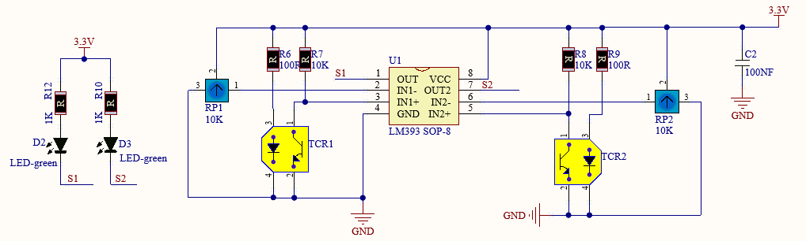

#### 3.4.4 Lire le capteur de suivi de ligne

Vous pouvez télécharger le code `3.4-Read the Line Tracking Sensor.py` directement depuis le tutoriel (lisez le fichier "Configuration de l'environnement de développement" en cas de doute).


```python
from microbit import *
pin12.set_pull(pin12.PULL_UP)
pin13.set_pull(pin13.PULL_UP)
sensor_L = 0
sensor_R = 0

while True:
    sensor_L = pin13.read_digital()
    sensor_R = pin12.read_digital()
    print("sensor_L:", sensor_L)
    print("sensor_R:", sensor_R)
    sleep(1000)
```

**Résultat du test :** Téléchargez le code sur la carte micro:bit, ne débranchez pas le câble USB. Cliquez sur "REPL" et appuyez sur le bouton de réinitialisation, les lectures détectées par le capteur de suivi de ligne s'afficheront sur le moniteur.

Lorsque le capteur de suivi de ligne détecte un objet blanc, 0 s'affiche et D2, D3 s'allument ; lorsqu'aucun objet blanc et seulement un objet noir sont détectés, 1 s'affiche et D2, D3 s'éteignent, comme illustré ci-dessous.


#### 3.4.5 Organigramme


#### 3.4.6 Code de test

Vous pouvez télécharger le code `3.4-Patrol car.py` directement depuis le tutoriel (lisez le fichier "Configuration de l'environnement de développement" en cas de doute).


```python
from microbit import *
from keyes_MiniCar import *		#Import the library file
minicar = MiniCar()				#Instantiate an object MiniCar（）as minicar
pin12.set_pull(pin12.PULL_UP)      #Set pin12 to pull up
pin13.set_pull(pin13.PULL_UP)
sensor_L = 0
sensor_R = 0

while True:
    sensor_L = pin13.read_digital()    #Read the value of the sensor
    sensor_R = pin12.read_digital()
    print("sensor_L:", sensor_L)
    print("sensor_R:", sensor_R)
    if sensor_L == 1 and sensor_R == 1: #Judge if sensor_L and sensor_R =1
        minicar.Motor_L(1, 70)			#Advance code
        minicar.Motor_R(1, 70)
    elif sensor_L == 0 and sensor_R == 1: #Judge if sensor_L =0 and sensor_R=1
        minicar.Motor_L(1, 70)			#Right turn code
        minicar.Motor_R(0, 70)
    elif sensor_L == 1 and sensor_R == 0: #Judge if sensor_L=1 and sensor_R=0
        minicar.Motor_L(0, 70)
        minicar.Motor_R(1, 70)
    else:
        minicar.Motor_stop()
```

**Résultat du test :** Téléchargez le code et ouvrez l'interrupteur d'alimentation de la voiture. Placez la voiture sur le papier de suivi de ligne, elle suivra alors la ligne noire pour se déplacer.

**Réglage du potentiomètre :**

Si le chariot ne suit pas correctement la ligne, veuillez ajuster le potentiomètre comme suit.


<iframe width="951" height="535" src="https://www.youtube.com/embed/O0q9ubsBAdU" title="Potentiometer adjustment" frameborder="0" allow="accelerometer; autoplay; clipboard-write; encrypted-media; gyroscope; picture-in-picture; web-share" referrerpolicy="strict-origin-when-cross-origin" allowfullscreen></iframe>

1. Téléchargez le code du cours.
2. Positionnez la voiture face à vous. Tournez le potentiomètre gauche complètement dans le sens inverse des aiguilles d