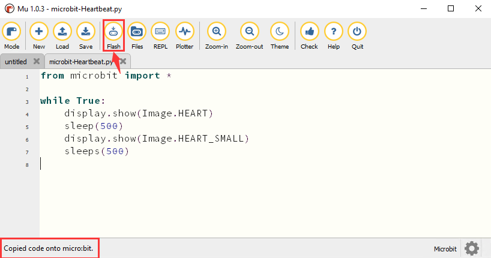
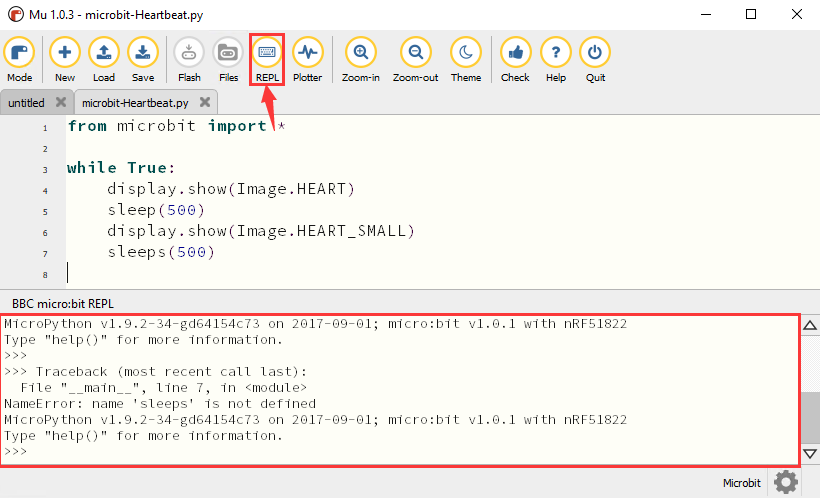
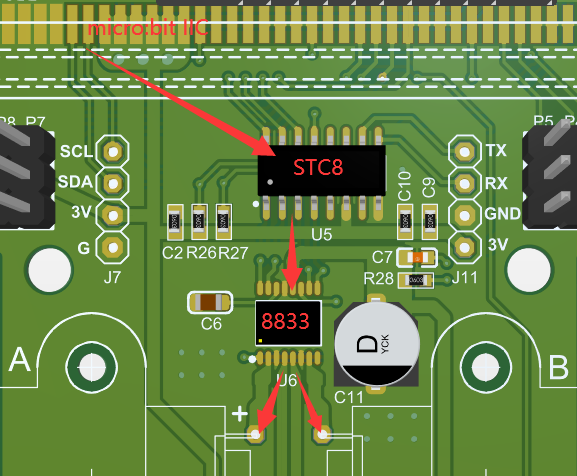

# MicroPython チュートリアル

## コードファイルのダウンロード

<span style="color:red;font-size:15px;">注：すべてのコースコードはここからダウンロードできます。ダウンロードリンクは後で提供されません。忘れないように、今後のチュートリアル学習のために今すぐコードをダウンロードすることをお勧めします。</span>

[クリックしてダウンロード](./MiroPython_Resource.7z)

## 1. MU IDE

### 1. 1 MU IDEのインストール

Muは、教師と生徒を対象とした、プログラミング初心者向けのPythonコードエディタです。Muを入手する最も簡単な方法は、WindowsまたはMac OSX用の公式インストーラーを使用することです（Muは32ビットWindowsをサポートしなくなりました）。現在の推奨バージョンはMu 1.0-beta 2です。

#### ステップ1 - バージョンを確認し、Muインストーラーをダウンロードする

リンクを開く：[https://codewith.mu/en/download](https://codewith.mu/en/download) 対応するMuソフトウェアバージョンをダウンロードします。

お使いのコンピューターがWindowsまたはMac OSXのどちらを実行しているかを確認し、エクスプローラーを開き、「PC」をクリックし、次に「プロパティ」を選択して、Windowsシステムが32ビットか64ビットかを確認します。


**システムの種類を表示する：**


#### ステップ2 - インストーラーを実行する

ダウンロードしたばかりのインストーラー（ダウンロードフォルダにあるかもしれません）を見つけて、インストーラーファイルをダブルクリックして開きます。


Mac OSXシステムのダウンロードリンク：[https://codewith.mu/en/howto/1.1/install_macos](https://codewith.mu/en/howto/1.1/install_macos)

**Windows 10システム**

「詳細情報」をタップ


「実行」を入力


#### ステップ3 - プロトコル

ライセンスを確認し、「インストール」をクリックします。


#### ステップ4 - インストール

Muがコンピューターにインストールされるまで数秒かかります。


#### ステップ5 - 完了

「完了」をタップ


#### ステップ6 - Muを起動する

スタートメニューのアイコンをクリックするか、検索ボックスにMuと入力してMuを起動できます（両方の方法を以下に示します）。


Muのメインインターフェースは以下の通りです。


### 1.2 コンパイラの設定とツールバーの紹介

まず「モード」をmicro bitに設定します。

Muソフトウェアを開き、メニューバーの「Mode」ボタンをクリックして「BBC micro: bit」を選択し、「OK」をタップします。


### 1.3 ライブラリファイルのインストール

ライブラリをインポートする前に、.pyコードをmicrobitにアップロードする必要があります。ここでは、チュートリアルのRGBモジュール「code_1.py」を例にとります。

「keyes_MiniCar.py」ファイルをインポート

Muのデフォルトの保存ディレクトリは「Mu_code」ファイルで、ユーザーディレクトリのルートにあります。

たとえば、Windowsでは、システムがコンピューターのCドライブにインストールされ、ユーザー名がAdministratorの場合、mu_codeディレクトリへのパスはC:\Users\Administrator\mu_codeです。Linuxでは、パスは~/home/mu_codeです。

**「mu_code」ファイルに入る**


「keyes_MiniCar.py」ライブラリファイルを「mu_code」フォルダに複製します。コードパスは以下の通りです。


Muソフトウェアを開き、micro:bitをコンピューターに接続し、「Files」ボタンをクリックして、「keyes_MiniCar.py」ライブラリファイルをmicro:bitにドラッグします。


インポートが成功すると、左側のボックスに表示されます。


「Check」をタップして、コードにエラーがないか確認します。カーソルまたはアンダースコアが表示された行がある場合、その行のプログラムにエラーがあります。


これらのヒントは警告であり、コードエラーのヒントではありません。


また、micro USBケーブルがmicro:bitとコンピューターに接続されていることを確認し、「Flash」ボタンをクリックしてコードをmicro:bitにダウンロードする必要があります。


「Flash」ボタンをクリックした後にエラーが発生した場合は、ライブラリファイルをmicro:bitにインポートしたかどうかを確認してください。

注：

「keyes_MiniCar.py」ライブラリファイル以外の他のプログラムをmicro:bitボードにダウンロードしている場合。Micropythonでプログラミングする前に、ライブラリファイルをmicro:bitにインポートする必要があります。

常に同じmicro:bitボードをMicropythonプログラミングに使用する場合、再度micro:bitに送信する必要はありません。

### 1.4 コンパイラにコードを追加する

基本チュートリアルの最初のプロジェクト「Heartbeat」を例にとり、最初のプロジェクトフォルダの「Program」フォルダを開き、「microbit-Heartbeat」ファイルを見つけます。


または、Muソフトウェアを開き、「microbit-Heartbeat.py」ファイルをタップして、Muソフトウェアにドラッグします。


以下に示すように：


### 1.5 コードをMicro:bitにダウンロードする

micro：bitボードとコンピューターをmicro USBケーブルで接続します。

「Flash」をタップして、コードをmicro：bitにダウンロードします。


コードにエラーがある場合でも、コードをmicro:bitにダウンロードすることはできますが、動作しません。sleepがsleepsの場合、「Flash」をクリックすると、コードもmicro:bitにダウンロードされます。



ダウンロード後、LEDマトリックスにエラーメッセージが表示された場合は、「REPL」ボタンをタップし、micro:bitのリセットボタン（AボタンとBボタンではありません）を押すと、REPLボックスに以下のようにエラーメッセージが表示されます。



もう一度「REPL」をクリックすると、REPLモードがオフ
| display.show(val1)<br/>sleep(500)<br/>display.show(val3)<br/>sleep(500) | (1,0)のLEDが0.5秒間点滅します。 |
| display.show(val2)<br/>sleep(500)<br/>display.show(val3)<br/>sleep(500) | (3,4)のLEDが0.5秒間点滅します。 |

#### 2.2.5 テスト結果

コードをダウンロードした後、USBケーブルで電源を接続すると、(1,0)のLEDが0.5秒間点滅し、次に(3,4)のLEDが0.5秒間点滅するループ動作が見られます。


### 2.3 5 x 5 LEDドットマトリックス

#### 2.3.1 説明

LEDスクリーン、バス停、エレベーター内のミニテレビなど、ドットマトリックスは私たちの生活で人気を集めています。

Micro:bitボードのドットマトリックスは25個の発光ダイオードで構成されています。前回のレッスンでは、座標点を設定することでMicro:bitボードのLEDを制御してパターン、数字、文字列を形成しました。さらに、パターン、数字、文字列の表示を完了する別の方法を採用することもできます。

#### 2.3.2 必要なコンポーネント

|  |  |
| :-----------------------: | :------------------: |
|       Micro:bit * 1       |    Micro:bit * 1     |

#### 2.3.3 テストコード

チュートリアルから直接コードをアップロードできます（不明な場合は「開発環境設定」ファイルをお読みください）。


```python
from microbit import *
val = Image("00900:""00900:""90909:""09990:""00900")
display.show(val)
```

**テスト結果：**`2.3-5× 5 LED Dot Matrix-1.py`をmicro:bitにアップロードすると、下向きの矢印が表示されます。


```python
from microbit import *
val = Image("00900:""00900:""90909:""09990:""00900")
display.show('1')
sleep(500)
display.show('2')
sleep(500)
display.show('3')
sleep(500)
display.show('4')
sleep(500)
display.show('5')
sleep(500)
display.show(val)
sleep(500)
display.scroll("hello!")
sleep(200)
display.show(Image.HEART)
sleep(500)
display.show(Image.ARROW_NE)
sleep(500)
display.show(Image.ARROW_SE)
sleep(500)
display.show(Image.ARROW_SW)
sleep(500)
display.show(Image.ARROW_NW)
sleep(500)
display.clear()
```


#### 2.3.4 コードの説明

| コード                                                         | 説明                                                  |
| ------------------------------------------------------------ | ------------------------------------------------------------ |
| from microbit import *                                       | micro:bitのライブラリファイルをインポートします。                         |
| val =<br/>Image("09000:""00000:""00000:""0000<br/>0:""00000:") | Image()を変数valに設定します。                                  |
| display.show(val)                                            | micro:bitが「→」を表示します。                                           |
| display.show('1')                                            | display.show('1')                                            |
| sleep(500)                                                   | sleep(500)                                                   |
| display.scroll("hello!")                                     | micro:bitが「hello!」をスクロール表示します。                            |
| display.show(Image.HEART)                                    | micro:bitが「❤」を表示します。                                        |
| display.show(Image.ARROW_NE)<br/>display.show(Image.ARROW_SE)<br/>display.show(Image.ARROW_SW)<br/>display.show(Image.ARROW_NW) | micro:bitが「北東」の矢印を表示します。<br/>micro:bitが「南東」の矢印を表示します。<br/>micro:bitが「南西」の矢印を表示します。<br/>micro:bitが「北西」の矢印を表示します。 |
| display.clear()                                              | micro:bitのLEDドットマトリックスをクリアします。                       |

#### 2.3.5 テスト結果

`2.3-5×5 LED Dot Matrix-2.py`をmicro:bitにダウンロードすると、LEDドットマトリックスに「1」、「2」、

「3」、「4」、「5」、「↓」、「hello!」、「❤」、、、、のパターンが表示されます。各間隔は500msです。

### 2.4 プログラマブルボタン

#### 2.4.1 説明

ボタンは回路のオン/オフを制御でき、回路に接続されています。ボタンが押されていないときは回路は切断されています。押されるとすぐに回路は接続されますが、離されると切断されます。

ボタンの両端は2つの山のようなものです。その間に川があります。内部の金属片が両側を接続し、電流が流れるようにします。これは、2つの山を接続する橋を架けるようなものです。


**動作原理**：ボタンを押す前は、1、2、3、4がオンになっていますが、1、3または1、4または2、3または2、4は切断されています（ブロックされています）。ボタンが押されるとオンになります。

Micro:bitボードには3つのボタンがあり、リセットボタンは裏側に、2つのプログラマブルボタンは表側にあります。A、B、ABをそれぞれ同時に押すと、対応する画面にそれぞれ表示されます。

#### 2.4.2 必要なコンポーネント

|  |  |
| :-----------------------: | :------------------: |
|       Micro:bit * 1       |    Micro:bit * 1     |

#### 2.4.3 テストコード

チュートリアルから直接コードをアップロードできます（不明な場合は「開発環境設定」ファイルをお読みください）。


```python
from microbit import *
while True:
if button_a.is_pressed():
display.show("A")
elif button_a.is_pressed() and button_b.is_pressed():
display.scroll("AB")
elif button_b.is_pressed():
display.show("B")
```

**テスト結果：**`2.4-Programmable Buttons-1.py`をアップロードし、USBケーブルでmicro:bitを接続し、Micro:bitボードの「A」を押すと、文字「A」が表示されます。Bが押された場合は、文字「B」が表示されます。AとBのボタンを同時に押すと「AB」が表示されます。


```python
from microbit import *
a = 0
b = 0
val1 = Image("00000:""00000:""00000:""00000:""00900")
val2 = Image("00000:""00000:""00000:""00900:""99999")
val3 = Image("00000:""00000:""00900:""99999:""99999")
val
| sleep(500)                                                   | 500ミリ秒の遅延                                               |
| **if** temperature() >= 35:<br/>display.show(Image.HEART)<br/>**else**:<br/>display.show(Image.HEART_SMALL) | 温度値が35℃以上の場合<br/>micro:bitは「 」を表示します。<br/>温度値が35℃未満の場合<br/>micro:bitは「」を表示します。 |

### 2.6 コンパス

#### 2.6.1 説明

このプロジェクトでは、Micro:bitのコンパスの使用方法を主に紹介します。方向を決定するために使用できます。磁気センサーが機能するときは、Micro:bitボードを校正する必要があります。正しい校正方法は、Micro:bitボードを回転させることです。

<span style="color:red;">また、近くの物体は読み取りと校正の精度に影響を与える可能性があります。</span>

#### 2.6.2 必要なコンポーネント

|  |  |
| :-----------------------: | :------------------: |
|       Micro:bit * 1       |    Micro:bit * 1     |

#### 2.6.3 テストコード

チュートリアルから直接コードをアップロードできます（不明な場合は「開発環境設定」ファイルをお読みください）。


```python
from microbit import *
compass.calibrate()
while True:
if button_a.is_pressed():
display.scroll(compass.heading())
```

**コードの説明：**地域によって磁場が異なるため、micro:bitを校正する必要があります。micro:bitは、初めて使用するときに校正を促します。

`2.6-Magnetic sensor-1.py`をmicro:bitに転送し、USBケーブルでmicro:bitを接続してボタンAを押します。「TILT TO FILL SCREEN」がmicro:bitに表示されます。次に、校正インターフェースに入ります。校正方法は、micro:bitボードを回転させ、以下の図に示すように、完全な正方形パターン（25個のLEDが点灯）を表示することです。


校正は、スマイルパターン  が表示されるまで完了です。

ボタンAを押すと、シリアルモニターに0°、90°、180°、270°が表示されます。

--------


```python
from microbit import *
compass.calibrate()
x = 0
while True:
x = compass.heading()
if x >= 293 and x < 338:
display.show(Image("00999:""00099:""00909:""09000:""90000"))
elif x >= 23 and x < 68:
display.show(Image("99900:""99000:""90900:""00090:""00009"))
elif x >= 68 and x < 113:
display.show(Image("00900:""09000:""99999:""09000:""00900"))
elif x >= 113 and x < 158:
display.show(Image("00009:""00090:""90900:""99000:""99900"))
elif x >= 158 and x < 203:
display.show(Image("00900:""00900:""90909:""09990:""00900"))
elif x >= 203 and x < 248:
display.show(Image("90000:""09000:""00909:""00099:""00999"))
elif x >= 248 and x < 293:
display.show(Image("00900:""00090:""99999:""00090:""00900"))
else:
display.show(Image("00900:""09990:""90909:""00900:""00900"))
```

micro:bitボードを水平に北、南、東、西に向け、LEDドットマトリックスが対応する方向パターンを表示します。

以下の図に示すように、値が292.5から337.5の範囲の場合、矢印は右上を指します。コードでは0.5を入力できないため、取得する値は293と338になります。


`2.6-Magnetic sensor-2.py`をmicro:bitボードにアップロードし、USBケーブルを抜かないでください。校正後、Micro:bitボードを傾けると、LEDドットマトリックスが方向記号を表示します。

#### 2.6.4 コードの説明

| code                                                         | Explanation                                                  |
| ------------------------------------------------------------ | ------------------------------------------------------------ |
| from microbit import *                                       | micro:bitのライブラリファイルをインポートします                         |
| compass.calibrate()                                          | コンパスの校正                                          |
| while True:                                                  | これは永続的なループで、<br/>micro:bitがコードを実行し続けます。 |
| **if** button_a.is_pressed():<br/>display.scroll(compass.heading()) | ボタンAが押されたとき<br/>Micro:bitはコンパスの値をスクロール表示します |
| x = 0                                                        | 変数x=0を設定します                                             |
| x = compass.heading()                                        | コンパスの値を変数xに設定します                       |
| **if**...**elif**...**else**                                 | コンパスの値を変数xに設定します                       |
| display.show(Image("00999:""0009<br/>9:""00909:""09000:""90000"))<br/>display.show(Image("99900:""9900<br/>0:""90900:""00090:""00009"))<br/>display.show(Image("00900:""0900<br/>0:""99999:""09000:""00900"))<br/>display.show(Image("00009:""0009<br/>0:""90900:""99000:""99900"))<br/>display.show(Image("00900:""0090<br/>0:""90909:""09990:""00900"))<br/>display.show(Image("90000:""0900<br/>0:""00909:""00099:""00999"))<br/>display.show(Image("00900:""0009<br/>0:""99999:""00090:""00900"))<br/>display.show(Image("00900:""0999<br/>0:""90909:""00900:""00900")) | Micro:bitは北東の矢印記号を表示します<br/>Micro:bitは北西の矢印記号を表示します<br/>Micro:bitは西の矢印記号を表示します<br/>Micro:bitは南西の矢印記号を表示します<br/>Micro:bitは南東の矢印記号を表示します<br/>Micro:bitは南の矢印記号を表示します<br/>Micro:bitは東の矢印記号を表示します<br/>Micro:bitは北の矢印記号を表示します |

### 2.7 加速度計

#### 2.7.1 説明

Micro:bitボードには、LSM303AGR加速度センサー（加速度計）が内蔵されています。8、10、12ビットの分解能を持ち、プログラム
| from microbit import *                      | micro:bitのライブラリファイルをインポートします。 |
| gesture = accelerometer.current_gesture()   | accelerometer.current_gesture()をgestureに設定します。 |
| while True:                                 | これは永久ループで、micro:bitはこのコードを実行します。 |
| Lightintensity = display.read_light_level() | display.read_light_level()をLightintensityに設定します。 |
| print("Light intensity:", Lightintensity)   | BBC micro:bit REPLは検出された光強度値を出力します。 |
| sleep(100)                                  | 100ms遅延します。 |

#### 2.8.5 テスト結果

micro:bitボードにコードをダウンロードし、USBケーブルを抜かないでください。「REPL」をクリックし、リセットボタンを押すと、以下に示すように光強度値が表示されます。

LEDドットマトリックスを覆うと、強度値は0になります。逆に、micro:bitボードを太陽の下に置くと、強度値は増加します。


### 2.9 スピーカー

#### 2.9.1 説明

micro:bitマザーボードにはスピーカーが内蔵されており、プロジェクトに簡単に音を追加できます。スピーカーは、喜びの歌などのさまざまな音色を発するようにプログラムでき、それを再生できます。


#### 2.9.2 必要なコンポーネント

|  |  |
| :-----------------------: | :------------------: |
|       Micro:bit * 1       |    Micro:bit * 1     |

#### 2.9.3 テストコード

チュートリアルから直接コードをアップロードできます（不明な場合は「開発環境設定」ファイルをお読みください）。


```python
from microbit import *
import audio
display.show(Image.MUSIC_QUAVER)
while True:
audio.play(Sound.GIGGLE)
sleep(1000)
audio.play(Sound.HAPPY)
sleep(1000)
audio.play(Sound.HELLO)
sleep(1000)
audio.play(Sound.YAWN)
sleep(1000)
```

#### 2.9.4 コードの説明

| コード                     | 説明                                             |
| ------------------------ | ------------------------------------------------------- |
| from microbit import *   | micro:bitのライブラリファイルをインポートします。                    |
| import audio             | オーディオライブラリファイル                                      |
| while True:              | これは永久ループで、micro:bitはこのコードを実行します。 |
| audio.play(Sound.GIGGLE) | クスクス笑う音を鳴らします。                                     |
| sleep(1000)              | 1000ms遅延します。                                         |

#### 2.9.5 テスト結果

micro:bitボードにコードをダウンロードし、USBケーブルを抜かないでください。すると、スピーカーから音が鳴り、LEDドットマトリックスに音楽ロゴパターンが表示されます。

### 2.10 タッチセンサーロゴ

#### 2.10.1 説明

micro:bitメインボードをお持ちの場合、金色のタッチセンサーロゴをプロジェクトの別の入力として使用することは理にかなっています。これは追加のボタンのようなものです。指で押す（または触れる）と電界の小さな変化を検出する静電容量式タッチセンサーを使用します。触れると、micro:bitボードを制御して特定の機能を実行できます。

#### 2.10.2 必要なコンポーネント

|  |  |
| :-----------------------: | :------------------: |
|       Micro:bit * 1       |    Micro:bit * 1     |

#### 2.10.3 テストコード

チュートリアルから直接コードをアップロードできます（不明な場合は「開発環境設定」ファイルをお読みください）。


```python
from microbit import *
time = 0
start = 0
running = False
while True:
if button_a.was_pressed():
running = True
start = running_time()
if button_b.was_pressed():
if running:
time += running_time() - start
running = False
if pin_logo.is_touched():
if not running:
display.scroll(int(time/1000))
if running:
display.show(Image.HEART)
sleep(300)
display.show(Image.HEART_SMALL)
sleep(300)
else:
display.show(Image.ASLEEP)
```

#### 2.10.4 コードの説明

（1）micro:bitは、起動時にミリ秒（1秒あたりの千分の1）単位で時間を記録します。これを実行時間と呼びます。

（2）ボタンAを押すと、startという変数が現在の実行時間に設定されます。

（3）ボタンBを押すと、新しい実行時間から開始時間が引かれ、ストップウォッチを開始してからどれだけの時間が経過したかが計算されます。この差は、timeという変数に格納されている合計時間に追加されます。

（4）金色のロゴアイコンを押すと、プログラムはLEDディスプレイに経過した合計時間を表示します。時間をミリ秒（1秒の千分の1）から秒に変換するために1000で割ります。整数除算演算子を使用して、整数の結果を返します。

（5）プログラムは、プログラムを制御するためにrunningというブール変数も使用します。ブール変数は、trueまたはfalseの2つの値しか持ちません。runningがtrueの場合、ストップウォッチが開始されます。runningがfalseの場合、ストップウォッチは開始されていないか停止しています。

（6）runningがtrueの場合、LEDドット画面に鼓動するハートが表示されます。

（7）ストップウォッチが停止している場合、つまり「running」がfalseの場合、金色のロゴアイコンを押したときにのみ時間が表示されます。

（8）ストップウォッチがすでに開始されている場合、つまり「running」がtrueの場合、このコードは、ボタンBが押されたときにのみ時間変数が変化するようにすることで、誤った読み取りを防ぎます。

#### 2.10.5 テスト結果

コードをアップロードし、USBケーブルでmicro:bitを接続します。ボタンAを押してストップウォッチを開始します。タイマーが計時されている間、LEDドットマトリックスには鼓動するハートが表示され、ボタンBをタップすると停止できます。実際のストップウォッチのように、時間が加算され続けます。

micro:bitの前面にある金色のロゴアイコンを押すと、測定された時間が秒単位で表示されます。時間をゼロにリセットするには、micro:bitボードの背面にあるリセットボタンを押します。

### 2.11 マイク

#### 2.11.1 説明

micro:bitマザーボードにはマイクが内蔵されており、周囲の音レベルを測定するために使用できます。拍手すると、micro:bitマザーボードのLEDインジケーターが点灯します。音の強度を測定できます。この接続では、サウンドレベルチャートや音楽に合わせて動くディスコライトを作成できます。


#### 2.11.2 必要なコンポーネント

|  |  |
| :-----------------------: | :------------------: |
|       Micro:bit * 1       |    Micro:bit * 1     |

#### 2.11.3 テストコード

チュートリアルから直接コードをアップロードできます（不明な場合は「開発環境設定」ファイルをお読みください）。


```python
from microbit import *
while True:
if microphone.current_event() == SoundEvent.LOUD:
display.show(Image.HEART)
sleep(200)
if microphone.current_event() == SoundEvent.QUIET:
display.show(Image.HEART_SMALL)
```

**テスト結果:** `2.11-Microphone-1.py`をmicro:bitボードにダウンロードし、USBケーブルを接続したままにします。拍手すると、LEDドットマトリックスに❤パターンが表示されます。外が静かなときは、


**動作原理:** Microbitはホストとして、IICを介してスレーブSTC8G1K08に命令を送信し、スレーブはPWMを出力してRGB LEDライトを制御します。これにより、microbitボードのIOポートが大幅に節約されます。IICは2つのモーターと2つのRGB LEDライトを制御できるためです。

#### 3.1.4 コードの説明

Keyes_MiniCar.pyファイル内のRGB LEDの機能：

Left.red(0-255): 左のRGBを赤に設定します。0が最も明るく、255が最も暗いです。

Left.green（0-255): 左のRGBを緑に設定します。0が最も明るく、255が最も暗いです。

Left.blue（0-255）: 左のRGBを青に設定します。0が最も明るく、255が最も暗いです。

right.red（0-255）: 右のRGBを赤に設定します。0が最も明るく、255が最も暗いです。

right.green（0-255）: 右のRGBを緑に設定します。0が最も明るく、255が最も暗いです。

right.blue（0-255）: 右のRGBを青に設定します。0が最も明るく、255が最も暗いです。

#### 3.1.5 テストコード

`3.1-RGB LED-1.py`ファイルをチュートリアルから直接アップロードできます（不明な場合は「開発環境設定」ファイルを参照してください）。


```python
from microbit import *
from keyes_MiniCar import *
minicar = MiniCar()

while True:
    minicar.left_red(0)
    minicar.right_red(0)
    sleep(1000)
    minicar.led_off()
    minicar.left_green(0)
    minicar.right_green(0)
    sleep(1000)
    minicar.led_off()
    minicar.left_blue(0)
    minicar.right_blue(0)
    sleep(1000)
    minicar.led_off()
```

**テスト結果:** コードをアップロードすると、RGB LEDは赤、緑、青の順に1秒ごとに切り替わります。

-------

`3.1-RGB LED-2.py`ファイルをインポートします。


```python
from microbit import *
from keyes_MiniCar import *
minicar = MiniCar()

while True:
    for num in range(0 , 255):  		#It is a loop statement, the range is 0 to 255
        num += 1					#It is equal to num = num + 1 
        minicar.left_red(255 - num)
        minicar.right_red(255 - num)
        sleep(10)
        
    for num in range(0 , 255):
        num += 1
        minicar.left_green(255 - num)
        minicar.right_green(255 - num)
        sleep(10)
        
    for num in range(0 , 255):
        num += 1
        minicar.left_red(num)
        minicar.right_red(num)
        sleep(10)
        
    for num in range(0 , 255):
        num += 1
        minicar.left_blue(255 - num)
        minicar.right_blue(255 - num)
        sleep(10)
    
    for num in range(0 , 255):
        num += 1
        minicar.left_red(255 - num)
        minicar.right_red(255 - num)
        sleep(10)
    
    for num in range(0 , 255):
        num += 1
        minicar.left_green(num)
        minicar.right_green(num)
        sleep(10)
        
    for num in range(0 , 255):
        num += 1
        minicar.left_red(num)
        minicar.right_red(num)
        sleep(10)
    
    for num in range(0 , 255):
        num += 1
        minicar.left_blue(num)
        minicar.right_blue(num)
        sleep(10)
```

**テスト結果:** コードをアップロードすると、RGB LEDは赤になり、次に緑になり、その後赤と緑の混合が表示されます。赤色のライトが消えると、青色のライトが点灯し、その後青と緑の混合が表示されます。

しかし、緑色のライトが消えると、赤色のライトが点灯し、その後青と赤の混合が表示されます。最後に、赤と青のライトが消灯します。

#### 3.1.6 拡張知識

1秒 = 1000ミリ秒；1ミリ秒 = 1000マイクロ秒；1マイクロ秒 = 1000ナノ秒

したがって、プロジェクトで使用した1000ミリ秒は1秒です。

おそらく、RGBの赤、緑、青のPWMを設定するだけで、希望の光の色を自分で設定できるでしょう。

### 3.2 モーター駆動

#### 3.2.1 説明

ロボットカーには2つのDCギアモーターが搭載されており、これらは通常のDCモーターを改良したものです。ギア減速機が組み込まれており、低速で大きなトルクを提供します。さらに、異なる減速比のギアボックスは、異なる速度とトルクを提供できます。

減速モーターは、ギアモーターとモーターを統合したもので、鉄鋼業や機械産業で広く応用されています。

さらに、この車にはSTC8G1K08とHR8833MTEチップが搭載されています。IOポートを節約するため、micro:bitのIICを介してSTC8G1K08チップに命令を送信し、STC8G1K08チップは対応する命令に従ってHR8833MTEチップを制御し、2つのDC減速モーターの回転方向と速度を制御します（制御プロセスは以下の通りです）。



#### 3.2.2 準備

（1）micro:bitを拡張ボードに正しく挿入します。

（2）バッテリーホルダーを拡張ボードに接続します。

（3）電源スイッチをオンにします（<span style="color:red;">POWERスイッチをON側にスライドさせます</span>）。

（4）micro:bitとコンピューターをmicro USBケーブルで接続します。


```python
        minicar.Motor_L(1, 70)			#It is a code of advance
        minicar.Motor_R(1, 70)
    elif LDR_L > 650 and LDR_R <= 650: #Judge if the left brightness＞650，right≤650
        minicar.Motor_L(0, 70)			#Left turn code
        minicar.Motor_R(1, 70)
    elif LDR_L <= 650 and LDR_R > 650: #Judge if the left side of the car≤650，right＞650
        minicar.Motor_L(1, 70) 			#The car turns right
        minicar.Motor_R(0, 70)
    else:
        minicar.Motor_stop()           #The car stops
```

#### 3.3.7 テスト結果

コードをアップロードした後、車の後部にあるスイッチをオンにすると、懐中電灯を使って車を操作できます。比較的暗い環境で使用するのが最適です。周囲の光強度が650を超えると、車は動き続けます。

### 3.4 ライントラッキングスマートカー

#### 3.4.1 説明

この車には、2つのライントラッキングセンサーと2つのポテンショメーターが搭載されています。

さらに、TCRT5000 IRチューブを採用しており、IR発光チューブとIR受光チューブが含まれています。発光チューブからの赤外線信号が反射によって受光チューブに受信されると、受光チューブの抵抗が変化し、これは通常、回路の電圧変化として現れます。

抵抗は、受光チューブが受信する赤外線信号の強度によって異なり、これはしばしば反射面の色の違いや受光チューブからの距離によって決まります。検出時、黒はハイレベルアクティブ、白はローレベルアクティブです。

**動作原理:** 車が白い道路の上を走行すると、車の下に設置されたIR発光チューブが赤外線信号を発して道路を検出し、受光チューブが送り返された信号を受信します。その後、出力端はローレベル(0)を出力します。黒い線を検出すると、ハイレベル(1)を出力します。

検出された信号をマイクロコントローラーのI/Oポートに送信します。ハイレベル(1)の場合、車は黒い線の上にあります。同様に、ローレベル(0)の場合、車は白い地面の上にあります。

<span style="color:red;">拡張ボード上の2つのライントラッキングセンサーは、micro:bit制御ボードのP12とP13によって制御され、左側はP13、右側はP12によって制御されます。ライントラッキングセンサーを調整し、車を黒い地面に置き、LED（D3、D2）が点灯するまでポテンショメーターを回し、その後、消灯するまで調整します。</span>

#### 3.4.2 準備

（1）micro:bitを拡張ボードに正しく挿入します。

（2）バッテリーホルダーを拡張ボードに接続します。

（3）電源スイッチをオンにします（<span style="color:red;">POWERスイッチをON側にスライドさせます</span>）。

（4）micro:bitとコンピューターをmicro USBケーブルで接続します。

（5）MU IDEを開きます。

Mini car拡張ライブラリを追加したい場合（「1.4 ライブラリファイルのインストール」ファイルを参照してください）。

#### 3.4.3 回路図


#### 3.4.4 ライントラッキングセンサーの読み取り

チュートリアルからコード`3.4-Read the Line Tracking Sensor.py`を直接アップロードできます（不明な場合は「開発環境設定」ファイルを参照してください）。


```python
from microbit import *
pin12.set_pull(pin12.PULL_UP)
pin13.set_pull(pin13.PULL_UP)
sensor_L = 0
sensor_R = 0

while True:
    sensor_L = pin13.read_digital()
    sensor_R = pin12.read_digital()
    print("sensor_L:", sensor_L)
    print("sensor_R:", sensor_R)
    sleep(1000)
```

**テスト結果:** micro:bitボードにコードをダウンロードし、USBケーブルを抜かないでください。「REPL」をクリックし、リセットボタンを押すと、ライントラッキングセンサーによって検出された読み取り値がモニターに表示されます。

ライントラッキングセンサーが白い物体を検出すると、0が表示され、D2、D3が点灯します。白い物体がなく、黒い物体のみが検出されると、1が表示され、D2、D3が消灯します。以下に示すとおりです。


#### 3.4.5 フローチャート


#### 3.4.6 テストコード

チュートリアルからコード`3.4-Patrol car.py`を直接アップロードできます（不明な場合は「開発環境設定」ファイルを参照してください）。


```python
from microbit import *
from keyes_MiniCar import *		#Import the library file
minicar = MiniCar()				#Instantiate an object MiniCar（）as minicar
pin12.set_pull(pin12.PULL_UP)      #Set pin12 to pull up
pin13.set_pull(pin13.PULL_UP)
sensor_L = 0
sensor_R = 0

while True:
    sensor_L = pin13.read_digital()    #Read the value of the sensor
    sensor_R = pin12.read_digital()
    print("sensor_L:", sensor_L)
    print("sensor_R:", sensor_R)
    if sensor_L == 1 and sensor_R == 1: #Judge if sensor_L and sensor_R =1
        minicar.Motor_L(1, 70)			#Advance code
        minicar.Motor_R(1, 70)
    elif sensor_L == 0 and sensor_R == 1: #Judge if sensor_L =0 and sensor_R=1
        minicar.Motor_L(1, 70)			#Right turn code
        minicar.Motor_R(0, 70)
    elif sensor_L == 1 and sensor_R == 0: #Judge if sensor_L=1 and sensor_R=0
        minicar.Motor_L(0, 70)
        minicar.Motor_R(1, 70)
    else:
        minicar.Motor_stop()
```

**テスト結果:** コードをアップロードし、車の電源スイッチをオンにします。車をライントラッキング用紙の上に置くと、黒い線に沿って移動します。

**ポテンショメーターの調整：**

カートが適切にラインを追跡できない場合は、次のようにポテンショメーターを調整してください。


<iframe width="951" height="535" src="https://www.youtube.com/embed/O0q9ubsBAdU" title="Potentiometer adjustment" frameborder="0" allow="accelerometer; autoplay; clipboard-write; encrypted-media; gyroscope; picture-in-picture; web-share" referrerpolicy="strict-origin-when-cross-origin" allowfullscreen></iframe>

1. コースコードをアップロードします。
2. 車を正面に向けて配置します。左のポテンショメーターを反時計回りに完全に回し、右のポテンショメーターを時計回りに完全に回します。
3. ビデオに示すように、車をトラックの白い領域に置きます。各ポテンショメーターをゆっくりと調整し、隣接するインジケーターライトが点灯するまで回します。車を手で持ち上げると、すべてのインジケーターライトが消灯するはずです。

### 3.5 超音波追従と障害物回避

#### 3.5.1 説明

超音波センサーは、コウモリのようにソナーを使って物体までの距離を測定します。トリガー信号の後、超音波を発します。超音波が物体に当たって反射して戻ってくると、モジュールはエコー信号を出力するため、トリガー信号とエコー信号の時間差から